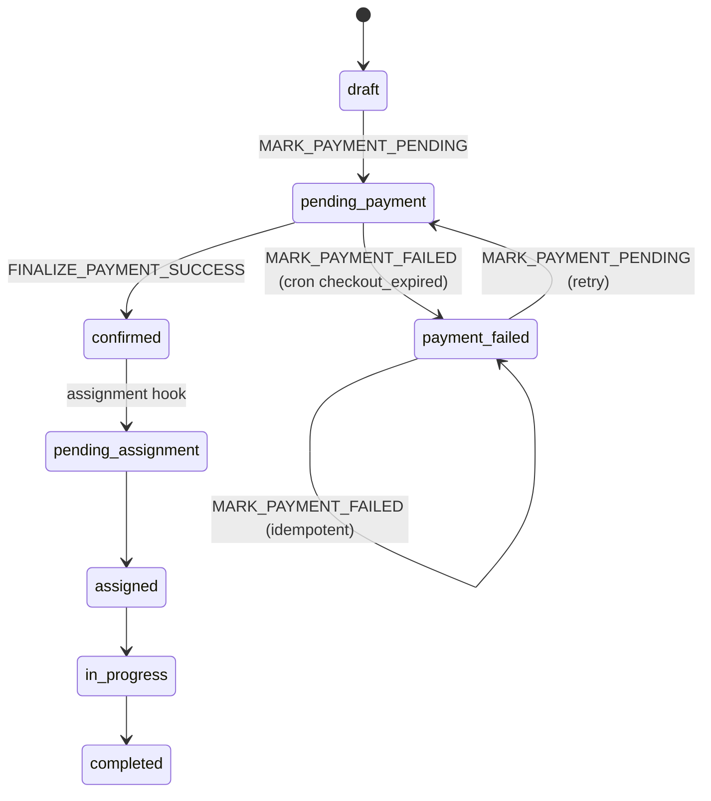
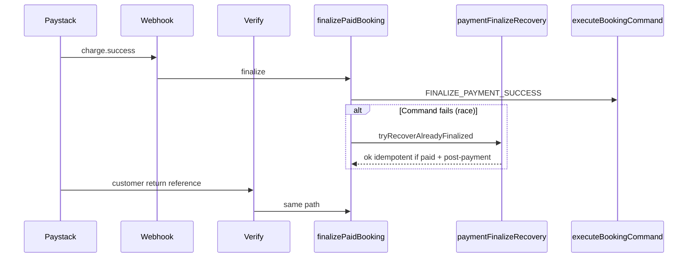
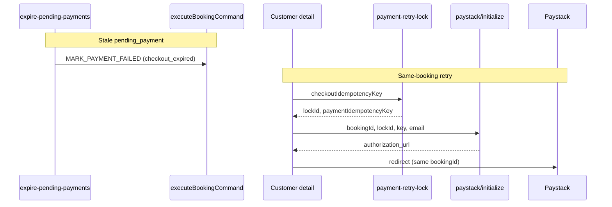
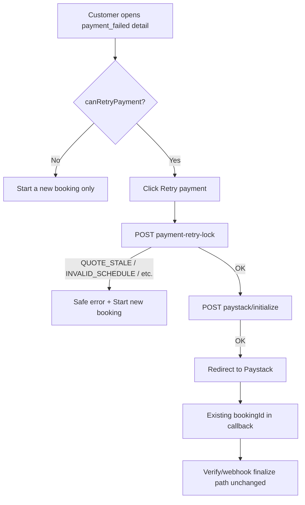

# Stage 2B — Payment edge safety final audit

**Date:** 2026-05-17  
**Type:** Audit only — no implementation changes in this pass  
**Baseline:** [Stage 2A audit](./stage-2a-payment-edge-safety-audit.md) (2026-05-16)  
**Scope:** Payment finalize recovery, abandoned-checkout expiry, `payment_failed` UX, same-booking retry (2B-2a → 2B-2c-3)

---

## Executive summary

Stage 2B addresses the highest-severity gaps identified in Stage 2A: **verify/webhook race false failures**, **stuck `pending_payment` abandonment**, **customer/admin visibility for failed checkout**, and **same-booking Paystack retry** without duplicating bookings.

| Area | Stage 2A | After Stage 2B |
|------|----------|----------------|
| Concurrent webhook + verify | Loser could show `PERSISTENCE_ERROR` on success page | Recovery + idempotent success when already paid |
| Abandoned checkout | `payment_link_expires_at` unused; no expiry job | Cron → `MARK_PAYMENT_FAILED` (`checkout_expired`) |
| Customer recovery | “Start new booking” only | Production retry-lock → initialize on same `bookingId` |
| Paystack `charge.failed` | Unwired | **Still unwired** (deferred Stage 2B-3) |
| Assignment / earnings / RLS / finalize RPC | — | **Unchanged** (verified by scope + migration inventory) |

**Final verdict:** **Approved for production rollout** of Stage 2B edge handling **before** Stage 2B-3 (`charge.failed` webhook), **provided** the pending-payment expiry cron is scheduled with `CRON_SECRET`, migrations are applied, and ops accept that card declines remain `pending_payment` until cron grace elapses (not real-time failure).

---

## Verification checklist (15 items)

| # | Requirement | Status | Evidence |
|---|-------------|--------|----------|
| 1 | Webhook/verify race recovery | **Pass** | `paymentFinalizeRecovery.ts` + `finalizePaidBookingWithDeps`; tests: webhook-first/verify-first recovery |
| 2 | Already-finalized paid → success/idempotent | **Pass** | Command idempotency + `tryRecoverAlreadyFinalizedPayment`; `paystackFoundation` duplicate finalize; `PaymentSuccessVerifier` copy |
| 3 | Abandoned `pending_payment` → `payment_failed` | **Pass** | `expirePendingPayments.ts`; tests mark stale rows |
| 4 | Expiry uses `MARK_PAYMENT_FAILED` only | **Pass** | `expirePendingPayments` calls `executeBookingCommand({ type: "MARK_PAYMENT_FAILED", ... })` — no direct status SQL |
| 5 | Cron route `CRON_SECRET` protected | **Pass** | `verifyCronSecret` + route 401; route tests |
| 6 | `payment_failed` customer display | **Pass** | `paymentFailureDisplay`, `PaymentIssuePanel`, customer detail page |
| 7 | `checkout_expired` copy when `failure_reason` set | **Pass** | `CHECKOUT_EXPIRED_FAILURE_REASON`; cron metadata; display tests |
| 8 | Admin failure/expiry context | **Pass** | Admin list/detail badges + read model `paymentFailureReason` |
| 9 | Retry creates lock, not duplicate booking | **Pass** | `createPaymentRetryLock` — no `CREATE_BOOKING`; test explicit |
| 10 | Retry initialize uses existing booking | **Pass** | `initializePayment` + `MARK_PAYMENT_PENDING` from `payment_failed`; lock tests |
| 11 | Retry hidden for paid/confirmed/assigned/etc. | **Pass** | `assessPaymentRetryEligibility`; retry-lock rejects confirmed/paid |
| 12 | Retry fails safely (stale quote, schedule, cleaner, active lock) | **Pass** | API codes + `mapRetryPaymentError`; createPaymentRetryLock tests |
| 13 | Amount mismatch still fails | **Pass** | `finalizePaidBooking` `AMOUNT_MISMATCH`; recovery test excludes recovery |
| 14 | Wrong customer/reference still fails | **Pass** | `verifyPayment` `FORBIDDEN`; `initializePayment` guards; foundation tests |
| 15 | No assignment/earnings/RLS/enum/finalize RPC changes | **Pass** | See §“Out-of-scope integrity” |

---

## Before vs after (customer-visible)

### Payment success path

| Scenario | Before (2A) | After (2B) |
|----------|-------------|------------|
| Webhook wins, verify runs second | Risk: error on `/payment/success` | Returns success with `recoveredFromAlreadyFinalized` |
| Verify wins, webhook runs second | Idempotent at command layer | Same + explicit recovery path documented |
| Duplicate finalize same reference | Partially idempotent | Explicit recovery + tests |

### Abandoned checkout

| Scenario | Before | After |
|----------|--------|-------|
| Customer leaves Paystack open | Booking stuck `pending_payment` indefinitely | After grace past `payment_link_expires_at`, cron → `payment_failed` |
| Customer sees status | Unclear / looked “upcoming” in places | Badge “Checkout expired” or “Payment failed”; no assignment promise |

### Failed payment recovery

| Scenario | Before | After |
|----------|--------|-------|
| `payment_failed` detail | “Start a new booking” only | **Retry payment** when eligible + always “Start a new booking” |
| Retry mechanism | N/A | `POST payment-retry-lock` → `POST paystack/initialize` → redirect (same `bookingId`) |

### Still deferred (2B-3)

| Scenario | After 2B | Notes |
|----------|----------|-------|
| Paystack `charge.failed` / declined charge | Booking may stay `pending_payment` until cron | Webhook still handles `charge.success` only (`handlePaystackWebhook.ts`) |
| Real-time failure UX | Cron-bound, not instant | Acceptable if cron runs every 5–15 min |

---

## Files changed across Stage 2B

Grouped by sub-stage (paths relative to repo root).

### 2B-1 — Finalize race recovery

| File | Role |
|------|------|
| `src/features/payments/server/paymentFinalizeRecovery.ts` | Recovery helpers |
| `src/features/payments/server/paymentFinalizeRecovery.test.ts` | Race + amount mismatch regression |
| `src/features/payments/server/finalizePaidBooking.ts` | Invokes recovery on recoverable command failure |
| `src/features/payments/server/verifyPayment.ts` | Surfaces `recoveredFromAlreadyFinalized` |
| `src/features/payments/server/upsertBookingFromPaystack.ts` | Propagates recovery flag |
| `src/app/payment/success/PaymentSuccessVerifier.tsx` | Idempotent success messaging |
| `src/app/payment/success/PaymentSuccessVerifier.test.ts` | UI copy tests |

### 2B-2a — Abandoned checkout expiry

| File | Role |
|------|------|
| `src/features/payments/server/expirePendingPayments.ts` | Cron service |
| `src/features/payments/server/expirePendingPayments.test.ts` | Stale detection + command path |
| `src/features/payments/server/constants.ts` | Grace/batch constants |
| `src/app/api/cron/expire-pending-payments/route.ts` | HTTP cron entry |
| `src/app/api/cron/expire-pending-payments/route.test.ts` | Auth + handler |
| `src/lib/cron/verifyCronSecret.ts` | Shared secret validation |
| `src/lib/cron/verifyCronSecret.test.ts` | Secret tests |
| `src/features/bookings/server/commands/bookingCommandGuards.ts` | `MARK_PAYMENT_PENDING` from `payment_failed` |
| `docs/operations/expire-pending-payments-cron.md` | Ops runbook |
| `docs/architecture/stage-2b-2-abandoned-checkout-expiry-design.md` | Design |

### 2B-2b — Payment failed UX

| File | Role |
|------|------|
| `src/features/bookings/server/paymentFailureDisplay.ts` | Labels + panel copy |
| `src/features/bookings/server/paymentFailureDisplay.test.ts` | Copy tests |
| `src/components/dashboard/PaymentIssuePanel.tsx` | Customer panel |
| `src/features/dashboards/server/customerBookingReadModel.ts` | `paymentFailureReason` |
| `src/features/dashboards/server/adminOperationsReadModel.ts` | Admin reason |
| `src/app/(customer)/customer/bookings/[bookingId]/page.tsx` | Panel wiring |
| `src/app/(admin)/admin/bookings/page.tsx` | List badges |
| `src/app/(admin)/admin/bookings/[bookingId]/page.tsx` | Detail banner |
| `docs/operations/payment-failed-customer-retry.md` | Customer retry ops (updated in 2c-3) |

### 2B-2c — Same-booking retry

| File | Role |
|------|------|
| `supabase/migrations/20260517210000_booking_lock_retry_active_unique.sql` | One active lock per booking |
| `src/features/bookings/server/lock/createPaymentRetryLock.ts` | Retry lock service |
| `src/features/bookings/server/lock/createPaymentRetryLock.test.ts` | Eligibility + idempotency |
| `src/features/bookings/server/lock/parseRetryLockFromBooking.ts` | Metadata parse |
| `src/app/api/bookings/[bookingId]/payment-retry-lock/route.ts` | API route |
| `src/app/api/bookings/[bookingId]/payment-retry-lock/route.test.ts` | Route tests |
| `src/features/bookings/server/paymentRetryEligibility.ts` | UI visibility |
| `src/features/bookings/server/paymentRetryEligibility.test.ts` | Eligibility tests |
| `src/features/payments/client/retryPaymentFlow.ts` | Client lock → initialize |
| `src/features/payments/client/retryPaymentFlow.test.ts` | Flow order + errors |
| `src/components/dashboard/RetryPaymentButton.tsx` | Retry CTA |
| `docs/architecture/stage-2b-2c-same-booking-payment-retry-design.md` | Design |

**Not modified (confirmed):** `runAssignmentAfterPayment.ts`, earnings feature modules, `20260516160000_rls_role_security.sql`, `booking_finalize_payment_success` in `20260515203000_booking_command_layer.sql`, booking status enum in `20260515201500_core_foundation.sql`.

---

## Payment lifecycle map (after Stage 2B)

### Success authority (unchanged architecture, hardened reads)

### Abandonment + retry (new)

---

## Customer UX summary

| Surface | Behavior |
|---------|----------|
| Booking list / home | `payment_failed` badge: “Checkout expired” or “Payment failed”; not treated as upcoming job |
| Booking detail (`payment_failed`) | Red **Payment not completed** panel; reason-specific body |
| Retry | **Retry payment** when `canRetryPayment` (server eligibility); opens Paystack on same booking |
| Fallback | **Start a new booking** always visible on failure panel |
| Success page | “Payment already confirmed” when verify recovers already-finalized state |

**Retry button shown only when:** `payment_failed`, customer owner, `BOOKING_LOCK_REQUIRED=true`, valid quote metadata, price matches live quote, future schedule, no `paid` payment.

---

## Admin UX summary

| Surface | Behavior |
|---------|----------|
| Booking list | Danger badge: “Checkout expired” or “Payment failed” |
| Booking detail | Alert when `paymentFailureReason === checkout_expired`; explains no assignment until paid |
| Actions | Read-only — no force-expire or status override in this stage |

---

## Retry flow diagram

---

## Test evidence

### Commands run (2026-05-17)

| Command | Result |
|---------|--------|
| `npm run typecheck` | **Pass** |
| Stage 2B targeted vitest (15 files, 93 tests) | **Pass** |
| `src/tests/security/rls-policies.integration.test.ts` | **Skipped** — `beforeAll` hook timeout (no local Supabase / gate); not a regression signal for Stage 2B |

### Targeted suite breakdown

| File | Tests | Focus |
|------|-------|-------|
| `paymentFinalizeRecovery.test.ts` | 9 | Race recovery, amount mismatch no recovery |
| `verifyPayment.test.ts` | — | Wrong customer, recovery flag |
| `paystackFoundation.test.ts` | — | Duplicate finalize, amount mismatch |
| `expirePendingPayments.test.ts` | — | Stale → `payment_failed`, idempotent cron key |
| `expire-pending-payments/route.test.ts` | — | 401 without secret |
| `verifyCronSecret.test.ts` | — | Bearer / header |
| `paymentFailureDisplay.test.ts` | — | checkout_expired copy |
| `paymentRetryEligibility.test.ts` | 6 | Visibility rules |
| `createPaymentRetryLock.test.ts` | 9 | No duplicate booking, stale quote, active lock |
| `initializePayment.lock.test.ts` | — | Lock + quote mismatch |
| `payment-retry-lock/route.test.ts` | — | Route delegation |
| `retryPaymentFlow.test.ts` | — | Lock then initialize order |
| `executeBookingCommand.test.ts` | — | `MARK_PAYMENT_FAILED` / pending transitions |
| `dashboardReadModels.test.ts` | — | Customer/admin `paymentFailureReason`, `canRetryPayment` |
| `PaymentSuccessVerifier.test.ts` | — | Idempotent success copy |

---

## Remaining risks

| Risk | Severity | Mitigation |
|------|----------|------------|
| **`charge.failed` not wired (2B-3)** | Medium | Schedule expiry cron; monitor `pending_payment` age; implement 2B-3 for real-time declines |
| **Cron not scheduled** | High | Apply ops doc: Vercel cron or Supabase `pg_net` + `CRON_SECRET` |
| **Cleaner ineligible shown in UI** | Low | API returns `CLEANER_INELIGIBLE` on click; eligibility does not pre-check cleaner |
| **Active lock blocks retry** | Low | Customer message + wait for lock TTL |
| **Assignment after payment** | Medium (pre-existing) | Unchanged; paid bookings can still lack offers if assignment hook fails |
| **RLS not re-run in CI** | Low | Run `rls-policies.integration.test.ts` against staging Supabase before major release |
| **No pg_cron migration for payment expiry** | Low | Manual/external scheduler required (same pattern as documented for 2B-2a) |

---

## Production rollout checklist

- [ ] Apply migration `20260517210000_booking_lock_retry_active_unique.sql`
- [ ] Set `BOOKING_LOCK_REQUIRED=true` in production
- [ ] Set `CRON_SECRET` in production (strong random value)
- [ ] Schedule `GET` or `POST` `/api/cron/expire-pending-payments` (recommended every 5–15 minutes)
- [ ] Confirm Paystack webhook + verify env vars unchanged
- [ ] Smoke test: happy-path pay → `confirmed` / `pending_assignment`
- [ ] Smoke test: abandon checkout → wait grace → `payment_failed` + “Checkout expired”
- [ ] Smoke test: eligible `payment_failed` → Retry payment → Paystack → success
- [ ] Monitor: `payment_failed` count, cron `expired` metric, false `PERSISTENCE_ERROR` on verify (should be near zero)

---

## Rollback plan

| Layer | Rollback action |
|-------|-----------------|
| **UI retry** | Hide retry by setting `BOOKING_LOCK_REQUIRED=false` (disables production retry button; not ideal long-term) |
| **Cron expiry** | Disable cron job (bookings stop auto-expiring; manual ops) |
| **Recovery code** | Revert deploy to pre-2B build (reintroduces race false failures on success page) |
| **DB migration** | Do **not** drop partial unique index without ops review; historical locks may exist |

Prefer **forward fix** over migration rollback for `booking_locks_one_active_per_booking_idx`.

---

## Out-of-scope integrity (checkpoint 15)

| Area | Finding |
|------|---------|
| Assignment engine | No Stage 2B edits to `runAssignmentAfterPayment` or offer creation logic |
| Earnings | No payment-edge changes under earnings modules |
| RLS | No new RLS migrations after `20260516160000_rls_role_security.sql` |
| Booking status enum | Still uses `payment_failed` (no `payment_expired` status added) |
| `booking_finalize_payment_success` RPC | Only defined in `20260515203000_booking_command_layer.sql`; unchanged |
| Webhook handler | Still `charge.success` only — 2B-3 scope |

---

## Final question: deploy Stage 2B before Stage 2B-3?

**Yes — with conditions.**

Stage 2B **improves** production safety for the **payment success path** (race recovery, idempotent reads) and **abandonment** (cron expiry, customer retry). It does **not** depend on 2B-3 to avoid breaking successful charges.

Stage 2B-3 (`charge.failed` → `MARK_PAYMENT_FAILED`) is a **complementary** improvement for **declined/failed charges** while checkout is still open. Without it:

- Declined Paystack charges may leave bookings in `pending_payment` until the expiry cron runs.
- Customers will not see instant “payment failed” from the gateway for declines (only after cron or manual ops).

That gap is **acceptable for rollout** if:

1. Expiry cron is live and monitored.
2. Support knows declines are cron-bound until 2B-3 ships.
3. Happy-path webhook delivery remains reliable (unchanged requirement from 2A).

**Do not** delay 2B deploy solely to wait for 2B-3 unless the business requires real-time decline UX on day one.

---

## Verdict

| Question | Answer |
|----------|--------|
| Did Stage 2B stabilize payment edge handling? | **Yes** — recovery, expiry, visibility, same-booking retry |
| Is the payment success path broken? | **No evidence** — 93 targeted tests pass; recovery paths covered |
| Safe before 2B-3 webhook? | **Yes, conditional** — cron + secrets + accept decline latency |
| Stage 2B complete? | **Yes** for scoped work; **2B-3 remains the next payment-edge increment |
