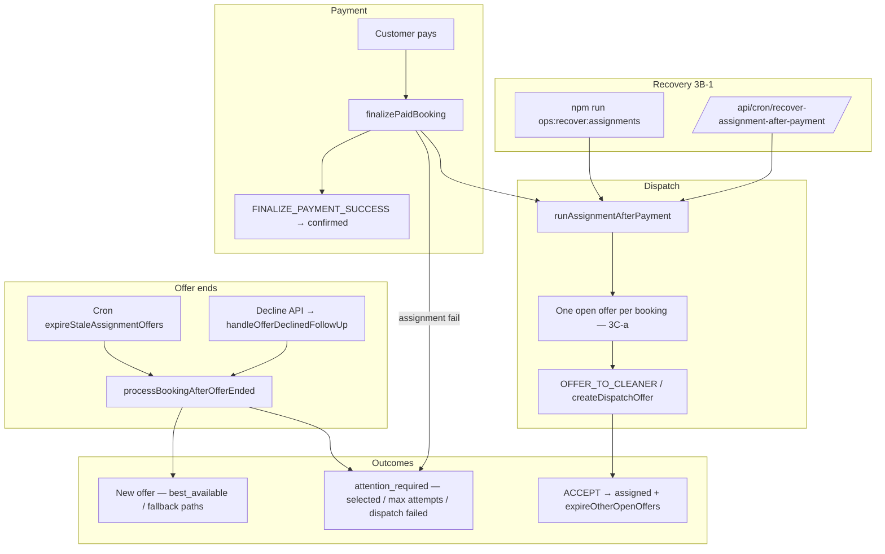

# Stage 3 Final Audit — Assignment Reliability & Race Safety

**Date:** 2026-05-17  
**Scope:** Stage 3A (baseline audit) → 3B-1 (recovery) → 3B-2 (decline redispatch + visibility) → 3C-a (global one-open-offer protection).  
**Type:** Audit only — no new features implemented in this pass.

**Related:**

- [stage-3a-assignment-dispatch-reliability-audit.md](./stage-3a-assignment-dispatch-reliability-audit.md)
- [stage-3b-assignment-recovery-redispatch-final-audit.md](./stage-3b-assignment-recovery-redispatch-final-audit.md)
- [stage-3c-offer-race-global-duplicate-protection-design.md](../architecture/stage-3c-offer-race-global-duplicate-protection-design.md)
- [assignment-recovery.md](../operations/assignment-recovery.md)
- [assignment-decline-redispatch.md](../operations/assignment-decline-redispatch.md)
- [assignment-offer-race-protection.md](../operations/assignment-offer-race-protection.md)

---

## Executive summary

| Area | Verdict | Notes |
|------|---------|-------|
| Post-payment failure observability (3B-1) | **Pass** | Log + `attention_required` metadata; admin **Paid — dispatch not started** |
| Recovery cron/script (3B-1) | **Pass** | `CRON_SECRET`; re-validates candidates; idempotent assignment |
| Decline/expiry redispatch (3B-2) | **Pass** | Shared `processBookingAfterOfferEnded`; selected stays admin-only |
| Customer/admin UX (3B-2b) | **Pass** | Calm redispatch copy; visibility keys wired in read models |
| Global one-open-offer (3C-a) | **Pass** | Migration + backfill + command guard + `isOfferOpenForOps` alignment |
| Payment finalize | **Pass** | Still succeeds when assignment fails; observability only added |
| Cleaner accept | **Pass** | Command path unchanged; tests green |
| Earnings preview | **Pass** | No assignment-module changes to earnings |
| RLS / assignment enums | **Pass** | No Stage 3 RLS or enum migrations for assignment |
| Team assignment | **Deferred** | `teamSize: 1` in dispatch context; index comment documents future slot model |

**Final recommendation:** **Stage 3 is complete and safe enough to begin Stage 4**, provided production has the **3C-a migration applied**, recovery and offer-expiry crons are scheduled, and the app build including 3B + 3C-a is deployed. Carry forward known deferred items (transactional accept, admin manual dispatch API, team assignment) as explicit Stage 4+ scope — not blockers for closing Stage 3.

---

## Before vs after (Stage 3A → Stage 3 complete)

| Scenario | Stage 3A (before) | After Stage 3 (3B + 3C-a) |
|----------|-------------------|---------------------------|
| Paid booking, assignment throws | Payment OK; booking stuck `confirmed`; easy to miss | Payment OK; `post_payment_assignment_failed` log + metadata; admin badge |
| Paid `confirmed`, no dispatch after grace | No sweeper | Recovery cron / `ops:recover:assignments` |
| `best_available` decline | `attention_required`; path often lost | Auto-redispatch; path preserved |
| `fallback_best_available` decline | Same gap | Same redispatch policy as best_available |
| `selected` decline | Admin attention | Still **no** silent fallback |
| Offer expiry | Cron redispatch | Unchanged; shared orchestrator with decline |
| Two open offers to different cleaners | Possible under concurrency | **Blocked** — DB partial unique + `OPEN_OFFER_EXISTS` |
| Stale `offered` past TTL blocks redispatch | `runAssignmentAfterPayment` treated any `offered` as open | Uses `isOfferOpenForOps`; command expires stale rows before insert |
| Customer during redispatch | Generic **Needs assignment** | Calm *finding another cleaner* copy |
| Max dispatch attempts | Implicit cap in engine | `attention_required` + admin label |

---

## Assignment lifecycle (after Stage 3)



**Statuses:** `pending_payment` → `confirmed` → `pending_assignment` → `assigned`. Recovery targets paid **`confirmed`** bookings with no cleaner and no ops-open/accepted offers after grace.

---

## Recovery flow (3B-1)

| Step | Behavior |
|------|----------|
| Detection | `isAssignmentRecoveryCandidate` — paid, `confirmed`, no `cleaner_id`, no `isOfferOpenForOps` / accepted offers, past `ASSIGNMENT_RECOVERY_GRACE_MINUTES` |
| Surface | `assignmentResultNeedsDispatchAttention` + `handlePostPaymentAssignmentFailure` on finalize; admin `dispatch_not_started` |
| Remediation | `runAssignmentRecoveryBatch` → `runAssignmentAfterPayment` per candidate |
| Auth | `verifyCronSecret` on cron route; service-role backend |
| Idempotency | Re-check candidate before dispatch; assignment idempotency keys unchanged |

**Code:** `finalizePaidBooking.ts`, `runAssignmentRecovery.ts`, `recover-assignment-after-payment/route.ts`, `isAssignmentRecoveryCandidate.ts`.

---

## Decline / expiry redispatch policy (3B-2)

Shared orchestrator: `processBookingAfterOfferEnded({ outcome: 'declined' | 'expired' })`.

| Path | Decline | Expiry (cron) |
|------|---------|---------------|
| `best_available` | Auto-redispatch (exclude prior declined/expired/cancelled cleaners) | Same |
| `fallback_best_available` | Auto-redispatch | Same |
| `selected` | `attention_required`, no new offer | Admin attention |
| Max 5 offer rows | `attention_required` | Same |

**Guards:** `hasOpenOffer` (`isOfferOpenForOps`) before redispatch; decline follow-up only when decline is non-idempotent.

**Code:** `handleOfferDeclinedFollowUp.ts`, `processBookingAfterOfferEnded.ts`, `expireOffers.ts` → `processBookingAfterOfferExpiry.ts`.

---

## Duplicate-offer protection (3C-a)

| Layer | Mechanism |
|-------|-----------|
| **Migration** | `20260517300000_assignment_offer_one_open_per_booking.sql` |
| **Backfill** | Duplicate `offered` per booking → keep newest; older → `cancelled` (no deletes) |
| **DB** | `idx_assignment_offers_one_open_per_booking` — unique `(booking_id) WHERE status = 'offered'` |
| **Per-cleaner index** | `idx_assignment_offers_one_open_per_cleaner` — preserved |
| **Command** | `OFFER_TO_CLEANER` — expire stale `offered`; reject second cleaner with `OPEN_OFFER_EXISTS`; catch unique violation |
| **Dispatch short-circuit** | `runAssignmentAfterPayment` uses `isOfferOpenForOps` (not raw stale `offered`) |

**Ops:** [assignment-offer-race-protection.md](../operations/assignment-offer-race-protection.md)

**Team caveat:** Global unique assumes single-cleaner dispatch; team work must replace with slot-based uniqueness.

---

## Customer / admin UX (3B-2b)

Resolver: `resolveAssignmentVisibility` → read models → UI.

| Key | Admin | Customer |
|-----|-------|----------|
| `dispatch_not_started` | Paid — dispatch not started | — |
| `decline_redispatched` | Cleaner declined — redispatched | Finding another cleaner (calm) |
| `offer_sent` | Offer sent — awaiting acceptance | — |
| `finding_cleaner` | Finding cleaner | Calm copy when applicable |
| `selected_declined_admin` | Selected cleaner declined — admin action needed | Reviewing availability |
| `max_attempts_admin` | No cleaner accepted after dispatch attempts | Reviewing availability |
| `needs_assignment` | Needs assignment | Warning only when appropriate |

`showCustomerAssignmentWarning: false` during active redispatch suppresses scary **Needs assignment** during auto-redispatch.

---

## Audit checklist (18 items)

| # | Check | Result | Evidence |
|---|-------|--------|----------|
| 1 | Post-payment assignment failure observable | **Pass** | `handlePostPaymentAssignmentFailure`; `dispatch_not_started` visibility |
| 2 | Paid `confirmed` without dispatch recoverable | **Pass** | `isAssignmentRecoveryCandidate`; recovery cron + CLI script |
| 3 | Recovery cron/script protected and idempotent | **Pass** | `verifyCronSecret`; `stillRecoveryCandidate`; `assignmentRecovery.test.ts`, `route.test.ts` |
| 4 | `best_available` decline redispatches | **Pass** | `processBookingAfterOfferEnded.test.ts` |
| 5 | `fallback_best_available` decline redispatches | **Pass** | Same test file — fallback case |
| 6 | `selected` decline admin-only | **Pass** | `handleOfferDeclinedFollowUp` early return; selected test — no auto-offer |
| 7 | Expiry behavior stable | **Pass** | `expireOffers.test.ts`; expiry wrapper unchanged semantics |
| 8 | Customer copy calm during redispatch | **Pass** | `resolveAssignmentVisibility.test.ts` |
| 9 | Admin assignment labels accurate | **Pass** | `labelForAssignmentVisibilityKey`; `dashboardReadModels.test.ts` |
| 10 | One-open-offer DB constraint exists | **Pass** | `20260517300000_*.sql`; migration static test; **pushed to remote** (2026-05-17) |
| 11 | Duplicate offered rows backfilled safely | **Pass** | Migration `ranked` CTE → `cancelled`; no `DELETE` |
| 12 | `OFFER_TO_CLEANER` blocks second open offer | **Pass** | `OPEN_OFFER_EXISTS`; `executeBookingCommand.test.ts` |
| 13 | Stale open offers do not block redispatch forever | **Pass** | Command expires stale `offered`; `runAssignmentAfterPayment.openOffer.test.ts` |
| 14 | Cleaner accept flow works | **Pass** | `executeBookingCommand.test.ts`, `assignmentEngine.test.ts`, accept API in `dashboardReadModels.test.ts` |
| 15 | Earnings preview unchanged | **Pass** | No `features/earnings` edits in assignment Stage 3 work |
| 16 | Payment finalize unchanged except observability | **Pass** | `finalizePaidBookingAssignment.test.ts`, `paymentFinalizeRecovery.test.ts` |
| 17 | No RLS or assignment enum changes in Stage 3 assignment work | **Pass** | 3B app-only; 3C-a index-only migration |
| 18 | Team assignment explicitly deferred | **Pass** | `assignmentContext.ts` `teamSize: 1`; design + index comment |

---

## Test evidence

**Commands run (2026-05-17):**

```text
npm run typecheck                                    → pass
npx vitest run (14 Stage 3-targeted files, 103 tests) → pass
```

**Files exercised:**

| File | Focus |
|------|--------|
| `assignmentRecovery.test.ts` | Recovery candidates, batch, duplicate guard |
| `recover-assignment-after-payment/route.test.ts` | Cron auth |
| `finalizePaidBookingAssignment.test.ts` | Payment OK when assignment fails |
| `paymentFinalizeRecovery.test.ts` | Paystack idempotent finalize |
| `processBookingAfterOfferEnded.test.ts` | Decline/expiry redispatch, max attempts |
| `expireOffers.test.ts` | Expiry cron |
| `resolveAssignmentVisibility.test.ts` | Admin + customer copy |
| `assignmentEngine.test.ts` | End-to-end dispatch, accept, decline |
| `runAssignmentAfterPayment.openOffer.test.ts` | Stale vs ops-open offer (3C-a) |
| `executeBookingCommand.test.ts` | Global offer guard, accept, decline redispatch |
| `dashboardReadModels.test.ts` | Admin queue, accept API |
| `parseBookingDisplay.test.ts` | Display enrichment |
| `assignment-offer-one-open-per-booking.migration.test.ts` | Migration SQL shape |
| `rls-policies.integration.test.ts` | RLS regression (8 tests) |

**Post-deploy SQL (recommended once per environment):**

```sql
select indexname from pg_indexes
where indexname = 'idx_assignment_offers_one_open_per_booking';

select booking_id, count(*) from assignment_offers
where status = 'offered' group by booking_id having count(*) > 1;
```

---

## Schema / migration notes (Stage 3)

| Migration | Stage | Assignment impact |
|-----------|-------|-------------------|
| `20260517300000_assignment_offer_one_open_per_booking.sql` | **3C-a** | Backfill + global partial unique on `offered` |
| `20260517210000_booking_lock_retry_active_unique.sql` | 2B-2c (adjacent) | Payment retry locks — not assignment logic |
| `20260517_*` / `20260517160000_*` | 1C | Auth/customer — re-applied during 2026-05-17 `db push` repair |

No new `assignment_offer_status` enum values in Stage 3. RLS policies on `assignment_offers` unchanged since `20260516160000_rls_role_security.sql`.

---

## Production rollout checklist

- [x] Apply migrations through `20260517300000` on remote (completed 2026-05-17 via `npx supabase db push`)
- [ ] Deploy application build containing 3B-1, 3B-2a/b, 3C-a command guards
- [ ] `CRON_SECRET` set; schedule **`/api/cron/recover-assignment-after-payment`** (5–15 min)
- [ ] Schedule **`/api/cron/expire-assignment-offers`** (existing)
- [ ] Smoke: pay → offer → accept
- [ ] Smoke: pay → simulate assignment failure → admin **Paid — dispatch not started** → recovery
- [ ] Smoke: decline on `best_available` → redispatch; customer calm message
- [ ] Smoke: selected decline → admin only, no second auto-offer
- [ ] Verify SQL: one-open-offer index present; zero duplicate `offered` rows per booking
- [ ] Brief support on [assignment-offer-race-protection.md](../operations/assignment-offer-race-protection.md)

---

## Rollback plan

| Layer | Action |
|-------|--------|
| **App** | Redeploy previous build. Payment, accept, earnings, RLS unchanged by Stage 3 app rollback alone. |
| **3C-a DB** | `drop index if exists idx_assignment_offers_one_open_per_booking;` — removes enforcement; command guard optional fallback |
| **3B crons** | Disable recovery cron only; expiry cron can remain |
| **Backfill** | Cancelled duplicate rows need not be reversed |

Do **not** roll back payment finalize RPC or RLS as part of Stage 3 rollback.

---

## Remaining risks (carried to Stage 4+)

| Risk | Severity | Notes |
|------|----------|-------|
| Accept not transactional with offer update (R5) | Medium | Re-accept idempotent if booking already `assigned`; offer row may lag |
| Near-simultaneous accept (two cleaners) | Low (reduced) | 3C-a prevents two open offers; booking RPC still serializes assignment |
| Admin manual dispatch API | Medium (ops) | Queue + metadata; no first-class admin offer UI |
| `attention_required` blocks `runAssignmentAfterPayment` retry | Low | By design; admin must clear or redispatch via decline/expiry paths |
| Team `teamSize > 1` quoted but one cleaner dispatched | Medium (product) | Documented deferral; not a race bug |
| Migration history orphans (`20260516201114`) | Low | Repaired via `migration repair`; monitor `migration list` on new envs |
| Cron batch limits / grace tuning | Low | `EXPIRE_OFFERS_BATCH_SIZE`, `ASSIGNMENT_RECOVERY_GRACE_MINUTES` |

**Explicitly deferred (not Stage 3 scope):**

- Transactional accept RPC (3B-3 / Stage 4)
- Admin `OFFER_TO_CLEANER` UI (3B-4)
- Team assignment with parallel offers (3B-6 / Stage 4+)
- Load tests for concurrent HTTP accepts

---

## Final verdict

**Stage 3 is complete** against its stated goals:

1. **Reliability** — Paid-but-unassigned bookings are observable and recoverable; decline and expiry share one redispatch policy; selected path does not silently fallback.
2. **Race safety (MVP)** — Global one-open-offer per booking is enforced in DB and command layer; stale TTL rows no longer block dispatch indefinitely.
3. **Safety boundaries** — Payment finalize, accept semantics, earnings, and RLS were not regressed in targeted tests.

---

## Is Stage 3 complete and safe enough to move to Stage 4?

**Yes**, with these conditions:

| Condition | Status |
|-----------|--------|
| Remote DB at `20260517300000` | Done (user `db push` 2026-05-17) |
| App deploy includes 3B + 3C-a | Confirm in hosting pipeline |
| Recovery + expiry crons enabled | Ops checklist |
| Stage 4 scope owns deferred items | Transactional accept, admin dispatch UI, team assignment |

Stage 4 should **not** re-open Stage 3 payment/accept/earnings/RLS unless a new feature requires it. Treat remaining accept-transaction and admin-dispatch gaps as **new work**, not Stage 3 blockers.

**Recommended next focus for Stage 4 (suggested, not prescribed):** admin assignment operations (manual offer/dispatch), transactional accept hardening, and/or team dispatch design — pick one vertical slice at a time with the same audit pattern used here.
