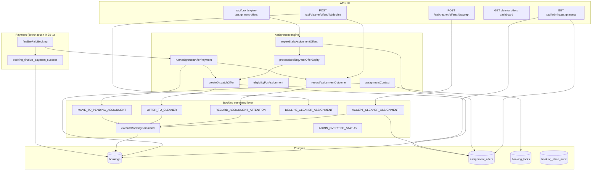
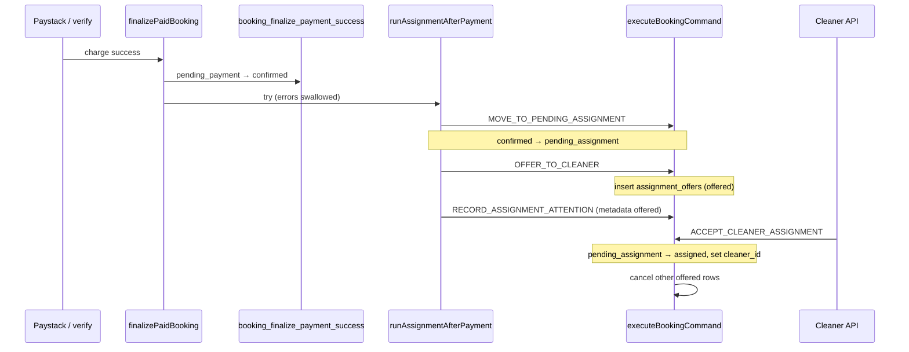
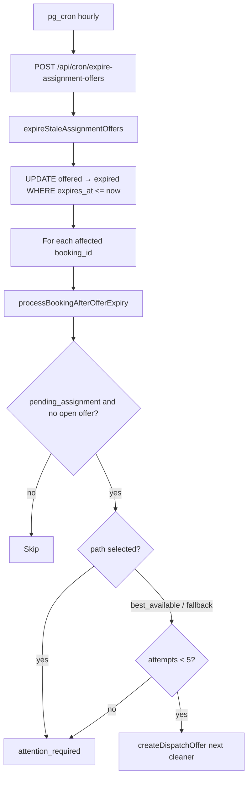

# Stage 3A — Assignment & Dispatch Reliability Audit

**Date:** 2026-05-17  
**Scope:** Full cleaner assignment lifecycle — offers, accept/decline, dispatch paths, expiry, redispatch, admin visibility, post-payment trigger, orphans, earnings preview during assignment.  
**Type:** Audit only — no code, migrations, RLS, payment finalize, or earnings formula changes.

**Related docs:** [assignment-engine.md](../assignments/assignment-engine.md), [expire-assignment-offers-cron.md](../operations/expire-assignment-offers-cron.md), [cleaner-offer-expiration-system-audit.md](./cleaner-offer-expiration-system-audit.md), [stage-2a-payment-edge-safety-audit.md](./stage-2a-payment-edge-safety-audit.md), [cleaner-login-identity-offer-visibility-audit.md](./cleaner-login-identity-offer-visibility-audit.md)

---

## Executive summary

| Area | Rating | Summary |
|------|--------|---------|
| Core offer lifecycle | **Good** | Commands, partial unique index, accept cancels siblings, idempotent accept/decline |
| Post-payment dispatch | **Medium risk** | Assignment failures swallowed; booking can stay `confirmed` with no offer |
| Expiry & cron | **Good** (since cron shipped) | Hourly `expireStaleAssignmentOffers`; `best_available` auto-redispatch |
| Selected-cleaner policy | **By design** | No auto-redispatch after expiry/decline — admin must act |
| Decline handling | **Gap** | Always `attention_required`; no auto-redispatch for `best_available` |
| Concurrent accept | **Mostly safe** | `booking_apply_transition` uses `FOR UPDATE`; no offer-row lock |
| Team assignment | **Not implemented** | `teamSize` forced to `1` in assignment context |
| Admin manual dispatch | **Read-only UI** | Queue exists; no admin API to create offers |
| Operational recovery | **Partial** | E2E-scoped repair script; no production assignment sweeper |
| Test coverage | **Good unit** | Missing concurrent-accept, confirmed-stuck, production repair tests |

**Escalation** in this codebase means `metadata.assignment.status = attention_required` plus admin queue visibility — there is no multi-tier automated escalation table or workflow.

---

## 1. Architecture map

### 1.1 Module boundaries



### 1.2 Key files

| Concern | Path |
|---------|------|
| Post-payment orchestrator | `src/features/assignments/server/runAssignmentAfterPayment.ts` |
| Offer creation | `src/features/assignments/server/createDispatchOffer.ts` |
| Accept / decline wrappers | `src/features/assignments/server/respondToOffer.ts` |
| Expiry batch + follow-up | `src/features/assignments/server/expireOffers.ts`, `processBookingAfterOfferExpiry.ts` |
| Command implementation | `src/features/bookings/server/commands/executeBookingCommand.ts` |
| Payment trigger | `src/features/payments/server/finalizePaidBooking.ts` |
| Cleaner offers read | `src/features/assignments/server/getCleanerOffers.ts` |
| Admin queue | `src/features/dashboards/server/adminOperationsReadModel.ts` |
| E2E repair | `src/scripts/repairOrphanedAssignments.ts` |
| Schema | `supabase/migrations/20260515201500_core_foundation.sql`, `20260516200000_assignment_offer_integrity.sql` |
| Cron | `supabase/migrations/20260516220000_expire_assignment_offers_cron.sql` |

### 1.3 Data model

**`assignment_offers`**

| Column | Role |
|--------|------|
| `id` | PK |
| `booking_id` | FK → `bookings` (CASCADE) |
| `cleaner_id` | FK → `cleaners` (CASCADE) |
| `status` | `offered` \| `accepted` \| `declined` \| `expired` \| `cancelled` |
| `offered_at`, `responded_at`, `expires_at` | Lifecycle timestamps |
| `created_at`, `updated_at` | Audit |

**Constraints**

- Partial unique: one `offered` row per `(booking_id, cleaner_id)` — `idx_assignment_offers_one_open_per_cleaner`
- Partial index on `expires_at` where `status = 'offered'` — cron selection
- **No** global “one open offer per booking” constraint (multiple cleaners could have `offered` rows if created incorrectly)

**`bookings.metadata.assignment`** (application snapshot, not enforced by DB)

```typescript
{
  engineVersion: "2026-05-16-phase8",
  status: "offered" | "attention_required" | "already_assigned" | "skipped",
  path: "selected" | "best_available" | "fallback_best_available" | null,
  cleanerId, offerId, reason, attemptedAt
}
```

**Booking statuses (assignment-relevant)**

`confirmed` → `pending_assignment` → `assigned` → `in_progress` → …

Offer state lives on `assignment_offers`, not on `bookings.status`.

---

## 2. Full assignment lifecycle map

### 2.1 Happy path (post-payment → assigned)



### 2.2 Where `assignment_offers` are created

| Trigger | Function | Command |
|---------|----------|---------|
| Post-payment dispatch | `runAssignmentAfterPayment` → `createDispatchOffer` | `OFFER_TO_CLEANER` |
| Cron redispatch (`best_available` / `fallback_best_available`) | `processBookingAfterOfferExpiry` → `createDispatchOffer` | `OFFER_TO_CLEANER` |
| E2E repair | `repairOrphanedAssignments` → `runAssignmentAfterPayment` | Same as post-payment |
| Admin UI | **None** | `ADMIN_OVERRIDE_STATUS` exists but no dispatch API wired |

`OFFER_TO_CLEANER` (`executeBookingCommand.ts` ~293–346):

- Requires `bookings.status = pending_assignment`
- Idempotent if same cleaner already has non-expired `offered` row
- Expires stale same-cleaner `offered` before insert
- Does **not** check whether another cleaner already has an open offer
- Inserts offer via plain DML (not RPC); duplicate `(booking_id, cleaner_id, offered)` blocked by partial unique index

### 2.3 What happens after cleaner accepts

`ACCEPT_CLEANER_ASSIGNMENT` (`executeBookingCommand.ts` ~385–445):

1. Validates offer belongs to acting cleaner and `status = offered`
2. Rejects if `expires_at` in the past (marks offer `expired`)
3. `booking_apply_transition(pending_assignment → assigned, cleaner_id)` — **RPC, `FOR UPDATE`**
4. Updates offer → `accepted`, sets `responded_at`
5. `expireOtherOpenOffers` → other `offered` rows → `cancelled`
6. Enqueues `cleaner_assigned` email notification

**Not transactional across steps 3–5.** Failure after RPC success leaves booking `assigned` with offer still `offered` until retry (idempotent re-accept mitigates).

### 2.4 Decline path

`DECLINE_CLEANER_ASSIGNMENT` → offer `declined`; booking stays `pending_assignment`.

Decline API (`src/app/api/cleaner/offers/[offerId]/decline/route.ts`) then calls `recordAssignmentOutcome` with `attention_required` (unless idempotent decline).

**No auto-redispatch** on decline (unlike expiry cron for `best_available`).

### 2.5 Policy matrix by assignment path

| Path | Initial dispatch | After decline | After expiry (cron) |
|------|------------------|---------------|---------------------|
| `best_available` | Top eligible cleaner | `attention_required` | Auto-redispatch to next eligible (excl. expired/declined/cancelled), max 5 offer rows |
| `selected` | Offer if eligible | `attention_required` | **No** redispatch — admin |
| `fallback_best_available` | Offer to fallback cleaner | `attention_required` | Same redispatch as `best_available` |

Constants: TTL **48h** (`ASSIGNMENT_OFFER_TTL_HOURS`), batch **100**, max offers per booking **5** (`ASSIGNMENT_MAX_DISPATCH_ATTEMPTS_PER_BOOKING`).

---

## 3. Race-condition analysis

### 3.1 Protections in place

| Mechanism | Location | Effect |
|-----------|----------|--------|
| Optimistic booking transition | `booking_apply_transition` — `FOR UPDATE`, `expected_from`, `BOOKING_STATUS_CONFLICT` | One winner for `pending_assignment → assigned` |
| Audit idempotency | Unique `(booking_id, idempotency_key)` on `booking_state_audit` | Safe retries |
| Partial unique index | `(booking_id, cleaner_id) WHERE status = 'offered'` | No duplicate open offer to same cleaner |
| Offer update guard | Cron expiry: `.eq("status", "offered")` | Lost-update safe expiry |
| Accept idempotency | Same offer + `assigned` + matching `cleaner_id` | Safe retry |
| Accept sibling cancel | `expireOtherOpenOffers` | Prevents two accepted cleaners |
| Engine short-circuit | `runAssignmentAfterPayment` open-offer / assigned checks | No duplicate dispatch |

### 3.2 Race scenarios (stress test)

| # | Scenario | Expected | Actual / risk |
|---|----------|----------|----------------|
| R1 | Two cleaners accept different offers concurrently | One assigned, one fails | **Likely OK** — second `booking_apply_transition` gets `BOOKING_STATUS_CONFLICT` if first committed. Offer row for loser may stay `offered` until manual/cron cleanup. |
| R2 | Cron expires offer while cleaner accepts | One wins on row status guard | **Medium** — accept checks `offered` + expiry time; cron sets `expired` with `status = offered` guard. No single transaction; narrow race window. |
| R3 | `runAssignmentAfterPayment` + cron redispatch overlap | Single open offer | **Mostly OK** — both check open offers; redispatch only when no `isOfferOpenForOps`. |
| R4 | Payment finalize retries + assignment | Idempotent move/offer | **OK** — idempotency keys on move; same-cleaner offer idempotent. |
| R5 | Accept succeeds, `updateOffer` fails | Orphan `assigned` + `offered` | **Gap** — re-accept idempotent if booking already assigned. |
| R6 | Second `OFFER_TO_CLEANER` to different cleaner while first still open | Should not happen in engine | **Gap** — command allows it; only engine discipline prevents it. Admin/manual future API could violate. |
| R7 | `attention_required` + repair calls `runAssignmentAfterPayment` | Should redispatch | **Blocked** — engine returns early if metadata `attention_required` and no open offer (lines 167–180). Repair only helps true orphans (no attention flag) or E2E pending with no offer. |

### 3.3 Double-acceptance prevention

| Layer | Prevents |
|-------|----------|
| Booking RPC | Second accept cannot transition from `pending_assignment` |
| `expireOtherOpenOffers` | Other cleaners' `offered` → `cancelled` after first accept |
| DB | No second `accepted` for same booking enforced — **application only** |

**Missing:** Integration test simulating concurrent accepts from two cleaners on two offers (if R6 ever created two open offers).

---

## 4. Orphan-state analysis

### 4.1 Orphan taxonomy

| State | How it happens | Customer impact | Detection | Recovery today |
|-------|----------------|-----------------|-----------|----------------|
| O1 `confirmed` + paid, never `pending_assignment` | `runAssignmentAfterPayment` throws; error swallowed in `finalizePaidBooking` | Paid, no cleaner outreach | Booking list shows `confirmed` only | E2E repair **does not** select (`status !== pending_assignment`) |
| O2 `pending_assignment`, no `offered` row | Dispatch failed after move; metadata drift; cleaner CASCADE deleted offers | Stuck dispatch | `isOrphanedPendingAssignmentCandidate` | `repairOrphanedAssignments` (E2E customers only) |
| O3 `metadata.assignment.offered` but no DB offer | Cleaner deleted (CASCADE), partial command failure | Admin/cleaner confusion | Compare metadata vs `assignment_offers` | Manual / E2E repair |
| O4 `assigned` + offer still `offered` | Accept partial failure | Low — booking assigned | Audit vs offers | Re-accept idempotent |
| O5 `attention_required`, no open offer | Decline, selected expiry, max attempts | Admin queue | `listAdminAssignmentQueue` | **No auto retry** — `runAssignmentAfterPayment` short-circuits |
| O6 `pending_assignment`, stale `offered` (past `expires_at`) | Cron not run / batch limit | Cleaner UI hides; admin queue filters via `isOfferOpenForOps` | Admin queue test | Hourly cron + manual cron POST |
| O7 Open offer points at deleted cleaner | `ON DELETE CASCADE` removed offers | Cleaner never sees job | Identity audit doc | Re-dispatch |

### 4.2 `runAssignmentAfterPayment` short-circuit logic

Critical branches (`runAssignmentAfterPayment.ts`):

- Already `assigned` or accepted offer → idempotent success
- Open offer + `pending_assignment` → idempotent `offered`
- `attention_required` in metadata, no open offer → **returns without re-offering**
- Missing context → `attention_required` metadata, failure result

### 4.3 Paid booking with no assignment

| Booking status | Payment | Assignment | Severity |
|----------------|---------|------------|----------|
| `confirmed` | `paid` | Never moved to `pending_assignment` | **High** — invisible to assignment queue (queue filters `pending_assignment` \| `confirmed` but only surfaces attention/pending) |
| `pending_assignment` | `paid` | No offer | **High** — in queue; E2E repairable |
| `pending_assignment` | `paid` | Expired/declined, `attention_required` | **Medium** — needs admin or policy change |

---

## 5. Visibility & read-model analysis

### 5.1 Cleaner offers (`getCleanerOffers`)

Filters:

- `assignment_offers.status = offered` for acting `cleaners.id`
- Skips `isOfferPastExpiry(expires_at)` — **soft hide**, row may still be `offered` in DB
- Booking must be `pending_assignment`

**Consistency:** Aligns with accept/decline hard reject on expiry. Cron eventually sets `expired`.

### 5.2 Cleaner dashboard (`listCleanerOffersForDashboard`)

- Adds schedule, service, location from booking metadata
- Earnings via `resolveCleanerEarningsDisplay` with `cleaner_id: null`, no earning lines — **preview only** from quote metadata

### 5.3 Admin assignment queue (`listAdminAssignmentQueue`)

- Bookings: `status IN (pending_assignment, confirmed)`
- Includes row if `assignmentAttention === attention_required` OR `pending_assignment`
- Open offers: `isOfferOpenForOps` (status + not past expiry) — **stale `offered` rows excluded** (regression test in `dashboardReadModels.test.ts`)

**Gap:** `confirmed` + paid + assignment never started may appear only if `assignmentAttention` set; if finalize swallowed error before metadata write, booking may look healthy.

### 5.4 Customer view

- `assignmentAttention === attention_required` badge on bookings list — does not distinguish selected vs best-available policy

### 5.5 Admin vs cleaner count mismatch

Documented in [cleaner-login-identity-offer-visibility-audit.md](./cleaner-login-identity-offer-visibility-audit.md): admin queue counts all pending bookings; cleaner sees only own open offers. Orphan metadata (`offered` without rows) amplifies confusion.

---

## 6. Admin / manual override analysis

| Capability | Exists? | Notes |
|------------|---------|-------|
| View assignment queue | Yes | `/admin/assignments`, `GET /api/admin/assignments` |
| View offers on booking detail | Yes | `getAdminBookingDetail` |
| `ADMIN_OVERRIDE_STATUS` | Command only | Tested; **no UI/API** for dispatch |
| `OFFER_TO_CLEANER` as admin | Guard allows admin actor on accept/decline, not on offer creation | Offers created as `service` actor |
| Manual cleaner on booking | Would need override to `assigned` + `cleaner_id` | Bypasses offer consent — **not implemented in UI** |
| Cancel stale offers | Cron + accept path | No admin “cancel offer” button |

**Conflict risk:** Admin `ADMIN_OVERRIDE_STATUS` to `assigned` without going through `ACCEPT_CLEANER_ASSIGNMENT` could leave orphan `offered` rows and metadata out of sync.

---

## 7. Earnings implications during assignment

`resolveCleanerEarningsDisplay` for offers (`cleanerJobReadModel.ts`):

1. Real `earning_lines` if present (usually **after** completion, not during offer)
2. Else `metadata.quote.cleanerEarningsPreview.perCleanerAmountCents`
3. Else recompute preview via `computeCleanerEarningsPreview` (`teamSize` from metadata, default 1)
4. Else `"Earnings being calculated"`

**Assignment engine** hardcodes `teamSize: 1` in `assignmentContext.ts` — team jobs quoted with `teamSize > 1` may show per-cleaner preview on offer card but dispatch only targets **one** cleaner.

**No earning_lines created on accept** — earnings materialize on completion path (Phase 10), not assignment.

**Risk:** Preview at offer time vs final payout after assignment/completion if tenure or quote changes — acceptable for MVP if documented; not a dispatch race.

---

## 8. Operational recovery gaps

| Mechanism | Status |
|-----------|--------|
| Hourly `expire-assignment-offers` cron | Implemented (`pg_cron` → `POST /api/cron/expire-assignment-offers`) |
| Manual cron trigger | `GET/POST` same route with `CRON_SECRET` |
| `expireStaleAssignmentOffers` batch limit | 100 offers/run — large backlogs need multiple hours |
| Assignment repair script | `repairOrphanedAssignments.ts` — **E2E customer prefix only**, `pending_assignment` without open offer |
| Production “stuck confirmed” sweeper | **Missing** |
| Decline → auto-redispatch | **Missing** (by policy) |
| Alerting on swallowed assignment errors | **Missing** (`finalizePaidBooking` empty `catch`) |
| Notification outbox delivery | Enqueued; delivery not audited here |

---

## 9. Existing tests & missing tests

### 9.1 Covered (Vitest)

| File | Coverage |
|------|----------|
| `assignmentEngine.test.ts` | Selected/best dispatch, accept/decline, expiry reject, idempotent accept, payment not rolled back on dispatch fail |
| `expireOffers.test.ts` | Expiry → attention (selected), idempotent cron, `best_available` redispatch |
| `expire-assignment-offers/route.test.ts` | Cron auth |
| `executeBookingCommand.test.ts` | Offer requires `pending_assignment`, paid gate, accept lifecycle, second accept idempotent |
| `repairOrphanedAssignments.test.ts` | Orphan detection, E2E filter, dry-run |
| `dashboardReadModels.test.ts` | Admin queue, stale offer filtering, cleaner accept API mock |
| `rls-policies.integration.test.ts` | Cleaner offer RLS |
| `resolveCleanerEarningsDisplay.test.ts` | Preview resolution |

### 9.2 Missing / recommended

| Test | Why |
|------|-----|
| Concurrent accept (two cleaners, two offers) | Validate R1 / RPC conflict behavior |
| `confirmed` + paid → assignment retry | O1 recovery |
| `runAssignmentAfterPayment` after `attention_required` | Document/lock policy for repair |
| Decline + cron redispatch interaction | Policy clarity for `best_available` |
| `OFFER_TO_CLEANER` while another cleaner has open offer | R6 admin safety |
| Supabase integration: partial unique index violation | DB constraint enforcement |
| Production repair script scope | Beyond E2E prefix |
| Accept failure between RPC and offer update | O4 recovery |

---

## 10. Team assignment consistency

| Layer | `teamSize` behavior |
|-------|---------------------|
| Quote / wizard | Can be 1–10 |
| `assignmentContext` | **Hardcoded `1`** |
| Dispatch | Single cleaner per booking |
| Earnings preview on offers | Uses quote `teamSize` in preview path |

**Conclusion:** Multi-cleaner team dispatch is **not implemented**. Offering to one cleaner for a `teamSize: 2` job is a product gap, not a race bug.

---

## 11. Things not to touch (Stage 3B guardrails)

Per audit rules and payment-safety precedent:

- `finalizePaidBooking` payment RPC path and amount guards
- `booking_finalize_payment_success` / `booking_apply_transition` signatures and transition matrix
- Earnings formulas (`computeEarningsForBooking`, `computeCleanerEarningsPreview`)
- RLS policies and `guard_assignment_offer_cleaner_update`
- Eligibility ranking algorithm (`pickBestAvailable`, Phase 5 tables)
- Paystack webhook / verify flows
- Customer payment retry UX

Changes should **compose** via existing commands (`runAssignmentAfterPayment`, `OFFER_TO_CLEANER`, cron) rather than new ad-hoc DML.

---

## 12. Safest first Stage 3B implementation slice

### Recommended: **3B-1 — Post-payment assignment recovery & observability**

**Problem:** Highest-impact orphan **O1** — paid bookings stuck in `confirmed` because `finalizePaidBooking` swallows assignment errors (`finalizePaidBooking.ts` 150–154). Invisible to assignment queue; E2E repair does not apply.

**Scope (minimal, composable):**

1. **Detection read model** — Extend admin assignment attention to include: `status = confirmed` AND exists paid payment AND no `pending_assignment`/`assigned` transition in audit (or no open/accepted assignment activity).
2. **Idempotent recovery action** — Service-role job or admin-triggered script calling existing `runAssignmentAfterPayment` (no engine algorithm change).
3. **Observability** — Structured log / metric when `runAssignmentAfterPayment` returns `ok: false` or throws inside finalize (log only; do not fail payment).
4. **Tests** — `confirmed`+paid stuck → recovery → `pending_assignment` + offer; idempotent second run.
5. **Docs** — Runbook entry alongside `repairOrphanedAssignments` for production ops.

**Why safest**

- Reuses proven `runAssignmentAfterPayment` idempotency
- No change to accept/decline, expiry cron, or payment commit
- Read-model + ops tooling only; failure modes are retryable
- Delivers ops value before harder fixes (transactional accept, decline redispatch policy)

**Explicitly defer to later 3B slices**

| Slice | Topic | Risk |
|-------|-------|------|
| 3B-2 | Decline auto-redispatch for `best_available` | Policy + engine behavior change |
| 3B-3 | Transactional accept (RPC includes offer update) | Command layer / migration |
| 3B-4 | Admin dispatch API (`OFFER_TO_CLEANER` + UI) | R6 multi-offer conflicts need guards |
| 3B-5 | Global one-open-offer-per-booking constraint | Schema + backfill |
| 3B-6 | Team assignment | Greenfield |

---

## 13. Final answer — safest first Stage 3B slice

**Ship 3B-1: Post-payment assignment recovery and observability** — detect paid `confirmed` bookings that never entered assignment, surface them in admin ops, and retry via existing `runAssignmentAfterPayment` with logging when finalize swallows failures. Do not modify payment finalize, earnings, RLS, or core accept/offer command semantics in this slice.

---

## Appendix A — Cron flow



## Appendix B — Symbol map

| Informal term | Code symbol |
|---------------|-------------|
| Auto-assign | `runAssignmentAfterPayment` + `pickBestEligibleCleanerId` |
| Accept offer | `acceptCleanerOffer` → `ACCEPT_CLEANER_ASSIGNMENT` |
| Redispatch | `processBookingAfterOfferExpiry` |
| Escalation | `attention_required` + admin queue |
| Selected cleaner | `cleanerPreference.mode === "selected"` / `preferred_cleaner_id` |
