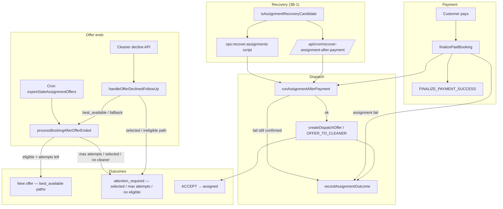

# Stage 3B Final Audit — Assignment Recovery & Redispatch Safety

**Date:** 2026-05-17  
**Scope:** Verify Stage 3B (3B-1 recovery/observability, 3B-2a decline redispatch, 3B-2b visibility) improved assignment reliability without breaking payment, cleaner acceptance, earnings, or RLS.  
**Type:** Audit only — no new features implemented.

**Related:** [stage-3a-assignment-dispatch-reliability-audit.md](./stage-3a-assignment-dispatch-reliability-audit.md), [assignment-recovery.md](../operations/assignment-recovery.md), [assignment-decline-redispatch.md](../operations/assignment-decline-redispatch.md), [stage-3b-2-decline-redispatch-policy-design.md](../architecture/stage-3b-2-decline-redispatch-policy-design.md)

---

## Executive summary

| Area | Verdict | Notes |
|------|---------|-------|
| Post-payment recovery (3B-1) | **Pass** | Candidates detected; cron/script safe; admin badge wired |
| Decline redispatch (3B-2a) | **Pass** | `best_available` / `fallback_best_available` redispatch; `selected` escalates |
| Expiry behavior | **Pass** | Wrapper delegates to shared orchestrator; cron tests green |
| Visibility (3B-2b) | **Pass** | Admin labels + calm customer copy |
| Payment finalize | **Pass** | Success even when assignment fails; metadata + log |
| Cleaner accept | **Pass** | Unchanged command path; dashboard tests pass |
| Earnings preview | **Pass** | No changes in assignment/3B modules |
| RLS / enums / migrations | **Pass** | Stage 3B is application-layer only |
| Duplicate open offers | **Partial** | Per-cleaner partial unique + orchestrator guard; **global one-open-per-booking race not solved** |

**Final recommendation:** Stage 3B is **safe to deploy** before offer-race / global duplicate-protection work, provided recovery cron is enabled, ops runbook is followed, and concurrent-accept / multi-open-offer races are tracked as the **next** hardening slice (not blockers for 3B itself).

---

## Before vs after (Stage 3A → 3B)

| Scenario | Stage 3A (before) | Stage 3B (after) |
|----------|-------------------|------------------|
| Paid booking, assignment throws | Payment succeeds; booking stuck `confirmed`; silent | Payment succeeds; `post_payment_assignment_failed` log + `attention_required` with dispatch-not-started reason |
| Paid `confirmed`, no offers after grace | No sweeper | Recovery cron/script re-runs `runAssignmentAfterPayment` |
| Admin sees stuck paid booking | Generic pending / no badge | **Paid — dispatch not started** (queue + bookings) |
| `best_available` decline | Always `attention_required`, path often `null` | Auto-redispatch via `processBookingAfterOfferEnded(outcome: declined)`; path preserved |
| `fallback_best_available` decline | Same gap | Same redispatch as best_available |
| `selected` decline | Admin attention (correct) | Still admin only — **no silent fallback** |
| Offer expiry (`best_available`) | Cron redispatch | Unchanged behavior via shared orchestrator |
| Max 5 offers | Implicit | `attention_required` + admin label **No cleaner accepted after dispatch attempts** |
| Customer during redispatch | Could see **Needs assignment** | Calm copy: *We're finding another available cleaner.* |
| Customer selected decline | Scary / generic | *We're reviewing cleaner availability for your booking.* |

---

## Assignment lifecycle map (after Stage 3B)



**Booking statuses touched:** `pending_payment` → `confirmed` → `pending_assignment` → `assigned` (accept). Recovery targets **`confirmed`** + paid + no cleaner + no open/accepted offers + past grace.

---

## Recovery flow (3B-1)

1. **Detection (immediate):** `finalizePaidBooking` wraps `runAssignmentAfterPayment` in try/catch. On failure or booking still `confirmed`, calls `handlePostPaymentAssignmentFailure` → logs `post_payment_assignment_failed`, writes `metadata.assignment` with `DISPATCH_NOT_STARTED_REASON`.
2. **Detection (batch):** `isAssignmentRecoveryCandidate` — `status === confirmed`, `cleaner_id` null, paid payment, past `ASSIGNMENT_RECOVERY_GRACE_MINUTES` (default 3), no accepted offer, no open offer (`isOfferOpenForOps`).
3. **Remediation:** `runAssignmentRecoveryBatch` re-checks each candidate (`stillRecoveryCandidate`) then calls `runAssignmentAfterPayment` (same path as post-payment).
4. **Surfaces:** Cron `GET/POST /api/cron/recover-assignment-after-payment` (cron secret); `npm run ops:recover:assignments`; admin queue uses `dispatchNotStarted` + visibility key `dispatch_not_started`.

**Safety properties:**

- Does not revert payment or booking finalize.
- Skips if state changed since candidate scan (open offer, accepted offer, cleaner assigned).
- Recovery test: **does not duplicate offers when recovery runs twice** (`assignmentRecovery.test.ts`).

---

## Decline / expiry policy (3B-2a)

Shared orchestrator: `processBookingAfterOfferEnded({ outcome: 'expired' | 'declined' })`.

| Path | Decline | Expiry (cron) |
|------|---------|---------------|
| `best_available` | Auto-redispatch (exclude declined/expired/cancelled cleaners) | Same (unchanged) |
| `fallback_best_available` | Auto-redispatch | Same |
| `selected` | `attention_required`, path preserved, no new offer | `attention_required` (unchanged) |
| Max 5 `assignment_offers` rows | `attention_required` + max-attempts reason | Same cap |

**Guards:**

- `hasOpenOffer` → orchestrator no-ops (prevents second dispatch while offer active).
- Decline API runs `handleOfferDeclinedFollowUp` only when `!result.idempotent`.
- `createDispatchOffer` idempotency key: `assignment:offer:{bookingId}:{cleanerId}`.

**DB constraint (pre-3B, unchanged):** partial unique index `idx_assignment_offers_one_open_per_cleaner` on `(booking_id, cleaner_id) WHERE status = 'offered'` — prevents duplicate open offer **to the same cleaner**, not globally one open offer per booking.

---

## Customer / admin UX (3B-2b)

Resolver: `resolveAssignmentVisibility` → read models → UI badges/messages.

| Visibility key | Admin label | Customer |
|----------------|-------------|----------|
| `dispatch_not_started` | Paid — dispatch not started | — |
| `decline_redispatched` | Cleaner declined — redispatched | Finding another cleaner (calm) |
| `offer_sent` | Offer sent — awaiting acceptance | — |
| `finding_cleaner` | Finding cleaner | Finding another cleaner (when applicable) |
| `selected_declined_admin` | Selected cleaner declined — admin action needed | Reviewing availability |
| `max_attempts_admin` | No cleaner accepted after dispatch attempts | Reviewing availability |
| `needs_assignment` | Needs assignment | Reviewing availability + warning badge |

Customer UI suppresses generic **Needs assignment** during active redispatch (`showCustomerAssignmentWarning: false`).

---

## Audit checklist (15 items)

| # | Check | Result | Evidence |
|---|-------|--------|----------|
| 1 | Paid `confirmed` + failed assignment detected | **Pass** | `assignmentResultNeedsDispatchAttention`; `handlePostPaymentAssignmentFailure`; `isAssignmentRecoveryCandidate` |
| 2 | Recovery cron/script safe | **Pass** | Re-validate before dispatch; idempotent assignment; tests in `assignmentRecovery.test.ts`, `route.test.ts` |
| 3 | Admin sees “Paid — dispatch not started” | **Pass** | `dispatch_not_started` visibility key; `labelForAssignmentVisibilityKey`; admin queue/read model |
| 4 | `best_available` decline redispatches | **Pass** | `processBookingAfterOfferEnded.test.ts` — best_available case |
| 5 | `fallback_best_available` decline redispatches | **Pass** | Same test file — fallback case |
| 6 | `selected` decline no silent fallback | **Pass** | `handleOfferDeclinedFollowUp` early return; selected test — 0 open offers, `attention_required` |
| 7 | Offer expiry unchanged | **Pass** | `processBookingAfterOfferExpiry` wrapper; expiry tests + `expireOffers.test.ts` |
| 8 | No duplicate open offers | **Partial** | Orchestrator `hasOpenOffer` + per-cleaner partial unique; **not** one-open-per-booking globally |
| 9 | Max attempts → admin attention | **Pass** | `ASSIGNMENT_MAX_DISPATCH_ATTEMPTS_PER_BOOKING = 5`; max-attempts test |
| 10 | Customer calm copy during redispatch | **Pass** | `resolveAssignmentVisibility.test.ts`; customer pages use `assignmentCustomerMessage` |
| 11 | Admin labels correct | **Pass** | `labelForAssignmentVisibilityKey`; read models enrich with offer statuses |
| 12 | Cleaner accept still works | **Pass** | `dashboardReadModels.test.ts` accept API tests; no changes to accept command |
| 13 | Earnings preview unchanged | **Pass** | No edits under `features/earnings` for 3B; `resolveCleanerEarningsDisplay.test.ts` untouched |
| 14 | Payment finalize succeeds if assignment fails | **Pass** | `finalizePaidBookingAssignment.test.ts` — returns `ok: true`, status `confirmed` |
| 15 | No RLS/payment/earnings/enum/migration changes in 3B | **Pass** | 3B deliverables are TS/app/docs only; RLS integration suite still passes |

---

## Test evidence

**Commands run (2026-05-17):**

```text
npm run typecheck                                    → pass
npx vitest run (9 Stage 3B-targeted files, 65 tests) → pass
npx vitest run src/tests/security/rls-policies.integration.test.ts → pass (8 tests)
```

**Targeted files:**

| File | Focus |
|------|--------|
| `assignmentRecovery.test.ts` | Candidate detection, batch recovery, no duplicate offers on double recovery |
| `recover-assignment-after-payment/route.test.ts` | Cron auth + batch invocation |
| `finalizePaidBookingAssignment.test.ts` | Payment success when assignment throws/fails |
| `paymentFinalizeRecovery.test.ts` | Paystack idempotent finalize recovery |
| `processBookingAfterOfferEnded.test.ts` | Decline redispatch paths, max attempts, duplicate guard, expiry wrapper |
| `expireOffers.test.ts` | Expiry cron regression |
| `resolveAssignmentVisibility.test.ts` | Admin labels + customer copy |
| `dashboardReadModels.test.ts` | Admin/customer read models + accept API |
| `parseBookingDisplay.test.ts` | Display enrichment |

---

## Remaining risks

| Risk | Severity | Mitigation |
|------|----------|------------|
| **Concurrent accept** on two open offers (different cleaners) | High (pre-existing) | Next slice: offer-row lock / single-open-per-booking constraint / accept serialization |
| **Two open offers** (race between decline redispatch + expiry cron) | Medium | Orchestrator `hasOpenOffer` reduces likelihood; not impossible under race |
| **Admin list N+1** offer fetches for `pending_assignment` | Low | Monitor query load; batch offers query later |
| **Recovery grace 3 min** | Low | Tune `ASSIGNMENT_RECOVERY_GRACE_MINUTES` if false positives |
| **Visibility without offer rows** | Low | Falls back to metadata/reason inference |
| **No admin manual dispatch UI** | Medium (ops) | Queue + attention metadata; manual DB/API still required |

---

## Production rollout checklist

- [ ] Deploy application build containing 3B-1, 3B-2a, 3B-2b (no new migrations required for 3B).
- [ ] Confirm `CRON_SECRET` and schedule **`/api/cron/recover-assignment-after-payment`** (e.g. every 5–15 min).
- [ ] Confirm existing **`expire-assignment-offers`** cron still scheduled.
- [ ] Set `ASSIGNMENT_RECOVERY_GRACE_MINUTES` in production if default 3 min is wrong for Paystack latency.
- [ ] Smoke: pay → `pending_assignment` → offer → accept.
- [ ] Smoke: pay → force assignment failure → verify admin **Paid — dispatch not started** → wait for recovery cron.
- [ ] Smoke: cleaner decline on best_available → admin **Cleaner declined — redispatched**; customer calm message.
- [ ] Smoke: selected cleaner decline → admin **Selected cleaner declined**; no second auto-offer.
- [ ] Monitor logs for `post_payment_assignment_failed` and recovery cron JSON responses.
- [ ] Brief support on customer copy (no “booking failed” after payment).

---

## Rollback plan

| Layer | Action |
|-------|--------|
| **App only** | Redeploy previous build. Payment, RLS, schema unchanged — rollback is revert deploy. |
| **Cron** | Disable recover-assignment cron; expiry cron can stay (pre-3B behavior). |
| **Metadata** | Existing `metadata.assignment` rows remain valid; older builds may ignore `lastOfferOutcome` / visibility keys (degrades to generic labels, not data corruption). |
| **Offers in flight** | No migration rollback needed. In-progress offers continue under prior decline policy if rolled back (selected-only admin path still safe). |

**Do not** roll back payment finalize RPC or RLS migrations as part of a 3B rollback — 3B did not change them.

---

## Final verdict

**Stage 3B meets its goals:** paid-but-unassigned bookings are observable and recoverable; best-available decline redispatch aligns with expiry policy; selected path does not silently fallback; customer and admin surfaces reflect system state without implying payment failure.

**Deploy before global duplicate protection?** **Yes**, with eyes open:

- 3B does **not** introduce regressions in payment finalize, accept, earnings display, or RLS (verified by targeted tests + RLS integration suite).
- The **known gap** from Stage 3A — concurrent accept / multiple open offers to **different** cleaners — remains and should be the **immediate next** reliability slice after 3B ships.
- Shipping 3B **reduces** operational pain (stuck `confirmed`, decline dead-ends, scary customer copy) without blocking on full race hardening.

**Recommended sequence:** Deploy 3B → enable recovery cron → monitor 48h → implement offer-race / single-open-per-booking protection (Stage 3C or equivalent).
