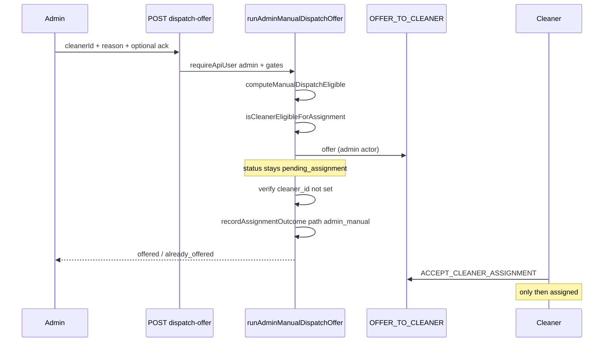
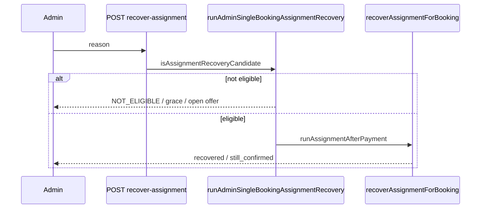

# Stage 4 Final Audit — Admin Operational Control & Dispatch Safety

**Date:** 2026-05-17  
**Type:** Audit only — no code changes  
**Scope:** Full Stage 4 — 4B-1 (read-only ops), 4B-2a (recovery), 4B-3a (manual dispatch offer), 4C-a (cancel/replace open offer)  
**Baselines:** [stage-4a-admin-dispatch-operational-control-audit.md](./stage-4a-admin-dispatch-operational-control-audit.md), [stage-4b-admin-operational-control-final-audit.md](./stage-4b-admin-operational-control-final-audit.md)

**Related:** [admin-operational-dashboard.md](../operations/admin-operational-dashboard.md), [assignment-recovery.md](../operations/assignment-recovery.md), [assignment-decline-redispatch.md](../operations/assignment-decline-redispatch.md), [assignment-offer-race-protection.md](../operations/assignment-offer-race-protection.md), [stage-4b-3-manual-cleaner-dispatch-design.md](../architecture/stage-4b-3-manual-cleaner-dispatch-design.md), [stage-4c-cancel-replace-open-offer-design.md](../architecture/stage-4c-cancel-replace-open-offer-design.md)

---

## Executive summary

| Question | Answer |
|----------|--------|
| Did Stage 4 improve admin operational control? | **Yes** — accurate read models, bounded assignment mutations, offer-only dispatch paths |
| Unsafe lifecycle bypass introduced? | **No new bypass in UI/API** — still no `ADMIN_OVERRIDE_STATUS`, no admin accept/decline, no payment finalize, no direct `cleaner_id` assignment |
| Stage 4 implementation complete (planned slices)? | **Yes** — 4B-1, 4B-2a, 4B-3a, 4C-a are implemented and tested |
| Safe to deploy? | **Yes**, with ops training and unchanged latent RLS risk from 4A |
| Safe to move to Stage 5? | **Yes** — Stage 4 goals met; Stage 5 should not assume admin queue shortcuts, RLS hardening, or `admin_manual` decline policy unless scoped explicitly |

---

## Before vs after (Stage 4A → Stage 4 final)

| Area | Stage 4A | Stage 4 final |
|------|----------|---------------|
| Home / bookings counts | Misleading partial counts | True totals vs visible slice (`computeAdminOperationsSummary`) |
| Bookings list | Last 200, no filters | Filters, search, date range (`filterAdminBookings`) |
| Booking detail ops | Payment + payout only | Operational panel, recovery/dispatch/replace eligibility, payout |
| Audit timeline | Command / from / to / time | + actor, reason, idempotency key, sanitized metadata (`summarizeAuditMetadata`) |
| Post-payment stuck (`confirmed`) | Cron/script only | Admin **Recover assignment** when eligible (4B-2a) |
| Selected declined / max attempts | “Not in app” copy | **Send offer** when no open offers (4B-3a) |
| Wrong cleaner has open offer | Ops deadlock / wait | **Replace open offer** — cancel then offer (4C-a) |
| Admin POST mutations | 2 (payout) | **5** (payout + recover + dispatch-offer + replace-open-offer) |
| `ADMIN_OVERRIDE_STATUS` UI | Absent | **Still absent** |
| Admin accept/decline | Absent | **Still absent** |
| Direct cleaner assignment | Absent | **Still absent** — assignment only via cleaner accept |
| Payment finalize from admin | Absent | **Still absent** |
| RLS / status enum / earnings formulas | Baseline | **Unchanged** in Stage 4 |

---

## Audit checklist (18 items)

| # | Check | Verdict | Evidence |
|---|--------|---------|----------|
| 1 | Read-only admin dashboards still work | **Pass** | `adminOperationsReadModel.ts`, `AdminOpsSummaryCards`, `AdminBookingsFilters`, `dashboardReadModels.test.ts` (18 tests) |
| 2 | Counts/filters/search remain safe | **Pass** | Pure in-memory transforms; totals vs visible caps tested; no writes |
| 3 | Operational status panel is accurate | **Pass** | `buildAdminOperationalStatus`, `resolveAssignmentVisibility`, enriched detail tests |
| 4 | Audit timeline is sanitized | **Pass** | `summarizeAuditMetadata` redacts secrets/tokens; `mapAuditRow` test |
| 5 | Single-booking recovery only for eligible bookings | **Pass** | `isAssignmentRecoveryCandidate` — `confirmed`, paid, past grace, no cleaner, no open/accepted offers; recovery tests |
| 6 | Manual dispatch sends offer only, not direct assignment | **Pass** | `createAdminDispatchOffer` → `OFFER_TO_CLEANER`; post-check `cleaner_id` still null / `ASSIGNMENT_CONFLICT` if not |
| 7 | Replace open offer cancels old offer then sends new offer | **Pass** | `runAdminReplaceOpenOffer`: `CANCEL_OPEN_ASSIGNMENT_OFFER` → re-read → `OFFER_TO_CLEANER`; does **not** call `processBookingAfterOfferEnded` |
| 8 | Admin reason required for all admin assignment mutations | **Pass** | `validateAdminRecoveryReason` (8–500 chars) on recovery, dispatch, replace |
| 9 | Max attempts acknowledgement works | **Pass** | `MAX_ATTEMPTS_REACHED` unless `acknowledgeMaxAttempts: true` when offer count ≥ 5; dispatch + replace tests |
| 10 | Ineligible cleaners are blocked | **Pass** | `isCleanerEligibleForAssignment`; `CLEANER_NOT_ELIGIBLE` in orchestrators + command guards |
| 11 | Open offer conflicts handled safely | **Pass** | DB one-open index + command `OPEN_OFFER_EXISTS`; dispatch blocks other cleaner; replace requires exactly one open offer; post-cancel re-check |
| 12 | No admin accept/decline exists | **Pass** | No `/api/admin/**/accept` or decline routes; no dashboard components |
| 13 | No direct cleaner assignment exists | **Pass** | No admin path sets `bookings.cleaner_id` without accept; manual dispatch post-check |
| 14 | No `ADMIN_OVERRIDE_STATUS` UI exists | **Pass** | Grep `src/components`: no matches; command layer only |
| 15 | Payout mutations still use command layer | **Pass** | `markBookingPayoutReadyAdmin` / `markBookingPaidOutAdmin` → `executeBookingCommand` |
| 16 | Payment finalize, earnings, RLS, status enum unchanged | **Pass** | No Stage 4 migrations for these; `executeBookingCommand.test.ts`, `earningsAndCompletion.test.ts`, `rls-policies.integration.test.ts` pass |
| 17 | Customer copy remains calm and non-internal | **Pass** | `resolveAssignmentVisibility` — no “manual dispatch”, “replaced”, or admin jargon in `customerMessage` |
| 18 | Tests cover admin-only route authorization | **Pass** | `requireApiUser(["admin"])` on mutation routes; `adminApiRoutes.test.ts` POST allowlist; per-route auth tests |

---

## Admin action inventory (Stage 4 final)

### UI routes

| Route | Purpose | Mutates? |
|-------|---------|----------|
| `/admin` | Ops home, summary cards, previews | No |
| `/admin/bookings` | Filterable bookings list | No |
| `/admin/bookings/[id]` | Ops panel, recovery, send offer, replace offer, payout, audits | Yes (via POST APIs) |
| `/admin/assignments` | Assignment queue (read + deep links) | No |
| `/admin/payouts` | Payout aggregates | No |

### API routes

| Method | Route | Auth | Mutates? |
|--------|-------|------|----------|
| `GET` | `/api/admin/bookings` | `requireApiUser(["admin"])` | No |
| `GET` | `/api/admin/bookings/[id]` | Same | No |
| `GET` | `/api/admin/assignments` | Same | No |
| `GET` | `/api/admin/payouts` | Admin role check | No |
| `POST` | `.../payout-ready` | Admin session | Yes |
| `POST` | `.../mark-paid-out` | Admin session | Yes |
| `POST` | `.../recover-assignment` | `requireApiUser(["admin"])` | Yes |
| `POST` | `.../dispatch-offer` | Same | Yes |
| `POST` | `.../replace-open-offer` | Same | Yes |

**POST allowlist test:** `adminApiRoutes.test.ts` — exactly **five** intentional admin POST mutation routes.

### UI actions on booking detail

| Component | When shown | API |
|-----------|------------|-----|
| `AdminRecoverAssignmentAction` | Recovery eligible (`confirmed` stuck) | `POST recover-assignment` |
| `AdminManualDispatchAction` | `manualDispatchEligible` (no open offers) | `POST dispatch-offer` |
| `AdminReplaceOpenOfferAction` | `openOfferCount === 1` | `POST replace-open-offer` |
| Payout actions | `completed` / `payout_ready` | Existing payout routes |

Manual dispatch and replace are **mutually exclusive** by eligibility (`openOfferCount`).

---

## Allowed admin mutations

| Action | Command(s) | Preconditions | Assigns cleaner? |
|--------|------------|---------------|------------------|
| Mark payout-ready | `MARK_BOOKING_PAYOUT_READY` | `completed` | No |
| Mark paid out | `MARK_BOOKING_PAID_OUT` | `payout_ready` | No |
| Recover assignment | Engine: `MOVE_TO_PENDING_ASSIGNMENT` + `OFFER_TO_CLEANER` (service actor) | `confirmed`, paid, past grace, no cleaner, no open/accepted offers | No — engine picks cleaner |
| Manual dispatch offer | `OFFER_TO_CLEANER` (admin actor) + `RECORD_ASSIGNMENT_ATTENTION` | `pending_assignment`, paid, no cleaner, no open offers, `manualInterventionNeeded`, eligible target, reason; max-attempts ack if ≥5 | **No** — cleaner must accept |
| Replace open offer | `CANCEL_OPEN_ASSIGNMENT_OFFER` (admin) then `OFFER_TO_CLEANER` (admin) | `pending_assignment`, paid, exactly one open offer, eligible target, reason; max-attempts ack if ≥5 | **No** |

All assignment mutations require admin session + reason (8–500 characters). Assignment commands write audit rows via `executeBookingCommand`.

---

## Forbidden admin mutations (still blocked)

| Capability | Status | Notes |
|------------|--------|-------|
| `ADMIN_OVERRIDE_STATUS` | Command exists; **no admin API/UI** | Would skip transition graph |
| Admin `ACCEPT_CLEANER_ASSIGNMENT` | **No API/UI** | Guard allows admin actor — **latent** if added without review |
| Admin `DECLINE_CLEANER_ASSIGNMENT` | **No API/UI** | Same |
| Direct `bookings.cleaner_id` update | **No app path** | Post-offer verification on manual dispatch |
| `FINALIZE_PAYMENT_SUCCESS` | **No admin route** | Paystack / system only |
| Cancel-only without re-offer | **No dedicated API** | Replace flow is atomic cancel + offer |
| Batch recovery from UI | **Not implemented** | Cron + `ops:recover:assignments` |
| Team / multi-cleaner dispatch | **Not implemented** | |
| Earnings formula / RLS edits | **Not in Stage 4** | |

---

## Manual dispatch flow (4B-3a)



**Safety properties:**

- Idempotency key: `assignment:offer:{bookingId}:{cleanerId}`
- Blocks offer to cleaner B while open offer to cleaner A (`OPEN_OFFER_EXISTS`)
- Idempotent success if same cleaner already has open offer
- Customer messaging unchanged (`resolveAssignmentVisibility`)

---

## Replace open offer flow (4C-a)

```mermaid
sequenceDiagram
  participant Admin
  participant API as POST replace-open-offer
  participant Orch as runAdminReplaceOpenOffer
  participant Cancel as CANCEL_OPEN_ASSIGNMENT_OFFER
  participant Offer as OFFER_TO_CLEANER

  Admin->>API: targetCleanerId + reason + optional ack
  API->>Orch: admin + exactly one open offer
  Orch->>Orch: isCleanerEligibleForAssignment
  Orch->>Cancel: cancel open offer (status cancelled)
  Orch->>Orch: re-list offers; fail if still open
  Orch->>Offer: offer to target (admin actor)
  Orch->>Orch: verify cleaner_id not assigned
  Orch-->>Admin: replaced
  Note over Orch: does not run processBookingAfterOfferEnded
```

**Safety properties:**

- Cancel uses `cancelled` status (admin command), not customer decline semantics
- Does not auto-redispatch via decline engine — admin explicitly selects next cleaner
- Post-cancel guard prevents double-open race
- Same max-attempts and reason rules as manual dispatch

---

## Recovery flow (4B-2a)



**Safety properties:**

- Only `confirmed` + paid + past grace + no assignment progress
- Does not target a specific cleaner
- Rejects when open or accepted offers exist
- Structured log: `admin_assignment_recovery`

---

## Security checks

| Control | Status |
|---------|--------|
| Admin layout role gate | `requireProfileRole(["admin"])` on `(admin)` routes |
| Mutation API auth | `requireApiUser(["admin"])` on assignment POST routes |
| POST surface allowlist | `adminApiRoutes.test.ts` — 5 routes only |
| Command-layer writes | All booking mutations via `executeBookingCommand` |
| One open offer per booking | DB index + `OPEN_OFFER_EXISTS` guard |
| Reason audit trail | Stored on command rows; shown in sanitized admin timeline |
| Service role in orchestrators | Reads via service client; **admin session still required at API** |
| RLS admin `FOR ALL` (latent) | **Unchanged** — UI does not exploit; see risks |

---

## Test evidence

**Commands run (2026-05-17):**

```text
npm run typecheck                                                                 → pass
npx vitest run (12 files, 99 tests — admin, assignments, dashboards, commands, earnings, RLS) → pass
```

**Suites included:**

| Suite | Tests | Relevance |
|-------|-------|-----------|
| `adminApiRoutes.test.ts` | 1 | POST allowlist = **5** routes |
| `adminAssignmentRecovery.test.ts` | 10+ | Recovery eligibility, reason, grace, open offers |
| `adminManualDispatchOffer.test.ts` | 10+ | Offer-only, conflicts, max attempts, eligibility |
| `adminReplaceOpenOffer.test.ts` | 8+ | Cancel-then-offer, no assign, max attempts |
| `adminOperationalHelpers.test.ts` | 10+ | Audit sanitization, filters, dispatch/replace eligibility |
| `dashboardReadModels.test.ts` | 18 | Admin read models, ops panel |
| `recover-assignment/route.test.ts` | 2 | API auth |
| `dispatch-offer/route.test.ts` | 2 | API auth |
| `replace-open-offer/route.test.ts` | 2 | API auth |
| `executeBookingCommand.test.ts` | 14+ | OFFER, CANCEL_OPEN_ASSIGNMENT_OFFER, guards |
| `earningsAndCompletion.test.ts` | 10 | Payout commands, role guards |
| `rls-policies.integration.test.ts` | 8 | RLS baseline unchanged |

**Not run (per audit scope):** Full-repo vitest; unrelated timeout failures in other suites were not investigated or fixed.

---

## Remaining risks

| Risk | Severity | Mitigation / Stage 5 note |
|------|----------|---------------------------|
| RLS grants admin `FOR ALL` on bookings/offers (4A latent) | **Medium** | Stage 4 did not widen; monitor raw Supabase admin usage; consider RLS hardening in Stage 5+ |
| `ACCEPT_CLEANER_ASSIGNMENT` allows admin in guards | **Medium** | Do not add admin accept UI without legal/ops sign-off |
| `admin_manual` not in `REDISPATCH_ELIGIBLE_PATHS` | **Low** | After admin offer cancelled/declined, auto-redispatch behavior may differ; document ops or add policy in Stage 5 |
| Replace does not notify withdrawn cleaner | **Low** | 4C-b scope; ops communicate offline if needed |
| Orchestrators use service role for reads | **Low** | API boundary enforces admin; mutations via command backend |
| List/queue scan caps (200/100 rows) | **Low** | UI labels totals vs visible; documented in runbooks |
| Assignment queue has no inline actions | **Low** | By design; booking detail is action surface |
| Atomic replace not DB-transaction wrapped | **Low** | Command guards + post-cancel re-check; rare race returns 409 |

---

## Production rollout checklist

- [ ] Deploy **single release** containing 4B-1, 4B-2a, 4B-3a, 4C-a (coherent admin ops).
- [ ] Confirm `CRON_SECRET` + recover-assignment cron scheduled (admin recovery does not replace batch).
- [ ] Confirm expire-assignment-offers cron active.
- [ ] Train ops: **Recover** = `confirmed` stuck after payment grace; **Send offer** = `pending_assignment`, no open offers; **Replace offer** = exactly one open offer to wrong cleaner.
- [ ] Train ops: all assignment actions are **offer only** — customer is not “assigned” until cleaner accepts.
- [ ] Train ops: reason field mandatory (8+ chars); max-attempts checkbox when ≥5 offer rows.
- [ ] Train ops: cannot use Send offer while another cleaner has open offer — use Replace instead.
- [ ] Verify `profiles.role = admin` provisioning in production.
- [ ] Staging smoke: payout-ready → paid-out unchanged.
- [ ] Staging smoke: recovery on test `confirmed` booking.
- [ ] Staging smoke: manual dispatch on `selected_declined_admin` scenario.
- [ ] Staging smoke: replace open offer cleaner A → B.
- [ ] Monitor logs: `admin_assignment_recovery`, `admin_manual_dispatch`, `admin_replace_open_offer`.

---

## Rollback plan

| Layer | Rollback |
|-------|----------|
| Application | Redeploy previous release (removes recovery, dispatch, replace UI/routes; read-only 4B-1 can remain if shipped alone) |
| Database | **No migration rollback** required for Stage 4 assignment features |
| Ops | Revert to cron/script recovery + offline cleaner coordination |
| Data | Offers/audits from Stage 4 actions remain valid; no destructive migration |

**Partial rollback:** Hide `AdminRecoverAssignmentAction`, `AdminManualDispatchAction`, `AdminReplaceOpenOfferAction` while keeping read-only dashboards.

---

## Final verdict

**Stage 4 is complete and safe enough to move to Stage 5** for the scope that was planned:

- **Operational control improved** without exposing status override, payment finalize, admin accept/decline, or direct assignment.
- **All 18 audit checks pass** with automated test evidence (typecheck + 99 targeted tests including RLS integration).
- **New mutations are narrow**, reason-audited, command-gated, and covered by an explicit POST allowlist test.
- **Customer copy** remains calm and non-internal.
- **Known latent risks** (RLS breadth, admin accept in guards) are unchanged from 4A — not introduced by Stage 4; should be tracked in Stage 5 planning, not treated as blockers for exiting Stage 4.

Deploy with updated ops runbooks. Stage 5 should define its own scope (e.g. queue shortcuts, notifications, `admin_manual` decline policy, RLS tightening) rather than assuming Stage 4 left gaps in the core safety model.

---

## References (implementation map)

| Feature | Primary files |
|---------|----------------|
| 4B-1 read models | `src/features/dashboards/server/adminOperationsReadModel.ts`, `adminOperationalHelpers.ts` |
| 4B-2a recovery | `src/features/assignments/server/adminAssignmentRecovery.ts`, `src/app/api/admin/bookings/[bookingId]/recover-assignment/route.ts` |
| 4B-3a manual dispatch | `src/features/assignments/server/adminManualDispatchOffer.ts`, `createAdminDispatchOffer.ts`, `dispatch-offer/route.ts` |
| 4C-a replace offer | `src/features/assignments/server/adminReplaceOpenOffer.ts`, `createAdminCancelOpenOffer.ts`, `replace-open-offer/route.ts` |
| Commands | `src/features/bookings/server/commands/types.ts`, `bookingCommandGuards.ts`, `executeBookingCommand.ts` |
| UI | `AdminOperationalStatusPanel.tsx`, `AdminRecoverAssignmentAction.tsx`, `AdminManualDispatchAction.tsx`, `AdminReplaceOpenOfferAction.tsx` |
| POST allowlist | `src/app/api/admin/adminApiRoutes.test.ts` |
| Customer visibility | `src/features/assignments/server/resolveAssignmentVisibility.ts` |
