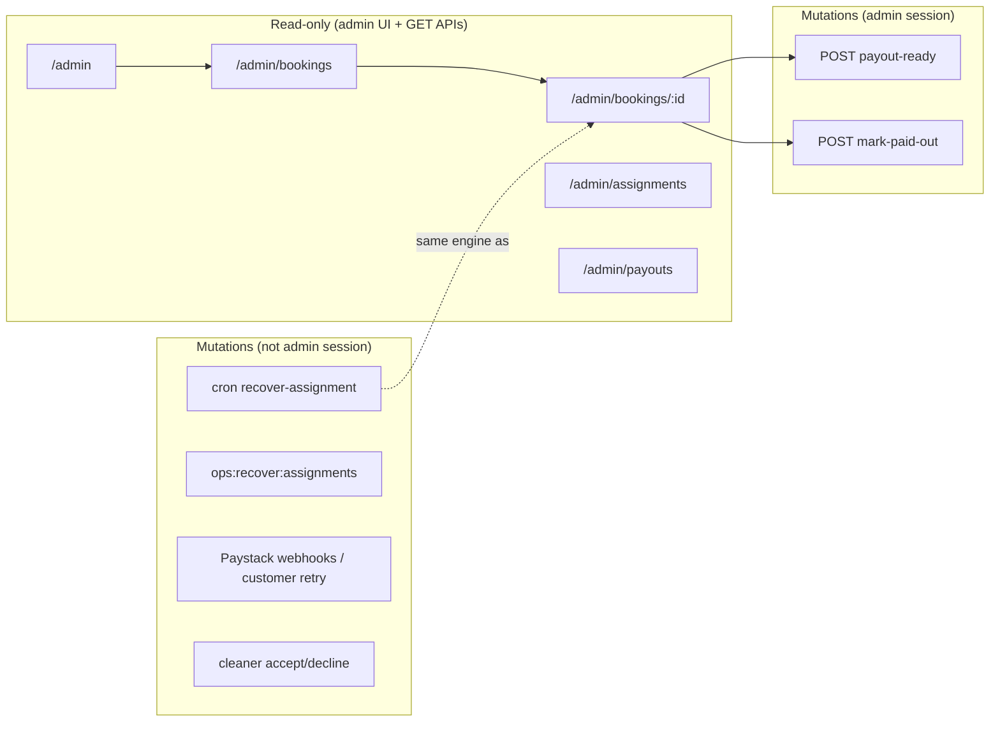

# Stage 4A — Admin Dispatch & Operational Control Audit

**Date:** 2026-05-17  
**Scope:** Admin bookings list/detail, assignment queue, payout controls, dispatch recovery visibility, payment-failure visibility, assignment attention states, cleaner availability APIs, audit logging, and lifecycle bypass risk.  
**Type:** Audit only — no code, migrations, RLS, payment finalize, assignment accept semantics, or earnings formula changes.

**Related:** [stage-3a-assignment-dispatch-reliability-audit.md](./stage-3a-assignment-dispatch-reliability-audit.md), [stage-3b-assignment-recovery-redispatch-final-audit.md](./stage-3b-assignment-recovery-redispatch-final-audit.md), [assignment-recovery.md](../operations/assignment-recovery.md), [assignment-decline-redispatch.md](../operations/assignment-decline-redispatch.md), [payment-failed-customer-retry.md](../operations/payment-failed-customer-retry.md)

---

## Executive summary

| Area | Verdict | Summary |
|------|---------|---------|
| Admin route coverage | **Read-heavy** | Four UI routes + five API routes; assignment/payment ops are mostly observability |
| Mutating admin actions | **Narrow** | Only payout-ready and paid-out booking transitions are exposed in UI |
| Command layer usage | **Partial** | Payout mutations use `executeBookingCommand`; reads bypass commands (direct Supabase) |
| Manual dispatch | **Not available** | No admin UI/API to offer a cleaner; engine exists (`createDispatchOffer` / `OFFER_TO_CLEANER`) |
| Dispatch recovery | **Ops/cron only** | Cron + `npm run ops:recover:assignments`; admin sees badge but cannot trigger recovery in-app |
| Payment failed visibility | **Good read** | List/detail badges + copy; admin cannot fix payment (by design) |
| Assignment attention | **Good read** | Visibility keys wired on bookings list, detail, and assignment queue |
| Cleaner availability | **API only** | `/api/cleaners/available` and `/api/booking/cleaners` allow admin; no admin UI |
| Dangerous overrides | **Command exists, UI blocked** | `ADMIN_OVERRIDE_STATUS` in command layer; **not exposed** to admin API/UI |
| Lifecycle bypass risk | **Medium (latent)** | RLS grants admin `FOR ALL` on bookings/payments/offers; UI does not use direct writes |
| Audit logging | **Read partial** | Detail shows command/from/to/time; **missing** actor, reason, idempotency key in UI |
| Misleading UI | **Several gaps** | Home attention count, payouts placeholder copy, queue lacks actions |

**Recommendation:** Stage 4B should start with **read-only operational hardening** (filters, true queue counts, recovery eligibility on detail), then add a **single-booking recovery action** that wraps existing `recoverAssignmentForBooking` — not manual override, not admin accept, not payment finalize.

---

## Admin route map

### UI routes (`src/app/(admin)/`)

| Route | Page | Auth | Primary data source |
|-------|------|------|---------------------|
| `/admin` | Operations home | `requireProfileRole(["admin"])` in layout | `listAdminBookings`, `listAdminAssignmentQueue` |
| `/admin/bookings` | All bookings | Same | `listAdminBookings` |
| `/admin/bookings/[bookingId]` | Booking operations detail | Same | `getAdminBookingDetail` |
| `/admin/assignments` | Assignment queue | Same | `listAdminAssignmentQueue` |
| `/admin/payouts` | Payout summary | Same | `getAdminPayoutSummary` |

Layout: `src/app/(admin)/layout.tsx` — admin role required before any child renders.

### API routes (`src/app/api/admin/`)

| Method | Route | Auth | Behavior |
|--------|-------|------|----------|
| `GET` | `/api/admin/bookings` | `requireApiUser(["admin"])` | JSON list (mirror of read model) |
| `GET` | `/api/admin/bookings/[bookingId]` | Same | JSON detail |
| `GET` | `/api/admin/assignments` | Same | JSON assignment queue |
| `GET` | `/api/admin/payouts` | `getCurrentUser` + role check | Payout aggregates |
| `POST` | `/api/admin/bookings/[bookingId]/payout-ready` | `getCurrentUser` | `markBookingPayoutReadyAdmin` → command |
| `POST` | `/api/admin/bookings/[bookingId]/mark-paid-out` | `getCurrentUser` | `markBookingPaidOutAdmin` → command |

### Related non-admin APIs (admin-eligible)

| Method | Route | Admin use |
|--------|-------|-----------|
| `GET`/`POST` | `/api/cleaners/available` | Eligible cleaners for slot (not wired to admin UI) |
| `GET`/`POST` | `/api/booking/cleaners` | Eligible cleaners for a booking (not wired to admin UI) |
| `GET`/`POST` | `/api/cron/recover-assignment-after-payment` | Batch recovery (`CRON_SECRET`, not admin session) |
| `GET`/`POST` | `/api/cron/expire-assignment-offers` | Offer expiry sweeper (cron) |

### Ops scripts (not admin UI)

| Script | Purpose |
|--------|---------|
| `npm run ops:recover:assignments` | Dry-run/apply `runAssignmentRecoveryBatch` (service role) |
| `npm run e2e:repair:assignments` | E2E-scoped orphaned assignment repair |

---

## Action inventory

### Table: all admin-facing actions today

| Action | Surface | Read / Mutate | Command layer? | Safe? | Notes |
|--------|---------|---------------|----------------|-------|-------|
| View operations home | `/admin` | Read | No | Safe | Recent bookings + up to 5 attention items |
| List all bookings | `/admin/bookings` | Read | No | Safe | Last 200 by `updated_at`; no filters |
| Open booking detail | `/admin/bookings/[id]` | Read | No | Safe | Full ops snapshot |
| View assignment queue | `/admin/assignments` | Read | No | Safe | Heuristic queue; up to 100 rows scanned |
| View payout summary | `/admin/payouts` | Read | No | Safe | Aggregates + payout-ready queue links |
| Mark booking payout-ready | Detail → button | **Mutate** | **Yes** — `MARK_BOOKING_PAYOUT_READY` | Safe when `status === completed` | Also updates earning lines via backend |
| Mark booking paid out | Detail → button | **Mutate** | **Yes** — `MARK_BOOKING_PAID_OUT` | Safe when `status === payout_ready` | Manual ledger step; no bank transfer |
| GET admin JSON APIs | `/api/admin/*` | Read | No | Safe | Parity with pages |
| Lookup available cleaners | `/api/cleaners/*` | Read | No | Safe | No admin page consumes this |
| Trigger assignment recovery (batch) | Cron / ops script | **Mutate** | Uses engine (`runAssignmentAfterPayment`) | Safe (bounded) | **Not** available to logged-in admin |
| Manual dispatch offer | — | — | Would use `OFFER_TO_CLEANER` (today: `service` actor) | N/A | **Not implemented** |
| Admin accept offer | — | — | `ACCEPT_CLEANER_ASSIGNMENT` allows `admin` actor in guards | **Unsafe if exposed** | No API; cleaner consent bypass |
| Admin override booking status | — | — | `ADMIN_OVERRIDE_STATUS` | **Unsafe** | Tests only; skips transition guards |
| Fix payment failed | — | — | Customer retry / Paystack | N/A | Admin sees state only |
| Cancel booking | — | — | `CANCEL_BOOKING` (customer or admin) | Latent | No admin UI |

---

## Read-only vs mutation classification



**Summary:** Admin UI is ~95% read-only. The only in-app writes are payout lifecycle buttons on booking detail.

---

## Command-boundary analysis

### Commands admins may run (guard policy)

From `bookingCommandGuards.ts`:

| Command | Admin allowed? | Exposed via admin API/UI? |
|---------|--------------|---------------------------|
| `MARK_BOOKING_PAYOUT_READY` | Yes | **Yes** |
| `MARK_BOOKING_PAID_OUT` | Yes | **Yes** |
| `CANCEL_BOOKING` | Yes | No |
| `CREATE_BOOKING_DRAFT` | Yes | No |
| `ADMIN_OVERRIDE_STATUS` | Yes (requires `reason`) | **No** — must stay blocked |
| `ACCEPT_CLEANER_ASSIGNMENT` | Yes (no `actingCleanerId` check for admin) | **No** |
| `DECLINE_CLEANER_ASSIGNMENT` | Yes | No |
| `OFFER_TO_CLEANER` | Yes (`systemish`) | No — dispatch uses `service` actor in `createDispatchOffer` |
| `FINALIZE_PAYMENT_SUCCESS` | Yes (`systemish`) | No — payment path only |
| `MOVE_TO_PENDING_ASSIGNMENT` | Yes (`systemish`) | No — assignment engine only |

### How payout mutations reach the command layer

```text
AdminPayoutActions (client)
  → POST /api/admin/bookings/:id/payout-ready | mark-paid-out
    → markBookingPayoutReadyAdmin | markBookingPaidOutAdmin (completionActions.ts)
      → executeBookingCommand(MARK_BOOKING_*)
        → supabaseBookingCommandBackend.applyTransition + earnings side effects
```

Audit rows are written by the backend on transition (RPC `booking_apply_transition` / `appendAudit`).

### Reads do not use the command layer

`adminOperationsReadModel.ts` queries Supabase directly (`bookings`, `payments`, `assignment_offers`, `booking_state_audit`, `earning_lines`, `payment_events`). This is appropriate for dashboards but means **displayed state can diverge** from what a command would allow until refresh.

---

## Safe / unsafe / no-op / scaffold actions

| Category | Actions |
|----------|---------|
| **Safe (implemented)** | All read routes; payout-ready / paid-out when booking status matches; cron/script recovery (outside admin UI) |
| **Safe (not implemented, recommended)** | Per-booking “Run assignment recovery” calling `recoverAssignmentForBooking`; read-only recovery eligibility panel; filters/export |
| **Unsafe — do not expose** | `ADMIN_OVERRIDE_STATUS`; admin `ACCEPT_CLEANER_ASSIGNMENT`; direct SQL/Supabase status patches; manual `FINALIZE_PAYMENT_SUCCESS` |
| **Unsafe — needs design first** | Manual dispatch to arbitrary cleaner; admin cancel with refund side effects; admin payment retry on behalf of customer |
| **No-op / misleading** | Home “Assignment attention: N shown” (N ≤ 5, not queue total); assignment queue links with no action buttons; payouts page “placeholders until transfer automation” while paid-out can be clicked manually |
| **Scaffold** | Payout history / batch settlement (explicit placeholder on `/admin/payouts`); no admin cleaner management UI |

---

## Operational visibility vs fixability

### Admin can see but not fix (in-app)

| Issue | Visible where | Why not fixable in UI |
|-------|---------------|------------------------|
| `payment_failed` | Bookings list badge, detail banner | Customer must retry via Paystack; no admin payment API |
| Checkout expired | `labelForAdminPaymentFailureAttention` | Same |
| Paid — dispatch not started | List, queue, detail badges | Recovery only via cron/ops script |
| Selected cleaner declined | Queue/detail visibility key | Requires manual dispatch design (path `selected`) |
| Max dispatch attempts | Visibility key `max_attempts_admin` | No manual re-offer UI |
| Stuck `confirmed` inside grace window | May not appear in queue yet | `ASSIGNMENT_RECOVERY_GRACE_MINUTES` (default 3 min) |
| Open offer awaiting cleaner | Queue shows open offers | Admin cannot accept/decline for cleaner |
| Payment webhook gaps | Payment events list (type + time only) | No replay/finalize admin action (correct) |
| Earning line amounts | Detail earnings section | Formulas not editable (correct) |

### Admin can fix safely (today)

| Issue | Action |
|-------|--------|
| Completed booking ready for payout batching | **Mark payout-ready** (booking + earnings) |
| Payout-ready booking marked paid in ledger | **Mark paid out** |
| Assignment recovery (paid, dispatch not started, past grace) | **Cron or ops script only** — not in UI |

### Admin can fix via ops (not UI)

| Issue | Mechanism |
|-------|-----------|
| Post-payment dispatch never started | `POST /api/cron/recover-assignment-after-payment` or `CONFIRM_ASSIGNMENT_RECOVERY=yes npm run ops:recover:assignments` |
| Orphaned assignment (E2E) | `npm run e2e:repair:assignments` |

---

## Assignment attention states (admin)

Resolved via `resolveAssignmentVisibility` + `labelForAssignmentVisibilityKey` / `labelForAssignmentAttention`:

| Key | Admin label | Typical meaning | Admin action today |
|-----|-------------|-----------------|-------------------|
| `dispatch_not_started` | Paid — dispatch not started | Paid `confirmed`, no offers | Wait for cron/script |
| `decline_redispatched` | Cleaner declined — redispatched | Auto redispatch in progress | Monitor |
| `finding_cleaner` | Finding cleaner | Open offer / searching | Monitor |
| `offer_sent` | Offer sent — awaiting acceptance | Open offer | Monitor |
| `selected_declined_admin` | Selected cleaner declined — admin action needed | Path `selected`, no auto redispatch | **No fix UI** |
| `max_attempts_admin` | No cleaner accepted after dispatch attempts | Cap hit | **No fix UI** |
| `needs_assignment` | Needs assignment | `attention_required` generic | **No fix UI** |

Queue inclusion logic (`listAdminAssignmentQueue`): bookings in `pending_assignment` or `confirmed` with `needsAttention` (attention metadata, dispatch-not-started recovery candidate, or open offers). Some `confirmed` rows appear only when recovery candidate or dispatch-not-started — not all `pending_assignment` rows with only benign `finding_cleaner` may surface equally.

---

## Payment failed visibility

| Surface | Behavior |
|---------|----------|
| Bookings list | Extra danger badge when `status === payment_failed"` |
| Booking detail | Banner: payment did not complete; no assignment/earnings until customer pays |
| Failure reason | From `MARK_PAYMENT_FAILED` audit metadata (`checkout_expired`, `paystack_declined`, etc.) |
| Payments section | Latest payment row status |
| Payment events | Webhook event types (no payload detail in UI) |

Admin **cannot** initialize retry, finalize payment, or change `payment_failed` → `pending_payment` in UI. Aligns with [payment-failed-customer-retry.md](../operations/payment-failed-customer-retry.md).

---

## Cleaner availability / admin controls

| Capability | Status |
|------------|--------|
| List eligible cleaners for slot | `getAvailableCleaners` — admin allowed |
| List eligible cleaners for booking | `getBookingCleaners` — admin can pass `bookingId`, uses service role for booking load |
| Admin UI to pick cleaner | **Missing** |
| Toggle cleaner active/availability in admin | **Missing** (no admin cleaners route) |
| Override eligibility rules | **Missing** (would bypass `eligibilityForAssignment`) |

---

## Payout readiness controls

| Control | Location | Guards |
|---------|----------|--------|
| Payout summary | `/admin/payouts` | Read-only totals + queue links |
| Mark payout-ready | Booking detail when `status === "completed"` | Command: `completed` → `payout_ready` + earnings `pending` → `payout_ready` |
| Mark paid out | Booking detail when `status === "payout_ready"` | Command: `payout_ready` → `paid_out` |

**Risks (low):** Admin could mark payout-ready before job quality review — operational policy, not enforced in code. **No** undo command in UI.

---

## Dangerous status overrides & lifecycle bypass

### `ADMIN_OVERRIDE_STATUS`

- Implemented in `executeBookingCommand` and `supabaseBookingCommandBackend.adminOverrideStatus`.
- **`assertTransitionShape` is skipped** — any valid `BookingStatus` can be set from any current status (subject only to DB enum).
- Requires non-empty `reason` in command payload.
- **Not exposed** in admin routes or UI. **Must remain blocked** per Stage 4A rules.

### Latent bypass via RLS

Policies in `20260516160000_rls_role_security.sql`:

- `bookings_admin_write` — `FOR ALL` for admins
- `payments_admin_write`, `assignment_offers_admin_write` — same pattern

The app does not use direct admin writes in TSX/read models, but a **custom Supabase client or future bug** could mutate rows without audit. Stage 4B+ architecture should route **all** admin mutations through commands/RPC.

### Accidental bypass scenarios

| Scenario | Can admin do it today? |
|----------|------------------------|
| Skip payment → assignment | Only via override command (not in UI) or direct DB |
| Accept offer without cleaner | Command allows `admin` actor; no API |
| Force `assigned` without offer | Override command / direct DB |
| Mark completed without in_progress | Override / invalid command rejected |
| Re-run assignment on `payment_failed` | Engine rejects non-`confirmed` |

---

## Audit logging

### Stored (DB)

`booking_state_audit`: `command`, `from_status`, `to_status`, `actor_type`, `actor_profile_id`, `reason`, `idempotency_key`, `metadata`, timestamps.

### Shown in admin UI (booking detail)

Only: `command`, `from` → `to`, timestamp (`audits` mapping in `getAdminBookingDetail`).

### Gaps for operational forensics

| Field | Stored | Shown in admin UI |
|-------|--------|------------------|
| `actor_type` / profile | Yes | **No** |
| `reason` | Yes | **No** |
| `idempotency_key` | Yes | **No** |
| `metadata` (failure_reason, assignment path) | Yes | **No** (partially inferred for payment_failed) |
| Recovery/cron runs | Logs only (`console.warn` on finalize failure) | **No** |

**Mutations needing stronger audit (when built in 4B):**

1. Any future **per-booking recovery** button — log admin profile + booking id + outcome in structured audit or ops log table.
2. **Manual dispatch** — must use command with `actorType: "admin"`, `reason`, cleaner id, path.
3. **Cancel booking** (if added) — reason required.
4. Payout actions — already audited via transition; UI should surface existing audit fields.

---

## Misleading or incomplete UI

| Location | Issue |
|----------|-------|
| `/admin` home | “Assignment attention: **N shown**” uses `queue.items.slice(0, 5).length`, not total queue depth |
| `/admin/assignments` | “Queue is clear” when empty — may hide `confirmed` bookings outside attention heuristics |
| `/admin/bookings` | No filter by status, payment failed, assignment attention, or date range |
| Booking detail | Rich data but **no** primary action for dispatch/recovery/payment issues |
| State audit | Monospace command list without actor/reason — hard to attribute support actions |
| Payment events | Event type only — no failure message or provider payload summary |
| `/admin/payouts` | Says bank transfer automation not integrated; admin can still mark paid out manually on detail |
| Open offers on detail | No expiry countdown or “expired but row still offered” ops hint |

---

## Missing filters / search / export

| Tool | Status |
|------|--------|
| Search by customer name / booking id | Missing |
| Filter: `payment_failed` | Missing (visual scan only) |
| Filter: assignment attention keys | Missing |
| Filter: payout-ready / completed | Missing on bookings list (payout page has queue only) |
| Sort options (schedule vs updated) | Fixed `updated_at` desc |
| Export CSV | Missing |
| Pagination | Hard limits only (200 bookings, 100 queue scan) |

---

## Manual dispatch safety (question 9)

**Can admin manually dispatch a cleaner safely today?**

**No.** There is no admin UI or API to:

- Move booking to `pending_assignment` (admin could via override — not exposed)
- Call `createDispatchOffer` / `OFFER_TO_CLEANER`

If built in 4B, safe design requires:

1. Booking must be paid post-payment states (`pending_assignment` or recovery path from `confirmed`).
2. Reuse `eligibilityForAssignment` / `getBookingCleaners` — no arbitrary cleaner id.
3. Respect `OPEN_OFFER_EXISTS` and one-open-offer DB constraint.
4. `actorType: "admin"` + mandatory `reason` on command audit.
5. Path-aware policy: `selected` vs `best_available` (no silent bypass of selected-cleaner rules).
6. **Do not** use `ADMIN_OVERRIDE_STATUS` to skip to `assigned`.

---

## Assignment / payment recovery safety (question 10)

| Recovery type | Admin in-app | Safety of existing backend |
|---------------|--------------|----------------------------|
| Post-payment dispatch not started | Cron/script only | **Safe** — `recoverAssignmentForBooking` → `runAssignmentAfterPayment`; idempotent; re-checks candidate |
| Decline/expiry redispatch | Automatic (engine) | **Safe** — do not change in 4B |
| Payment finalize recovery | Webhook/verify path | **Safe** — `tryRecoverAlreadyFinalizedPayment`; not admin |
| Payment failed | Customer retry | Correct separation |
| Admin-triggered batch recovery | Cron secret | Safe but not role-gated admin |

**Verdict:** Recovery is safe **when invoked through existing engine**, but admin lacks a **scoped, audited, single-booking** trigger — forcing ops to cron/script increases operational latency and error risk (wrong booking id in script).

---

## Lifecycle bypass (question 11)

| Path | Risk level | Mitigation today |
|------|------------|------------------|
| Admin UI buttons | Low | Only payout transitions, guarded by `nextStatusForCommand` |
| `ADMIN_OVERRIDE_STATUS` | High if exposed | Not in API |
| Admin accept assignment | High if exposed | Not in API |
| RLS direct write | Medium latent | No app code path; document “do not use” |
| Ops script with service role | Medium | Requires env confirm / cron secret |

---

## Recommended Stage 4B slices

### 4B-1 — Operational read model hardening (safest, no lifecycle risk)

- True assignment queue count on home (total candidates, not slice length).
- Booking list filters: status, `payment_failed`, assignment visibility keys, date range.
- Booking detail: **recovery eligibility** panel (read-only): is candidate, grace remaining, last recovery outcome hint.
- Expand audit display: `actor_type`, `reason`, `idempotency_key` (read-only).
- Link to ops runbook sections from detail when `dispatch_not_started` or `selected_declined_admin`.

**Do not touch:** payment finalize, accept API, earnings formulas, RLS, override command exposure.

### 4B-2 — Single-booking assignment recovery (first safe mutation)

- `POST /api/admin/bookings/[bookingId]/recover-assignment`
- Server: `recoverAssignmentForBooking` after `isAssignmentRecoveryCandidate` (or dispatch-not-started metadata).
- Require admin role + optional `reason` string stored in audit metadata.
- UI: one button on detail + queue row when eligible; disabled during grace window with explanation.
- **Do not** batch all bookings from UI (keep cron for batch).

### 4B-3 — Manual dispatch (architecture first)

- Design doc: selected vs best_available, open offer conflicts, max attempts reset policy.
- UI: eligible cleaner picker via existing `/api/booking/cleaners`.
- Implementation: `createDispatchOffer` with **admin** actor and reason; never override status to `assigned`.

### 4B-4 — Payout ops polish

- Batch mark payout-ready from `/admin/payouts` queue (repeat command per booking).
- Show actor/reason on payout transitions in audit panel.

### Defer / blocked

| Feature | Why defer |
|---------|-----------|
| `ADMIN_OVERRIDE_STATUS` UI | Violates Stage 4A rules; bypasses lifecycle |
| Admin accept/decline offers | Violates accept semantics |
| Admin payment finalize/retry | Violates payment finalize boundary |
| Direct earnings edits | Violates earnings formula boundary |
| RLS tightening | Explicit out of scope |

---

## Things not to touch (Stage 4B)

- `finalizePaidBooking` and Paystack finalize/webhook paths
- `POST /api/cleaner/offers/[offerId]/accept` and accept command semantics
- Earnings calculation (`recordEarningsForBooking`, payout amount formulas)
- RLS policies (unless dedicated security stage)
- Exposing `ADMIN_OVERRIDE_STATUS` without a designed override matrix and approval flow
- Replacing cron recovery with ad-hoc SQL updates

---

## Final answer: safest first Stage 4B slice

**Safest first slice: 4B-1 — Operational read model hardening (read-only).**

It improves dispatch and payment incident response **without mutating bookings**, avoids payment/accept/earnings/RLS boundaries, and fixes misleading queue counts and thin audit visibility — prerequisites for any later admin action button.

**Safest first *mutating* slice (if 4B must ship a fix action immediately): 4B-2 — Per-booking assignment recovery** wired to `recoverAssignmentForBooking`, with eligibility guards and admin `reason` in audit — **not** manual dispatch and **not** status override.

---

## Appendix: file reference map

| Concern | Primary files |
|---------|----------------|
| Admin pages | `src/app/(admin)/admin/**` |
| Admin read model | `src/features/dashboards/server/adminOperationsReadModel.ts` |
| Payout actions UI | `src/components/dashboard/AdminPayoutActions.tsx` |
| Payout commands | `src/features/earnings/server/completionActions.ts` |
| Command types/guards | `src/features/bookings/server/commands/types.ts`, `bookingCommandGuards.ts` |
| Assignment recovery | `src/features/assignments/server/runAssignmentRecovery.ts`, `isAssignmentRecoveryCandidate.ts` |
| Visibility labels | `src/features/assignments/server/resolveAssignmentVisibility.ts`, `statusLabels.ts` |
| Payment failure display | `src/features/bookings/server/paymentFailureDisplay.ts` |
| Cleaner lookup (admin) | `src/features/cleaners/server/getAvailableCleaners.ts` |
