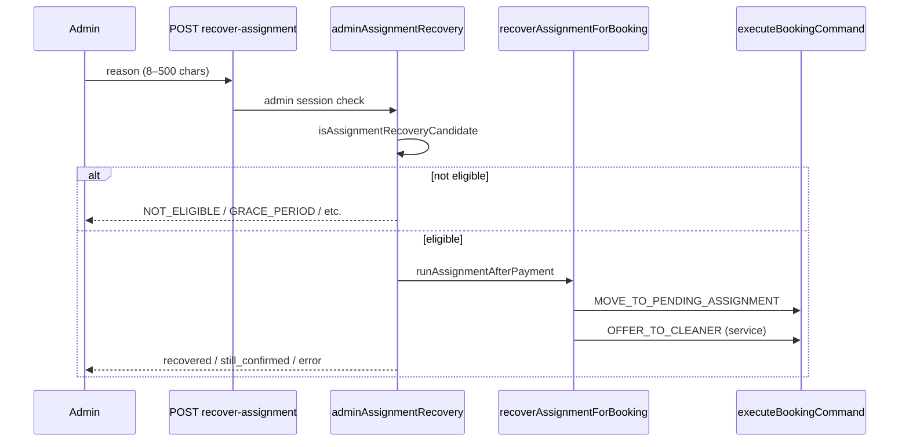
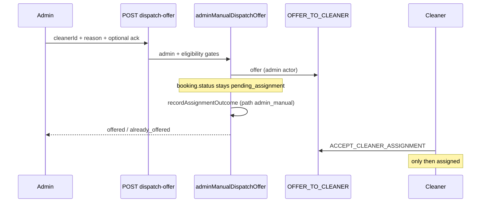

# Stage 4B Final Audit — Admin Operational Control Safety

**Date:** 2026-05-17  
**Type:** Audit only — no code changes  
**Scope:** Stage 4B-1 (read-only ops hardening), 4B-2a (single-booking recovery), 4B-3a (manual dispatch offer)  
**Baseline:** [stage-4a-admin-dispatch-operational-control-audit.md](./stage-4a-admin-dispatch-operational-control-audit.md)

**Related:** [admin-operational-dashboard.md](../operations/admin-operational-dashboard.md), [assignment-recovery.md](../operations/assignment-recovery.md), [assignment-decline-redispatch.md](../operations/assignment-decline-redispatch.md), [stage-4b-3-manual-cleaner-dispatch-design.md](../architecture/stage-4b-3-manual-cleaner-dispatch-design.md)

---

## Executive summary

| Question | Answer |
|----------|--------|
| Did Stage 4B improve admin operations safely? | **Yes** — read models, filters, and two bounded assignment mutations behind command layer + eligibility |
| Unsafe lifecycle bypass introduced? | **No new bypass in UI/API** — still no `ADMIN_OVERRIDE_STATUS`, no admin accept/decline, no payment finalize |
| Safe to deploy? | **Yes**, with ops training and known latent RLS risk unchanged from 4A |
| Recommended next (Stage 4C) | **Offer replace/cancel**, queue shortcuts, `admin_manual` decline policy, optional audit hardening |

---

## Before vs after (Stage 4A → 4B)

| Area | Stage 4A | Stage 4B |
|------|----------|----------|
| Home / bookings counts | Misleading partial counts | True totals vs visible slice (`computeAdminOperationsSummary`) |
| Bookings list | Last 200 only, no filters | Filters, search, date range (`filterAdminBookings`) |
| Booking detail ops | Payment + payout only | Operational panel, recovery eligibility, manual dispatch eligibility |
| Audit timeline | Command / from / to / time | + actor, reason, idempotency key, sanitized metadata summary |
| Post-payment stuck (`confirmed`) | Cron/script only | **4B-2a:** admin recovery button when eligible |
| Selected declined / max attempts | “Not in app” copy | **4B-3a:** manual offer to eligible cleaner |
| Admin POST mutations | 2 (payout) | **4** (payout + recover + dispatch-offer) |
| `ADMIN_OVERRIDE_STATUS` UI | Absent | **Still absent** |
| Admin accept/decline | Absent | **Still absent** |
| Payment finalize from admin | Absent | **Still absent** |
| RLS / enum / earnings formulas | Unchanged | **Unchanged** in Stage 4B |

---

## Audit checklist (15 items)

| # | Check | Verdict | Evidence |
|---|--------|---------|----------|
| 1 | Read-only dashboard improvements | **Pass** | `adminOperationsReadModel`, `AdminOpsSummaryCards`, `AdminBookingsFilters`, `dashboardReadModels.test.ts` |
| 2 | Counts/filters/search safe | **Pass** | Pure functions; no writes; totals vs visible distinguished in tests |
| 3 | Operational panel accurate | **Pass** | `buildAdminOperationalStatus` + `resolveAssignmentVisibility`; enriched detail test |
| 4 | Audit timeline sanitized | **Pass** | `summarizeAuditMetadata` redacts secrets; `mapAuditRow` test |
| 5 | Recovery only eligible bookings | **Pass** | `isAssignmentRecoveryCandidate` + status/grace/open-offer guards in `adminAssignmentRecovery.ts` |
| 6 | Recovery requires admin + reason | **Pass** | `requireApiUser(["admin"])` + `validateAdminRecoveryReason` (8–500 chars) |
| 7 | Manual dispatch = offer only | **Pass** | `createAdminDispatchOffer` → `OFFER_TO_CLEANER`; post-check `cleaner_id` null |
| 8 | Manual dispatch requires eligible cleaner | **Pass** | `isCleanerEligibleForAssignment`; `CLEANER_NOT_ELIGIBLE` |
| 9 | Blocks open-offer conflicts | **Pass** | Pre-check + command `OPEN_OFFER_EXISTS`; tests |
| 10 | Max attempts require acknowledgement | **Pass** | `MAX_ATTEMPTS_REACHED` unless `acknowledgeMaxAttempts: true` |
| 11 | Unauthorized roles rejected | **Pass** | API `requireApiUser(["admin"])`; orchestrators `FORBIDDEN` for non-admin |
| 12 | Payout mutations use commands | **Pass** | `markBookingPayoutReadyAdmin` / `markBookingPaidOutAdmin` → `executeBookingCommand` |
| 13 | No `ADMIN_OVERRIDE_STATUS` UI | **Pass** | Grep: only command layer + tests; no admin components |
| 14 | No admin accept/decline | **Pass** | No `/api/admin/**/accept` or decline routes |
| 15 | No payment/earnings/RLS/enum changes | **Pass** | No Stage 4B migrations; typecheck + RLS integration tests pass |

---

## Admin action inventory (after Stage 4B)

### UI routes (unchanged count: 4)

| Route | Purpose |
|-------|---------|
| `/admin` | Ops home + summary cards + preview |
| `/admin/bookings` | Filterable bookings list |
| `/admin/bookings/[id]` | Detail: ops panel, recovery, manual dispatch, payout, audits |
| `/admin/assignments` | Assignment queue (read-only actions) |
| `/admin/payouts` | Payout aggregates |

### API routes

| Method | Route | Auth | Mutates? |
|--------|-------|------|----------|
| `GET` | `/api/admin/bookings` | `requireApiUser(["admin"])` | No |
| `GET` | `/api/admin/bookings/[id]` | Same | No |
| `GET` | `/api/admin/assignments` | Same | No |
| `GET` | `/api/admin/payouts` | `getCurrentUser` + admin role | No |
| `POST` | `/api/admin/bookings/[id]/payout-ready` | Session admin | Yes |
| `POST` | `/api/admin/bookings/[id]/mark-paid-out` | Session admin | Yes |
| `POST` | `/api/admin/bookings/[id]/recover-assignment` | `requireApiUser(["admin"])` | Yes |
| `POST` | `/api/admin/bookings/[id]/dispatch-offer` | `requireApiUser(["admin"])` | Yes |

**Allowlist test:** `adminApiRoutes.test.ts` — exactly **four** intentional admin POST mutation routes.

### Supporting read APIs (admin-eligible, unchanged)

- `GET|POST /api/booking/cleaners?bookingId=…` — cleaner picker for manual dispatch (no command on GET)

---

## Safe mutation list (admin session)

| Action | Command(s) | Preconditions | Direct `cleaner_id`? |
|--------|------------|---------------|----------------------|
| Mark payout-ready | `MARK_BOOKING_PAYOUT_READY` | `completed` | No |
| Mark paid out | `MARK_BOOKING_PAID_OUT` | `payout_ready` | No |
| Recover assignment (4B-2a) | Engine: `MOVE_TO_PENDING_ASSIGNMENT` + `OFFER_TO_CLEANER` (service actor) | `confirmed`, paid, past grace, no cleaner, no open/accepted offers | No |
| Manual dispatch offer (4B-3a) | `OFFER_TO_CLEANER` (admin actor) + `RECORD_ASSIGNMENT_ATTENTION` (metadata) | `pending_assignment`, paid, no cleaner, no open offer to other, eligible target, reason; max-attempts ack if ≥5 offers | **No** — assigned only after cleaner `ACCEPT_CLEANER_ASSIGNMENT` |

All mutations write **audit rows** via `executeBookingCommand` (except metadata-only `RECORD_ASSIGNMENT_ATTENTION` which is systemish by design).

---

## Forbidden mutation list (still blocked)

| Capability | Status | Notes |
|------------|--------|-------|
| `ADMIN_OVERRIDE_STATUS` | Command exists; **no admin API/UI** | Skips transition graph if ever exposed |
| Admin `ACCEPT_CLEANER_ASSIGNMENT` | **No API/UI** | Guard allows admin actor — latent if added without review |
| Admin `DECLINE_CLEANER_ASSIGNMENT` | **No API/UI** | Same |
| Direct `bookings.cleaner_id` update | **No app path** | Manual dispatch verifies `cleaner_id` still null after offer |
| `FINALIZE_PAYMENT_SUCCESS` | **No admin route** | Paystack / system only |
| Cancel/replace open offer | **Not in 4B-3a** | Admin must wait for decline/expiry or 4C |
| Batch recovery from UI | **Not implemented** | Cron + `ops:recover:assignments` |
| Earnings formula edits | **Not implemented** | |
| RLS policy changes in 4B | **None** | |

---

## Recovery lifecycle (4B-2a)



**Safety properties:**

- Only `confirmed` + paid + past grace + no assignment progress.
- Rejects `pending_assignment` with open offer.
- Does not pick a specific cleaner (engine chooses).
- Structured log: `admin_assignment_recovery`.

---

## Manual dispatch lifecycle (4B-3a)



**Safety properties:**

- Never calls `ACCEPT_CLEANER_ASSIGNMENT`.
- Idempotency: `assignment:offer:{bookingId}:{cleanerId}`.
- Blocks second cleaner while first offer open.
- Customer copy unchanged (no “manual dispatch” wording).

---

## Read-only layer safety

| Component | Safe? | Why |
|-----------|-------|-----|
| `filterAdminBookings` | Yes | In-memory filter on already-loaded rows |
| `computeAdminOperationsSummary` | Yes | Aggregates only; exposes limit caps |
| `summarizeAuditMetadata` | Yes | Denylist for secrets/tokens; truncates long strings |
| `buildAdminOperationalStatus` | Yes | Guidance strings only; no side effects |
| Assignment queue | Yes | Read + deep links; no queue POST |

**Caveat:** List/queue scans are capped (`ADMIN_BOOKINGS_LIST_LIMIT` 200, queue 100). Totals can exceed visible rows — UI labels this.

---

## Test evidence

**Commands run (2026-05-17):**

```text
npm run typecheck                                    → pass
npx vitest run (9 files, 76 tests)                 → pass
npx vitest run rls-policies.integration.test.ts    → pass (8 tests)
```

**Targeted suites:**

| Suite | Tests | Relevance |
|-------|-------|-----------|
| `adminApiRoutes.test.ts` | 1 | POST allowlist = 4 routes |
| `adminAssignmentRecovery.test.ts` | 10 | Recovery eligibility, reason, non-admin |
| `adminManualDispatchOffer.test.ts` | 10 | Offer-only, conflicts, max attempts, eligibility |
| `adminOperationalHelpers.test.ts` | 10 | Audit sanitization, filters, manual dispatch eligible |
| `dashboardReadModels.test.ts` | 18 | Admin read models, ops panel, filters |
| `recover-assignment/route.test.ts` | 2 | API auth |
| `dispatch-offer/route.test.ts` | 2 | API auth |
| `executeBookingCommand.test.ts` | 14 | OFFER guards, no direct patch |
| `earningsAndCompletion.test.ts` | 10 | Admin payout commands only |

---

## Remaining risks

| Risk | Severity | Mitigation |
|------|----------|------------|
| RLS grants admin `FOR ALL` on bookings/offers (4A latent) | **Medium** | Stage 4B did not widen; all new writes go through commands; monitor for raw Supabase admin clients |
| `ACCEPT_CLEANER_ASSIGNMENT` allows admin in guards | **Medium** | Do not add admin accept UI without legal/ops sign-off |
| Cannot replace open offer (4B-3a) | **Low–Med** | Ops wait for decline/expiry; Stage 4C cancel-and-reoffer |
| Orchestrators use **service role** for reads | **Low** | Admin session still required at API; mutations via command backend |
| `admin_manual` decline redispatch policy undefined | **Low** | Document ops expectation; add to `REDISPATCH_ELIGIBLE_PATHS` in 4C if needed |
| Assignment queue has no inline actions | **Low** | By design; use booking detail |
| Home attention count vs full DB | **Low** | Document caps in runbook |

---

## Production rollout checklist

- [ ] Deploy app build containing 4B-1, 4B-2a, 4B-3a together (single coherent admin ops release).
- [ ] Confirm `CRON_SECRET` + recover-assignment cron still scheduled (4B-2a does not replace batch).
- [ ] Confirm expire-assignment-offers cron active.
- [ ] Train ops: **Recover** = `confirmed` stuck; **Send offer** = `pending_assignment` + admin attention.
- [ ] Train ops: manual dispatch is **offer only**; customer must not be told “assigned” until cleaner accepts.
- [ ] Train ops: max-attempts checkbox required when ≥5 offer rows.
- [ ] Train ops: cannot offer cleaner B while open offer to cleaner A (wait or 4C).
- [ ] Verify admin role provisioning in production (`profiles.role = admin`).
- [ ] Smoke test on staging: payout-ready → paid-out unchanged.
- [ ] Smoke test: recovery on test `confirmed` booking after grace.
- [ ] Smoke test: manual dispatch on `selected_declined_admin` test booking.
- [ ] Monitor logs: `admin_assignment_recovery`, `admin_manual_dispatch`.

---

## Rollback plan

| Layer | Rollback |
|-------|----------|
| Application | Redeploy previous release (removes recovery + dispatch UI/routes; read-only 4B-1 can stay if shipped separately) |
| Database | **No migration rollback required** for Stage 4B |
| Ops | Revert to cron/script-only recovery and offline cleaner coordination |
| Data | Offers/audits created by 4B actions are valid; no data migration to undo |

**Partial rollback:** Feature-flag or hide `AdminRecoverAssignmentAction` / `AdminManualDispatchAction` in UI while leaving read-only 4B-1 live.

---

## Final verdict

**Stage 4B is safe to deploy** as an operational-control increment:

- Improves visibility and bounded admin actions without exposing status override, payment finalize, or direct assignment.
- New mutations are **narrow**, **audited**, and **test-covered**.
- Customer/cleaner authorization boundaries on admin APIs are enforced.
- Payout path unchanged and still command-gated.

Deploy with ops runbooks updated ([admin-operational-dashboard.md](../operations/admin-operational-dashboard.md), [assignment-decline-redispatch.md](../operations/assignment-decline-redispatch.md)).

---

## What should Stage 4C be?

Recommended priority order:

| Priority | Stage 4C item | Why |
|----------|---------------|-----|
| **P0** | **Cancel/replace open offer** (`4B-3b`) | Removes ops deadlock when wrong cleaner has open offer |
| **P1** | **`admin_manual` decline/expiry policy** | Clarify auto-redispatch after admin-initiated offer ends |
| **P2** | Assignment queue inline “Open booking” + dispatch shortcut | Same guards as detail; faster triage |
| **P3** | Structured admin action audit export / SIEM | Compliance beyond `console.warn` JSON |
| **P4** | RLS tightening for admin direct writes | Reduce latent bypass from 4A |
| **Defer** | Admin accept/decline, `ADMIN_OVERRIDE_STATUS` UI, team dispatch | High consent / legal risk |

**Not recommended for 4C:** payment finalize, earnings formula changes, or batch “recover all” without per-booking reason.

---

## References (implementation map)

| Feature | Primary files |
|---------|----------------|
| 4B-1 read models | `adminOperationsReadModel.ts`, `adminOperationalHelpers.ts` |
| 4B-2a recovery | `adminAssignmentRecovery.ts`, `recover-assignment/route.ts` |
| 4B-3a dispatch | `adminManualDispatchOffer.ts`, `createAdminDispatchOffer.ts`, `dispatch-offer/route.ts` |
| UI | `AdminOperationalStatusPanel.tsx`, `AdminRecoverAssignmentAction.tsx`, `AdminManualDispatchAction.tsx` |
| POST allowlist | `adminApiRoutes.test.ts` |
