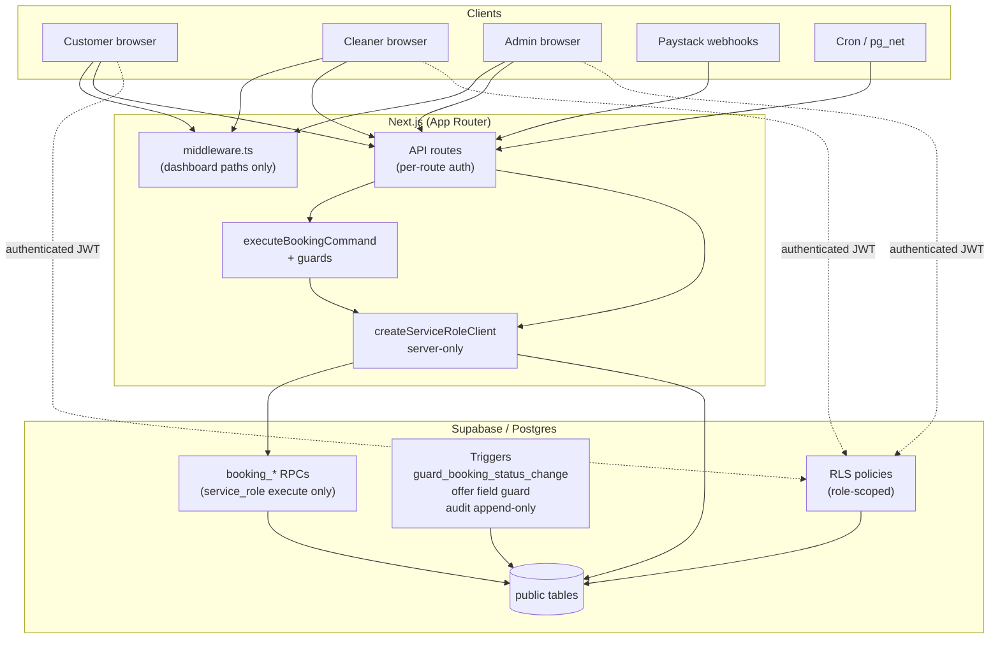

# Stage 5A — Security, RLS & Governance Audit

**Date:** 2026-05-17  
**Scope:** Supabase RLS, admin `FOR ALL` policies, service-role usage, command-boundary enforcement, direct DB write risks, admin mutation governance, audit integrity, payout governance, dangerous APIs/routes, idempotency, cron governance, operational overrides, auth/session trust boundaries.  
**Type:** Audit only — no code, migrations, RLS, payment finalize, assignment accept semantics, or earnings formula changes.

**Related:** [stage-4a-admin-dispatch-operational-control-audit.md](./stage-4a-admin-dispatch-operational-control-audit.md), [stage-3a-assignment-dispatch-reliability-audit.md](./stage-3a-assignment-dispatch-reliability-audit.md), [database-plan.md](../database-plan.md)

---

## Executive summary

| Area | Verdict | Summary |
|------|---------|---------|
| RLS baseline | **Good** | Core tables RLS-enabled; customer/cleaner scoped reads; status-change trigger on `bookings` |
| Admin `FOR ALL` | **High latent risk** | 12+ tables grant authenticated admins unrestricted DML; app routes use commands, PostgREST does not |
| Service role | **Centralized** | Booking commands, locks, crons, admin dispatch/recovery use server-only service role |
| Command boundary | **Strong for status** | `bookings.status` blocked for authenticated sessions; transitions via `booking_*` RPCs (service role only) |
| Direct write gaps | **Medium** | `payments`, `earning_lines`, `assignment_offers` lack DB guards equivalent to booking status |
| Audit integrity | **Partial** | Status transitions audited; offers/declines/admin ops often lack durable audit rows |
| Payout governance | **Adequate via app** | Payout mutations admin-only + command layer; RLS allows direct ledger tampering |
| Dangerous routes | **Mostly gated** | Webhook signature + cron secret; public quote/health OK; no `ADMIN_OVERRIDE` API |
| Idempotency | **Uneven** | Payment/finalize/cron strong; assignment offer commands weak on audit keys |
| Cron governance | **Good auth, thin ops** | `CRON_SECRET` required; pg_cron invoke locked down; limited run observability |
| Auth / escalation | **Good** | `handle_new_user` ignores metadata role; profile role self-escalation blocked |
| Convention vs enforcement | **Mixed** | Lifecycle enforced in DB+commands; earnings/payments/offers rely on app discipline |

**Stage 5B direction:** Prefer additive, application-layer hardening before broad RLS surgery. Narrow command actor policies and persist admin operational audit before rewriting admin `FOR ALL` policies.

---

## Governance architecture map

### Trust layers (strongest → weakest)

| Layer | What it enforces | Bypass if compromised |
|-------|------------------|------------------------|
| 1. API route auth | Role checks (`requireApiUser`, `getCurrentUser`) | Direct PostgREST with user JWT |
| 2. Command guards | Actor + transition matrix in `bookingCommandGuards.ts` | Service role misuse or `ADMIN_OVERRIDE_STATUS` |
| 3. `executeBookingCommand` | Orchestration order, idempotency for finalize | Direct DML via service role (expected for server) |
| 4. `booking_*` RPCs | Atomic status + audit; idempotency index | Service role only (not grant to `authenticated`) |
| 5. `guard_booking_status_change` | Blocks `bookings.status` change when `auth.uid()` set | Service role / SQL superuser |
| 6. RLS | Row visibility; admin `FOR ALL` writes | Compromised admin account |
| 7. Convention | `forbidBookingStatusInPatch`, docs | Raw SQL, service role abuse |

---

## RLS risk table

**Migration source:** `supabase/migrations/20260516160000_rls_role_security.sql` (+ phase 10, locks, cleaner tables).

| Table | RLS | Admin policy | Primary risk | DB enforcement beyond RLS |
|-------|-----|--------------|--------------|---------------------------|
| `profiles` | Yes | Select any; update own row only | Low | Role change blocked in `with check` for non-admin |
| `customers` | Yes | Insert/delete admin | Medium | No lifecycle fields |
| `cleaners` | Yes | Insert/delete admin | Medium | No lifecycle fields |
| `services` | Yes | **`FOR ALL`** | Low–medium | Catalog tampering |
| `bookings` | Yes | **`FOR ALL`** | **High (latent)** | **Status trigger** blocks authenticated status writes |
| `payments` | Yes | **`FOR ALL`** | **High (latent)** | **None** on `status` |
| `payment_events` | Yes | **`FOR ALL`** | Medium | Unique `provider_event_id` |
| `assignment_offers` | Yes | **`FOR ALL`** | **High (latent)** | Cleaner field guard only (not admin) |
| `earning_lines` | Yes | **`FOR ALL`** | **High (latent)** | **None** (comment: app-only) |
| `notification_outbox` | Yes | **`FOR ALL`** | Medium | — |
| `booking_state_audit` | Yes | **Select only** | Low | Append-only trigger |
| `booking_locks` | Yes | **`FOR ALL`** | Medium | No customer insert policy (locks via service role) |
| `payout_batches` | Yes | **`FOR ALL`** | Medium | — |
| `cleaner_*` (4 tables) | Yes | **`FOR ALL`** each | Low–medium | Eligibility data only |

### Tables with overly broad admin writes (`FOR ALL`)

These allow any authenticated admin JWT to **insert/update/delete arbitrary rows** via PostgREST, without going through application commands:

1. `bookings` — mitigated for **`status`** only by `guard_booking_status_change`
2. `payments` — **not mitigated** (can set `status = paid`, change `amount_cents`)
3. `payment_events` — forge events (webhook path also protected by app)
4. `assignment_offers` — create/accept offers, change `booking_id` / `cleaner_id` (no admin field guard)
5. `earning_lines` — change `payout_status`, amounts, `payout_batch_id`
6. `services`, `notification_outbox`, `booking_locks`, `payout_batches`, cleaner eligibility tables

### What RLS does well

- Customers isolated to own bookings/payments; cleaners scoped to offers and assigned/offer-linked bookings.
- `booking_state_audit` has **no insert policy** for `authenticated` — clients cannot forge audit rows (service role / RPC only).
- `booking_*` functions: `REVOKE ALL FROM public` + `GRANT EXECUTE TO service_role` only (`20260515203000_booking_command_layer.sql`).

### `profiles` role escalation (signup / client)

| Vector | Status | Evidence |
|--------|--------|----------|
| `raw_user_meta_data.role` on signup | **Blocked** | `handle_new_user` always inserts `customer` (`20260517_stage1c_harden_handle_new_user.sql`) |
| Self-update `profiles.role` | **Blocked** | `profiles_update` `with check` requires role unchanged unless already admin |
| JWT `user_metadata` in app | **Not used** | `getCurrentUser` reads `profiles.role` from DB |
| Service-role seed admin | **Intentional** | Integration test documents E2E service-role upsert to `admin` |

---

## Service-role usage inventory

| Location | Purpose | Justification | Risk if leaked |
|----------|---------|---------------|----------------|
| `src/lib/supabase/serviceRole.ts` | Factory + `requireServiceRoleClient` | Server-only; bypasses RLS for trusted orchestration | Full database access |
| `runBookingCommand` / `SupabaseBookingCommandBackend` | All booking commands | RPC + DML in one backend; matches trigger bypass (`auth.uid()` null) | Lifecycle manipulation |
| `createBookingPaymentLock` / `insertBookingLock` | Lock rows (no customer insert RLS) | Customers cannot insert `booking_locks` | Lock/checkout abuse |
| `initializePayment` | `payment_link_expires_at` patch, payment lookup | Post-command field update | Payment metadata tampering |
| `verifyPayment` | Load payment/booking for ownership check | Customer scoped verify | Read all payments |
| `expireStalePendingPayments` (cron) | Scan + command per row | Batch expiry | Mass `payment_failed` |
| `expireStaleAssignmentOffers` (cron) | Direct offer expiry + redispatch | Cron batch | Offer/status corruption |
| `recover-assignment-after-payment` cron/script | Assignment recovery batch | Ops automation | Dispatch storms |
| `adminManualDispatchOffer` / `adminReplaceOpenOffer` / `adminAssignmentRecovery` | Pre-flight reads (booking paid, offers) | Consistent eligibility checks | Read/write all rows |
| `phase1IntegrationTestSupport` / RLS tests | Test provisioning | Dev/test only | N/A in prod if keys scoped |
| `repairOrphanedAssignments.ts` | Ops script | Manual repair | Same as service role |
| Postgres `provision_customer_for_profile` | **service_role only** | Provisioning | Customer row creation |
| Postgres `booking_*` RPCs | **service_role only** | Atomic transitions | Payment finalize, status changes |

**Client bundle safety:** `src/lib/auth/clientBundleSafety.test.ts` forbids service-role imports in auth UI paths.

**Grants note:** `20260516140000_api_role_grants.sql` grants `authenticated` broad table DML; RLS is the real gate, not table grants.

---

## Mutation boundary analysis

### Commands as the lifecycle spine

All `bookings.status` changes intended for production flow through `executeBookingCommand` → `booking_apply_transition` / `booking_finalize_payment_success` / `booking_record_payment_failure` (service-role client).

`guard_booking_status_change` raises `BOOKING_STATUS_MUTATION_FORBIDDEN` when `auth.uid()` is not null — verified in `src/tests/security/rls-policies.integration.test.ts`.

### Mutations that bypass or partially bypass commands

| Path | Bypass type | Severity | Notes |
|------|-------------|----------|-------|
| Admin PostgREST `payments` update | Direct DB | **Critical latent** | Could mark paid without Paystack |
| Admin PostgREST `earning_lines` update | Direct DB | **High latent** | Payout ledger without `MARK_BOOKING_*` |
| Admin PostgREST `assignment_offers` | Direct DB | **High latent** | Fake accept / wrong cleaner |
| `expireStaleAssignmentOffers` | Direct `assignment_offers` update | **Accepted** | Cron uses service role; then `processBookingAfterOfferExpiry` commands |
| `initializePayment` | Direct `payments.update` for `payment_link_expires_at` | Low | After `MARK_PAYMENT_PENDING` |
| `paymentRepository.updatePaymentProviderRef` | Direct payment patch | Low | Provider ref only |
| Cleaner RLS offer `update` | Direct DB | **By design** | Status/response fields; field guard blocks `booking_id` tamper |
| `ADMIN_OVERRIDE_STATUS` | Command (tests only) | **Critical if exposed** | Skips transition matrix; not in any API route |
| `OFFER_TO_CLEANER` / `DECLINE_*` | No `booking_state_audit` row | Medium | Assignment ops invisible in audit timeline |

### API → command coverage (production routes)

| Route | Auth | Command / path |
|-------|------|----------------|
| `POST /api/bookings/lock` | Customer | `CREATE_BOOKING_DRAFT` + service-role lock |
| `POST /api/paystack/initialize` | Customer | `MARK_PAYMENT_PENDING` |
| `POST /api/paystack/webhook` | HMAC signature | `FINALIZE_*` / failure commands |
| `GET/POST /api/paystack/verify` | User | Finalize via command (service role inside) |
| `POST /api/cleaner/offers/[id]/accept` | Cleaner | `ACCEPT_CLEANER_ASSIGNMENT` |
| `POST /api/cleaner/offers/[id]/decline` | Cleaner | `DECLINE_CLEANER_ASSIGNMENT` |
| `POST /api/cleaner/jobs/[id]/start|complete` | Cleaner | `MARK_BOOKING_IN_PROGRESS` / `COMPLETED` |
| `POST /api/admin/bookings/[id]/payout-ready` | Admin | `MARK_BOOKING_PAYOUT_READY` |
| `POST /api/admin/bookings/[id]/mark-paid-out` | Admin | `MARK_BOOKING_PAID_OUT` |
| `POST /api/admin/bookings/[id]/dispatch-offer` | Admin | `OFFER_TO_CLEANER` (admin actor) |
| `POST /api/admin/bookings/[id]/replace-open-offer` | Admin | Cancel + offer commands |
| `POST /api/admin/bookings/[id]/recover-assignment` | Admin | `runAssignmentAfterPayment` engine |
| `GET/POST /api/cron/*` | `CRON_SECRET` | Batch commands / direct offer expiry |

**Unauthenticated (by design):** `POST /api/pricing/quote`, `GET /api/health` — no data mutation.

### Command guard gaps (convention, not API today)

| Command | Issue |
|---------|--------|
| `ACCEPT_CLEANER_ASSIGNMENT` | `cleanerOrAdmin` policy; `assertCleanerIs` **skipped** for `admin` actor — admin could accept any offer if a route called it |
| `DECLINE_CLEANER_ASSIGNMENT` | Same pattern |
| `MARK_BOOKING_IN_PROGRESS` / `MARK_BOOKING_COMPLETED` | Admin/system actors skip cleaner ownership checks |
| `ADMIN_OVERRIDE_STATUS` | Skips `assertTransitionShape`; reachable only via `executeBookingCommand` + service role today |

---

## Audit integrity analysis

### Durable audit (`booking_state_audit`)

| Property | Enforcement |
|----------|-------------|
| Append-only | `forbid_booking_state_audit_mutation` trigger |
| Idempotency | Partial unique `(booking_id, idempotency_key)` when key set |
| Actor fields | `actor_type`, `actor_profile_id`, `reason`, `metadata` |
| Authenticated insert | **Denied** (no insert policy) |

### Gaps

| Event | Durable audit? | Today |
|-------|----------------|-------|
| Status transition via RPC | Yes | `booking_apply_transition` inserts row |
| `CREATE_BOOKING_DRAFT` | Yes | `appendAudit` |
| `OFFER_TO_CLEANER` | **No** | Offer row only |
| `DECLINE_CLEANER_ASSIGNMENT` | **No** | Offer row only |
| `ACCEPT_CLEANER_ASSIGNMENT` | Yes | Via `applyTransition` |
| `CANCEL_OPEN_ASSIGNMENT_OFFER` | Yes | `appendAudit` (same status) |
| `RECORD_ASSIGNMENT_ATTENTION` | Yes | Metadata + audit |
| Admin dispatch / recovery / replace | **Partial** | `console.warn` JSON (`logAdminManualDispatch`, etc.) only |
| Payout-ready / paid-out | Yes | Command transition + earning updates |
| Cron expiry / recovery | Yes (when command runs) | Per-command `idempotencyKey` where implemented |

**Operational impact:** Admin UI cannot show who dispatched, why, or tie recovery to audit rows without log aggregation.

---

## Idempotency analysis

| Flow | Key | Enforced at | Gap |
|------|-----|-------------|-----|
| Paystack finalize | `paystack:…` / event id | Command + DB unique audit | Strong |
| Paystack failure | Failure command key | Command + audit | Strong |
| Cron expire pending payment | `cron:expire-pending-payment:{paymentId}` | Command | Strong |
| Payment row | `payments.idempotency_key` UNIQUE | DB + `MARK_PAYMENT_PENDING` | Strong |
| Lock checkout | `booking_locks.idempotency_key` UNIQUE | DB | Strong |
| Admin payout actions | `payout-ready-{bookingId}` / `paid-out-{bookingId}` | Command audit lookup via transition RPC | Re-run safe |
| Assignment accept/decline | `assignment:accept|decline:{offerId}` | Passed but **not checked** in `OFFER_TO_CLEANER` path | Weak for offers |
| Admin dispatch offer | `assignment:offer:{bookingId}:{cleanerId}` | Passed on command; **no pre-check** in executor | Duplicate handling relies on DB unique open offer |
| Offer expiry cron | Status guard `offered` | Row update | Safe but no audit idempotency key |
| Post-decline redispatch | Design doc recommends `assignment:process-terminal-offer:{offerId}` | **Not fully implemented** | Duplicate redispatch risk under race |

**FINALIZE_PAYMENT_SUCCESS** is the only command that hard-fails without `idempotencyKey` in `executeBookingCommand`.

---

## Cron governance analysis

| Job | Entry | Auth | Observability |
|-----|-------|------|---------------|
| Expire pending payments | `/api/cron/expire-pending-payments` | `verifyCronSecret` | JSON: `scanned`, `expired`, `skipped`, `errors` |
| Expire assignment offers | `/api/cron/expire-assignment-offers` | Same | JSON counts + booking id lists |
| Recover assignment after payment | `/api/cron/recover-assignment-after-payment` | Same | Batch result payload |

### Strengths

- `verifyCronSecret` returns false when `CRON_SECRET` unset — endpoints return 401.
- Supports `Authorization: Bearer` and `x-cron-secret`.
- `invoke_expire_assignment_offers_http` revoked from `public`, `anon`, `authenticated` (`20260516220000_expire_assignment_offers_cron.sql`).
- Vault-based URL/secret for pg_net (no secrets in migration).

### Gaps

- **GET allowed** on cron routes (same handler as POST) — secret in query logs risk if ever misused.
- No first-class **run id**, duration, or dead-letter table — only HTTP response + app logs.
- No automated alert if `CRON_SECRET` missing in production deploy (fails at runtime only).
- pg_cron job registration in migration — environment-specific URL must be configured manually.

---

## Payout governance

| Control | Present? | Detail |
|---------|----------|--------|
| API role gate | Yes | `markBookingPayoutReadyAdmin` / `markBookingPaidOutAdmin` check `user.role === admin` |
| Command actor | Yes | `adminOnly` for `MARK_BOOKING_PAYOUT_READY` / `MARK_BOOKING_PAID_OUT` |
| Transition guards | Yes | `completed` → `payout_ready` → `paid_out` only |
| Earning line coupling | Yes | `markBookingEarningsPayoutReady` / `markBookingEarningsPaid` in command path |
| RLS | **Weak** | `earning_lines_admin_write` **`FOR ALL`** — direct DB can mark paid without booking transition |
| `payout_batches` | Admin RLS only | Optional `payoutBatchId` on paid-out; no bank transfer automation |
| Separation of duties | **No** | Same admin can mark payout-ready and paid-out (no maker/checker) |
| Audit | Partial | Status transition audited; earning line changes not in separate ledger audit |

---

## Dangerous routes & exposure

| Route | Risk | Mitigation |
|-------|------|------------|
| `POST /api/paystack/webhook` | Forged payments | HMAC-SHA512 signature |
| Cron routes | Batch lifecycle | `CRON_SECRET` |
| Admin dispatch/recovery/replace | Wrong cleaner / bypass consent | Eligibility checks + reason length; still uses `OFFER_TO_CLEANER` not cleaner accept API |
| `POST /api/pricing/quote` | Abuse / DoS | Stateless; rate limit at edge (not in app) |
| `GET /api/health` | Info disclosure | Minimal JSON |
| Dashboard paths | Role confusion | Middleware + layout `requireProfileRole` |
| **API routes outside middleware** | Missed auth if new route added | Per-route discipline required |

**Not exposed (good):** `ADMIN_OVERRIDE_STATUS`, admin accept assignment, payment finalize without provider proof.

---

## Auth / session trust boundaries

| Concern | Implementation | Assessment |
|---------|----------------|------------|
| Session proof | `supabase.auth.getUser()` in `getCurrentUser` | Correct (not `getSession()` alone) |
| Role source of truth | `profiles.role` in DB | Correct |
| Dashboard gate | `middleware.ts` on `/customer`, `/admin`, `/cleaner` | Good |
| API gate | Per-handler | Consistent on reviewed routes; **not centralized** |
| Service role in browser | Blocked by test + `server-only` | Good |
| Customer provisioning | `ensure_customer_provisioned` RPC with self/admin check | Good |
| Admin auth inconsistency | Some admin routes use `getCurrentUser` + manual check, others `requireApiUser` | Low — behavior equivalent if role checked |

---

## High-risk gap list (prioritized)

| # | Gap | Severity | Exploitability |
|---|-----|----------|----------------|
| G1 | Admin `FOR ALL` on `payments` / `earning_lines` / `assignment_offers` | **Critical latent** | Compromised admin JWT or insider |
| G2 | `ACCEPT_CLEANER_ASSIGNMENT` allows `admin` actor without cleaner binding | **High latent** | New API or script mistake |
| G3 | Assignment offer commands lack `booking_state_audit` rows | **Medium** | Ops / compliance |
| G4 | Admin ops log to stdout only (`logAdmin*`) | **Medium** | No forensic trail in DB |
| G5 | `payments.status` has no DB trigger guard | **High latent** | PostgREST |
| G6 | `earning_lines` mutable by admin RLS | **High latent** | PostgREST |
| G7 | `ADMIN_OVERRIDE_STATUS` in command surface | **High latent** | Future admin tool |
| G8 | Idempotency not enforced in `OFFER_TO_CLEANER` executor | **Medium** | Race / double dispatch |
| G9 | Cron observability / prod secret validation | **Low–medium** | Ops blind spots |
| G10 | `expireOffers` direct offer update outside command | **Low** | Accepted pattern; document |

---

## Safest governance hardening roadmap (Stage 5B+)

Ordered by **safety × leverage** (additive first, RLS surgery later).

| Slice | Scope | Touches lifecycle? | Risk |
|-------|--------|-------------------|------|
| **5B-1** | Persist admin operational audit (dispatch, recovery, replace) to `booking_state_audit` via `RECORD_ASSIGNMENT_ATTENTION` or dedicated append-only `admin_operations_audit` | No | **Lowest** |
| **5B-2** | Tighten command actor policies: remove `admin` from `ACCEPT`/`DECLINE`; require cleaner binding | No accept semantics change for cleaner routes | Low |
| **5B-3** | Add `appendAudit` (or metadata audit) for `OFFER_TO_CLEANER` / decline paths | No | Low |
| **5B-4** | Production guard: require `CRON_SECRET` at startup / deploy check; cron structured logging with `runId` | No | Low |
| **5B-5** | Idempotency: honor `idempotencyKey` in `OFFER_TO_CLEANER`; post-terminal-offer processing key | No | Low–medium |
| **5B-6** | DB triggers: `payments.status` change guard (mirror bookings) | No payment finalize logic change if service role exempt | Medium |
| **5B-7** | Narrow RLS: split `bookings_admin_write` → select + update (non-status columns) / revoke admin delete | No | **Medium–high** |
| **5B-8** | `earning_lines` append-only + command-only payout status | No formula change | Medium |
| **5B-9** | Maker/checker for payout paid-out vs payout-ready | Workflow | Higher |
| **5B-10** | Remove or gate `ADMIN_OVERRIDE_STATUS` behind break-glass flag | Override only | Medium |

---

## Things not to touch (Stage 5B unless explicitly replanned)

- Payment finalize path (`booking_finalize_payment_success`, Paystack webhook mapping, verify flow)
- Cleaner **accept** semantics and customer consent model
- Earnings **calculation** formulas and `recordEarningsForBooking` amounts
- Assignment engine ranking / eligibility algorithms (unless security-specific)
- Customer signup / `handle_new_user` role defaulting (already hardened)
- Existing Paystack idempotency keys and `payments.idempotency_key` contract
- `booking_apply_transition` optimistic concurrency semantics

---

## Checklist answers (1–15)

1. **Overly broad admin writes:** `services`, `bookings`, `payments`, `payment_events`, `assignment_offers`, `earning_lines`, `notification_outbox`, `booking_locks`, `payout_batches`, four `cleaner_*` tables — see RLS table.
2. **Service role APIs:** Booking command backend, locks, payment verify side reads, crons, admin dispatch/recovery reads, ops scripts — see inventory.
3. **Mutations bypassing commands:** Direct payment/earning/offer admin DML; offer expiry cron update; payment metadata patch — see mutation table.
4. **Direct DB bypass lifecycle:** Admin can tamper `payments` / `earning_lines` / offers; cannot change `bookings.status` as authenticated user.
5. **Audit sufficiency:** Status changes yes; offers/declines/admin ops insufficient.
6. **Stronger governance needed:** Payout paid-out, manual dispatch, replace offer, recovery, any future override.
7. **Payout protection:** App-layer strong; RLS weak; no dual control.
8. **Dangerous routes:** None critical exposed; webhook/cron depend on secrets.
9. **Idempotency consistency:** Payment strong; assignment offer weak.
10. **Cron protected/observable:** Auth yes; observability thin.
11. **Auth/session boundaries:** Clean for role; API not in middleware.
12. **Role escalation from signup/client:** Blocked.
13. **Command guards for lifecycle:** Strong for transitions; admin actor holes on accept/complete.
14. **Convention vs enforcement:** Payments, earnings, offers, admin audit = convention.
15. **Safest next slices:** 5B-1 → 5B-2 → 5B-3 before RLS narrowing.

---

## Final question: safest first implementation slice for Stage 5B?

**Recommendation: Stage 5B-1 — Persist admin operational audit (additive only).**

Wire existing admin mutations (`dispatch-offer`, `replace-open-offer`, `recover-assignment`) to append durable rows (either extend `RECORD_ASSIGNMENT_ATTENTION` metadata on the booking or add a small `admin_operations_audit` append-only table) capturing:

- `admin_profile_id`
- `booking_id`
- `action` (`dispatch_offer`, `replace_offer`, `recover_assignment`)
- `reason` (already validated 8–500 chars)
- `cleaner_id` / `offer_id` when applicable
- `idempotency_key` derived from action + booking + target

**Why this is safest**

- No RLS migration rollback risk
- No payment finalize, accept, or earnings formula changes
- No change to assignment or payout state machines
- Immediately improves forensics and unblocks admin UI audit display later
- Pairs naturally with 5B-2 (command actor tightening) and 5B-7 (RLS narrowing) in later slices

**Do not start Stage 5B with:** broad admin `FOR ALL` RLS removal or `ADMIN_OVERRIDE` exposure — high regression risk while latent paths remain un-audited.

---

## Verification references

- RLS integration: `src/tests/security/rls-policies.integration.test.ts`
- Signup role: `src/tests/security/handle-new-user.integration.test.ts`
- Command guards: `src/features/bookings/server/commands/bookingCommandGuards.ts`
- Cron auth: `src/lib/cron/verifyCronSecret.ts`
