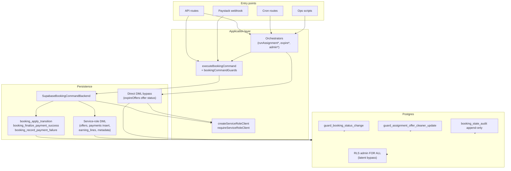

# Stage 5B-2 — Command Boundary Guard Audit

**Date:** 2026-05-17  
**Scope:** Command-boundary enforcement for lifecycle tables after Stage 4 admin operational tooling and Stage 5B-1 durable admin operational audit. Audits direct writes vs `executeBookingCommand` / booking RPCs across bookings, payments, assignment offers, earnings/payouts, APIs, crons, scripts, and service-role helpers.  
**Type:** Audit / design only — **no code, migrations, RLS, payment finalize, assignment accept semantics, earnings formulas, or `ADMIN_OVERRIDE_STATUS` exposure.**

**Related:** [stage-5a-security-governance-audit.md](./stage-5a-security-governance-audit.md), [stage-5b-1-durable-admin-operational-audit-final-audit.md](./stage-5b-1-durable-admin-operational-audit-final-audit.md), [booking-command-execution-layer.md](../architecture/booking-command-execution-layer.md), [admin-operational-audit.md](../operations/admin-operational-audit.md)

**Stage 5B-2a implemented:** [command-boundary-static-guards.md](../security/command-boundary-static-guards.md) — static CI guards and POST route allowlists (detection-only).

---

## Executive summary

| Area | Verdict | Summary |
|------|---------|---------|
| `bookings.status` | **Strong** | All app paths use `executeBookingCommand` → `booking_*` RPCs; DB trigger blocks authenticated status writes |
| `payments.status` | **App-strong, DB-weak** | Only RPCs + command backend insert; no status trigger; admin `FOR ALL` allows PostgREST bypass |
| `assignment_offers.status` | **Mixed** | Command-orchestrated updates in executor; **cron direct expiry** bypasses commands; cleaner RLS update + field guard |
| `earning_lines` / payout | **App-strong, DB-weak** | Payout transitions only via command backend helpers; admin RLS allows direct ledger tampering |
| Command coverage (APIs) | **Good** | Production mutation routes delegate to commands or approved ops flows |
| Service role | **Centralized** | Booking commands, locks, Paystack finalize/failure, crons, admin ops reads, ops scripts |
| Convention vs enforcement | **Mixed** | Booking status has static CI guard + DB trigger; payments/offers/earnings rely on discipline + RLS latency |
| Admin ops (5B-1) | **Additive audit only** | `admin_operational_audit` does not replace lifecycle audit; admin actions still use same command paths |

**Stage 5B-2 direction:** Harden **detection and allowlists** before RLS surgery (Stage 5A deferred broad admin `FOR ALL` narrowing). Prefer static guards and route inventories that do not change runtime lifecycle behavior.

---

## Governance architecture (command boundary view)

---

## 1. Which code paths write to `bookings.status`?

### Command-backed (intended production paths)

| Path | Command / RPC | Actor | Notes |
|------|---------------|-------|-------|
| `CREATE_BOOKING_DRAFT` | Insert `draft` (no RPC) | customer/admin | `supabaseBookingCommandBackend.insertBooking` |
| `MARK_PAYMENT_PENDING` | `booking_apply_transition` | customer/admin | → `pending_payment` |
| `FINALIZE_PAYMENT_SUCCESS` | `booking_finalize_payment_success` | service | → `confirmed`; updates payment to `paid` in same RPC |
| `MARK_PAYMENT_FAILED` | `booking_record_payment_failure` | service | → `payment_failed` |
| `MOVE_TO_PENDING_ASSIGNMENT` | `booking_apply_transition` | service | → `pending_assignment`; paid-payment gate in TS |
| `ACCEPT_CLEANER_ASSIGNMENT` | `booking_apply_transition` (+ `cleaner_id`) | cleaner | → `assigned` |
| `MARK_BOOKING_IN_PROGRESS` / `MARK_IN_PROGRESS` | `booking_apply_transition` | cleaner/admin/system | → `in_progress` |
| `MARK_BOOKING_COMPLETED` / `MARK_COMPLETED` | `booking_apply_transition` | cleaner/admin/system | → `completed` |
| `MARK_BOOKING_PAYOUT_READY` | `booking_apply_transition` | admin | → `payout_ready` |
| `MARK_BOOKING_PAID_OUT` | `booking_apply_transition` | admin | → `paid_out` |
| `CANCEL_BOOKING` | `booking_apply_transition` | customer/admin | → `cancelled` |
| `ADMIN_OVERRIDE_STATUS` | `booking_apply_transition` (arbitrary `nextStatus`) | admin | **Tests / break-glass only — no API** |

**Orchestrators that invoke commands (no direct status patch):**

- `runAssignmentAfterPayment` → `MOVE_TO_PENDING_ASSIGNMENT`
- `finalizePaidBooking` → `FINALIZE_PAYMENT_SUCCESS`
- `processPaystackChargeFailure` → `MARK_PAYMENT_FAILED`
- `expireStalePendingPayments` → `MARK_PAYMENT_FAILED` per row
- `initializePayment` → `MARK_PAYMENT_PENDING`
- `createBookingPaymentLock` → `CREATE_BOOKING_DRAFT`
- Admin: `createAdminDispatchOffer`, `createAdminCancelOpenOffer`, `adminReplaceOpenOffer` (cancel + offer commands)
- Cleaner: `respondToOffer` (accept/decline), `completionActions` (start/complete)
- Admin payout: `markBookingPayoutReadyAdmin`, `markBookingPaidOutAdmin`

### Direct writes (non-status)

| Path | Writes | Safe? |
|------|--------|-------|
| `SupabaseBookingCommandBackend.updateBookingMetadata` | `metadata`, `updated_at` only | **Yes** — no `status` |
| `RECORD_ASSIGNMENT_ATTENTION` | metadata via command | **Yes** — status unchanged |
| Read models / eligibility | `select` only | **Yes** |

### Direct `bookings.status` writes outside commands

| Location | Finding |
|----------|---------|
| Application `src/` | **None** outside `supabaseBookingCommandBackend` / `inMemoryBookingCommandBackend` (verified by `bookingStatusMutationGuard.test.ts`) |
| Postgres RPCs | `booking_apply_transition`, `booking_finalize_payment_success`, `booking_record_payment_failure` |
| Tests / RLS probes | Integration tests intentionally attempt forbidden patches |

---

## 2. Which code paths write to `payments.status`?

### Command-backed

| Transition | Mechanism |
|------------|-----------|
| Row created `pending` | `MARK_PAYMENT_PENDING` → `insertPayment` |
| → `paid` | `booking_finalize_payment_success` RPC only |
| → `failed` | `booking_record_payment_failure` RPC only |

### Direct writes (non-status or infrastructure)

| Path | Fields | Classification |
|------|--------|----------------|
| `paymentRepository.updatePaymentProviderRef` | `provider_ref`, `updated_at` | **Safe infrastructure** — no status |
| `initializePayment` (post-command) | `payment_link_expires_at` | **Safe infrastructure** — after `MARK_PAYMENT_PENDING` |
| `recordPaymentEvent` | `payment_events` insert | **Safe** — append-only log |
| `SupabaseBookingCommandBackend.insertPayment` | initial `pending` | **Command-backed** |

### Direct `payments.status` writes outside RPCs

| Location | Finding |
|----------|---------|
| Application `src/` | **No** `.update({ status: ... })` on `payments` outside command backend / in-memory backend |
| Postgres | Only inside `booking_finalize_payment_success` and `booking_record_payment_failure` |
| **Latent** | Admin JWT + PostgREST `payments_admin_write` **`FOR ALL`** can set any status without Paystack proof |

---

## 3. Which code paths write to `assignment_offers.status`?

### Command-backed (via `backend.updateOffer` / `insertOffer` inside `executeBookingCommand`)

| Command / flow | Offer transitions |
|----------------|-------------------|
| `OFFER_TO_CLEANER` | insert `offered`; may expire stale `offered` → `expired` inline |
| `DECLINE_CLEANER_ASSIGNMENT` | `offered` → `declined` |
| `ACCEPT_CLEANER_ASSIGNMENT` | `offered` → `accepted`; other open → `cancelled` |
| `CANCEL_OPEN_ASSIGNMENT_OFFER` | `offered` → `cancelled` |
| Accept/decline expiry handling | `offered` → `expired` when past `expires_at` |

### Direct write bypass (documented exception)

| Path | Mechanism | Risk |
|------|-----------|------|
| **`expireStaleAssignmentOffers`** (`expireOffers.ts`) | Service-role client `.update({ status: "expired" })` with `eq("status", "offered")` guard | **Low runtime risk** (idempotent row guard); **medium governance gap** (no `booking_state_audit`, not in command executor) |
| Follow-up | `processBookingAfterOfferExpiry` → commands for redispatch / attention | Partially mitigates |

### Cleaner authenticated path (by design)

- RLS `assignment_offers_update_cleaner` allows cleaner to update own offers.
- Trigger `guard_assignment_offer_cleaner_update` blocks tampering with `booking_id`, `cleaner_id`, timestamps; allows **status** / `responded_at` changes.
- Production cleaner routes use `declineCleanerOffer` / accept via **commands** (service-role backend), not raw client patches — but a custom client could still PATCH offers if it mimicked allowed fields.

### Latent bypass

- Admin `assignment_offers_admin_write` **`FOR ALL`**: fake accept, wrong cleaner, status jumps without commands.

---

## 4. Which code paths write to `earning_lines` or payout state?

### Command-backed

| Flow | Mechanism |
|------|-----------|
| `MARK_BOOKING_COMPLETED` | `recordEarningsForBooking` → `appendEarningLine` (`payout_status: pending`) |
| `MARK_BOOKING_PAYOUT_READY` | `markBookingEarningsPayoutReady` → `updateEarningLinesPayoutStatus(pending → payout_ready)` then booking RPC |
| `MARK_BOOKING_PAID_OUT` | `markBookingEarningsPaid` → `updateEarningLinesPayoutStatus(payout_ready → paid)` + optional `payout_batch_id` |
| Legacy `MARK_COMPLETED` + snapshot | explicit `appendEarningLine` when flag set |

### Direct writes

| Path | Operation | Classification |
|------|-----------|----------------|
| `SupabaseBookingCommandBackend.appendEarningLine` | insert | **Command port only** |
| `SupabaseBookingCommandBackend.updateEarningLinesPayoutStatus` | update `payout_status`, `payout_batch_id` | **Command port only** |
| `payout_batches` | admin RLS `FOR ALL` | **No app mutation routes** in `src/app/api` today — latent PostgREST |

### DB protection

- `earning_lines_booking_completion_unique` — one completion line per booking
- Check constraints on positive payout / non-negative gross
- **No** append-only or status-change trigger on `earning_lines` (comment in foundation migration: app layer until payouts phase)

---

## 5. Which mutations go through `executeBookingCommand`?

### Production callers (non-test)

| Module | Commands used |
|--------|----------------|
| **Customer checkout** | `CREATE_BOOKING_DRAFT`, `MARK_PAYMENT_PENDING` |
| **Paystack** | `FINALIZE_PAYMENT_SUCCESS`, `MARK_PAYMENT_FAILED` |
| **Assignment engine** | `MOVE_TO_PENDING_ASSIGNMENT`, `OFFER_TO_CLEANER`, `RECORD_ASSIGNMENT_ATTENTION` |
| **Cleaner offers** | `ACCEPT_CLEANER_ASSIGNMENT`, `DECLINE_CLEANER_ASSIGNMENT` |
| **Cleaner jobs** | `MARK_BOOKING_IN_PROGRESS`, `MARK_BOOKING_COMPLETED` |
| **Admin payout** | `MARK_BOOKING_PAYOUT_READY`, `MARK_BOOKING_PAID_OUT` |
| **Admin dispatch** | `OFFER_TO_CLEANER` (via `createAdminDispatchOffer`) |
| **Admin replace** | `CANCEL_OPEN_ASSIGNMENT_OFFER`, `OFFER_TO_CLEANER` |
| **Admin recovery** | `runAssignmentAfterPayment` (orchestrator → commands) |
| **Crons** | `MARK_PAYMENT_FAILED` (expire pending); assignment follow-up via orchestrator |
| **Decline follow-up** | `OFFER_TO_CLEANER` / `RECORD_ASSIGNMENT_ATTENTION` via `processBookingAfterOfferEnded` |

### Does **not** go through commands

| Mutation | Path |
|----------|------|
| Offer cron expiry | `expireStaleAssignmentOffers` direct update |
| Payment provider ref / link expiry | `paymentRepository`, `initializePayment` |
| Lock rows | `lockRepository` (`booking_locks`) |
| Payment events | `recordPaymentEvent` |
| Admin operational audit | `recordAdminOperationalAudit` → `admin_operational_audit` |
| Notifications | `enqueueNotification` → `notification_outbox` |

---

## 6. Which mutations use service role directly?

| Consumer | Uses service role | Mutates lifecycle tables? |
|----------|-------------------|---------------------------|
| `createBookingCommandBackend("supabase")` | Yes | Yes (via RPC + backend DML) |
| `finalizePaidBooking` / Paystack flows | `requireServiceRoleClient` | Yes (commands) |
| `initializePayment` | `requireServiceRoleClient` | Yes (command + safe payment patch) |
| `createBookingPaymentLock` / `createPaymentRetryLock` | Yes (locks + draft command) | Locks + booking draft |
| Cron: expire payments / offers / recovery | `createServiceRoleClient` | Yes |
| Admin: dispatch / replace / recovery | `createServiceRoleClient` for **reads**; commands via backend | Commands for writes |
| `recordAdminOperationalAudit` | Service role insert | Audit table only |
| Ops scripts | `repairOrphanedAssignments`, `recoverAssignmentAfterPayment` | Assignment orchestration |
| E2E / integration helpers | `phase1IntegrationTestSupport`, `rlsTestSupport` | Test only |
| Customer setup | `ensure_customer_provisioned` RPC (authenticated + service) | Provisioning only |

**Never in browser bundles:** `clientBundleSafety.test.ts` blocks service-role imports in auth UI paths.

---

## Mutation inventory — command-backed vs direct-write

| Table / field | Command-backed | Direct-write (app) | Direct-write (latent: admin PostgREST) |
|---------------|----------------|--------------------|----------------------------------------|
| `bookings.status` | All production transitions | **None** in `src/` | Blocked by `guard_booking_status_change` for authenticated |
| `bookings.metadata` | `RECORD_ASSIGNMENT_ATTENTION`, command patches | `updateBookingMetadata` via command | Admin `FOR ALL` can patch |
| `payments.status` | Finalize / fail RPCs; insert pending | **None** | **Unrestricted** |
| `payments.provider_ref`, `payment_link_expires_at` | N/A | `paymentRepository`, `initializePayment` | Admin can patch |
| `assignment_offers.status` | Decline / accept / cancel / offer commands | **`expireOffers` cron** | Admin `FOR ALL` |
| `earning_lines.payout_status` | Payout commands via backend | **Only backend port** | Admin `FOR ALL` |
| `booking_state_audit` | RPC + `appendAudit` | Service role insert | No authenticated insert policy |
| `admin_operational_audit` | N/A (sidecar) | Service role insert (5B-1) | No authenticated write policy |

---

## Safe direct writes

| Write | Why safe |
|-------|----------|
| `booking_locks` insert/update (consumed/expired) | Not lifecycle status; checkout coordination |
| `payment_events` append | Idempotent `provider_event_id`; observability |
| `payments.provider_ref` | Links Paystack reference before finalize |
| `payments.payment_link_expires_at` | Abandonment signal; read by cron only |
| `bookings.metadata` without status | Assignment attention, quote snapshot |
| `notification_outbox` insert | Side effect; not financial |
| `admin_operational_audit` insert | Append-only table + trigger; admin read-only |
| `expireOffers` status `offered` → `expired` | Guarded row update; then command orchestration |

---

## Risky direct writes (or latent)

| Write | Severity | Notes |
|-------|----------|-------|
| Admin PostgREST `payments.status = paid` | **Critical latent** | Bypasses Paystack / `FINALIZE_PAYMENT_SUCCESS` |
| Admin PostgREST `earning_lines.payout_status = paid` | **High latent** | Bypasses `MARK_BOOKING_PAID_OUT` + booking `paid_out` |
| Admin PostgREST offer `accepted` without accept flow | **High latent** | Orphan booking state vs `cleaner_id` |
| `expireOffers` outside command layer | **Low–medium** | Accepted ops pattern; weak audit linkage |
| `ADMIN_OVERRIDE_STATUS` if ever wired to API | **Critical** | Skips `assertTransitionShape`; still writes RPC audit |
| `ACCEPT_CLEANER_ASSIGNMENT` with `admin` actor | **High latent** | Guard allows admin actor; no route today |
| Cleaner direct offer UPDATE (RLS) | **Medium** | Field guard limits columns; status still mutable |

---

## API route coverage

### POST mutation routes (production)

| Route | Auth | Boundary |
|-------|------|----------|
| `POST /api/bookings/lock` | Customer | `CREATE_BOOKING_DRAFT` + lock |
| `POST /api/bookings/[id]/payment-retry-lock` | Customer | Retry lock + `MARK_PAYMENT_PENDING` path |
| `POST /api/paystack/initialize` | Customer | `MARK_PAYMENT_PENDING` |
| `POST /api/paystack/webhook` | HMAC | Finalize / failure commands |
| `GET/POST /api/paystack/verify` | User | Finalize via service role |
| `POST /api/cleaner/offers/[id]/accept` | Cleaner | `ACCEPT_CLEANER_ASSIGNMENT` |
| `POST /api/cleaner/offers/[id]/decline` | Cleaner | `DECLINE` + `handleOfferDeclinedFollowUp` |
| `POST /api/cleaner/jobs/[id]/start` | Cleaner | `MARK_BOOKING_IN_PROGRESS` |
| `POST /api/cleaner/jobs/[id]/complete` | Cleaner | `MARK_BOOKING_COMPLETED` |
| `POST /api/admin/bookings/[id]/payout-ready` | Admin | `MARK_BOOKING_PAYOUT_READY` |
| `POST /api/admin/bookings/[id]/mark-paid-out` | Admin | `MARK_BOOKING_PAID_OUT` |
| `POST /api/admin/bookings/[id]/dispatch-offer` | Admin | `OFFER_TO_CLEANER` |
| `POST /api/admin/bookings/[id]/replace-open-offer` | Admin | Cancel + offer commands |
| `POST /api/admin/bookings/[id]/recover-assignment` | Admin | `runAssignmentAfterPayment` |
| `POST /api/cron/expire-pending-payments` | `CRON_SECRET` | `MARK_PAYMENT_FAILED` batch |
| `POST /api/cron/expire-assignment-offers` | `CRON_SECRET` | **Direct offer expiry** + orchestrator |
| `POST /api/cron/recover-assignment-after-payment` | `CRON_SECRET` | Recovery batch |

**Read-only / no lifecycle mutation:** `GET` admin/customer/cleaner lists, `POST /api/pricing/quote`, `GET/POST /api/cleaners/available` (eligibility only), `GET /api/health`.

### Route allowlist gaps

| Gap | Today | Recommendation (5B-2+) |
|-----|-------|---------------------------|
| Admin POST allowlist | **`adminApiRoutes.test.ts`** — 5 routes | Keep updated when adding admin mutations |
| Customer POST allowlist | **`customerMutationRoutes.test.ts`** (5B-2a) | Keep updated when adding checkout/payment POST routes |
| Cleaner POST allowlist | **`cleanerMutationRoutes.test.ts`** (5B-2a) | Keep updated when adding cleaner POST routes |
| Cron POST allowlist | **`cronMutationRoutes.test.ts`** (5B-2a) | Keep updated when adding cron POST routes |
| Paystack webhook POST | Not in customer allowlist (by design) | Add dedicated test if more Paystack POST routes appear |
| Command import guard | Partial (`apiRoutes.test` for cleaners GET) | Extend: assert mutation routes import `executeBookingCommand` or approved orchestrators |

---

## Script guard gaps

| Script | Service role | Writes | Guards today | Gap |
|--------|--------------|--------|--------------|-----|
| `scripts/recover-assignment-after-payment.mjs` | Yes | Recovery batch | `CONFIRM_ASSIGNMENT_RECOVERY=yes` for apply | Good pattern |
| `src/scripts/recoverAssignmentAfterPayment.ts` | Yes | Same | Dry-run default via CLI env | Document in ops runbook |
| `scripts/e2e/repair-orphaned-assignments.mjs` | Yes | `runAssignmentAfterPayment` | **E2E customer prefix only** + `CONFIRM_ASSIGNMENT_REPAIR=yes` | Production scope limited |
| `scripts/e2e/inspect-*.mjs` | Yes | Read-only | N/A | Low risk |
| `scripts/ensure-phase1-integration-customer.mjs` | Yes | Provisioning RPC | Dev/test | Not for prod booking repair |
| `scripts/ops/*-soak.mjs` | Yes | Auth soak | Ops-only | Out of booking lifecycle |

**Recommendations:** Central `ops-mutation-allowlist.json` or shared test mirroring `adminApiRoutes.test.ts`; require `CONFIRM_*` env for any script that calls `createServiceRoleClient` and mutates bookings/payments/offers.

---

## Supabase RPC inventory

| RPC | Grants | Mutates |
|-----|--------|---------|
| `booking_apply_transition` | `service_role` only | `bookings.status`, audit, optional `cleaner_id` |
| `booking_finalize_payment_success` | `service_role` only | `payments.status`, `bookings.status`, audit |
| `booking_record_payment_failure` | `service_role` only | `payments.status`, `bookings.status`, audit |
| `ensure_customer_provisioned` | `authenticated`, `service_role` | `customers` row only |
| `provision_customer_for_profile` | `service_role` only | Provisioning |
| Auth helpers (`auth_is_admin`, etc.) | Broad execute | Read-only |

**No RPC** for offer status, earning payout status, or admin override — those remain application DML on service role.

---

## DB protection summary

| Protection | Applies to | Effect |
|------------|------------|--------|
| `guard_booking_status_change` | `bookings` | Blocks `status` change when `auth.uid()` present; service role exempt |
| `booking_*` RPC grants | Functions | Authenticated cannot execute transition RPCs |
| `booking_state_audit` append-only trigger | Audit | No update/delete |
| `booking_state_audit_booking_idempotency_unique` | Audit | Dedupe keyed transitions |
| `guard_assignment_offer_cleaner_update` | `assignment_offers` | Cleaner cannot reassign offer fields |
| `idx_assignment_offers_one_open_per_booking` | Offers | One `offered` per booking |
| `payments.idempotency_key` UNIQUE | Payments | Checkout retry safety |
| `payment_events.provider_event_id` UNIQUE | Events | Webhook dedupe |
| `earning_lines_booking_completion_unique` | Earnings | One completion line per booking |
| Admin `FOR ALL` RLS | Many tables | **Overrides app discipline** if JWT compromised |
| **Missing** | `payments.status`, `earning_lines.payout_status`, offer status (non-cleaner) | Convention only |

---

## Convention-only protections

| Concern | Enforcement today |
|---------|-------------------|
| `bookings.status` in TS | `bookingStatusMutationGuard.test.ts` + `forbidBookingStatusInPatch` |
| Transition matrix | `bookingCommandGuards.assertTransitionShape` |
| Actor policies | `assertActorAuthorizedForCommand` |
| Paid-before-assignment | TS `hasPaidPaymentForBooking` + RPC preconditions on payment flows |
| Admin override | Documented “do not expose”; no API |
| Offer / payment / earnings status in TS | **No static guard** |
| Admin PostgREST | **RLS only** (broad write) |

---

## APIs that could bypass lifecycle invariants if misused

| API / capability | Misuse scenario | Mitigation today |
|------------------|-----------------|------------------|
| New admin route calling `executeBookingCommand` with `admin` + `ACCEPT_CLEANER_ASSIGNMENT` | Assign without cleaner consent | No route; policy allows admin actor |
| New route calling `ADMIN_OVERRIDE_STATUS` | Skip payment / assignment graph | Not exposed |
| Compromised admin session + Supabase client | Direct paid / assigned / paid_out | RLS allows; booking status blocked for authenticated |
| Compromised `CRON_SECRET` | Mass fail payments / expire offers / recovery storm | Secret rotation; batch sizes in constants |
| Compromised service role key | Full DB | Key scope + Vercel env isolation |
| `expire-assignment-offers` without follow-up command | Stale `expired` offers, no redispatch | `processBookingAfterOfferExpiry` loop |
| `recover-assignment` on wrong booking | Extra offers | Eligibility checks in `adminAssignmentRecovery` |

---

## Recommended hardening roadmap

Ordered for **safety × leverage** without touching forbidden domains.

| Slice | Scope | Touches lifecycle runtime? | Risk |
|-------|--------|------------------------------|------|
| **5B-2a** | Static CI guards for `payments.status` and `assignment_offers.status`; POST route allowlists (customer, cleaner, cron); document `expireOffers` in allowlist | **No** | **Lowest** |
| **5B-2b** | Tighten command actor policy: remove `admin` from `ACCEPT_CLEANER_ASSIGNMENT` / `DECLINE_CLEANER_ASSIGNMENT` | No change to cleaner routes | Low |
| **5B-2c** | `appendAudit` (or status-neutral audit) for `OFFER_TO_CLEANER` and decline | No accept semantics | Low |
| **5B-2d** | Honor `idempotencyKey` in `OFFER_TO_CLEANER` executor (pre-check audit / offer) | No | Low–medium |
| **5B-2e** | Optional: route `expireOffers` expiry through a dedicated command type (e.g. `EXPIRE_ASSIGNMENT_OFFER`) | Behavior equivalent if careful | Medium |
| **5B-2f** | DB trigger: `payments.status` change guard (mirror bookings; service role exempt) | No finalize logic change | Medium |
| **5B-2g** | `earning_lines` payout_status guard + append-only completion lines | No formula change | Medium |
| **5B-3+** | Narrow admin `FOR ALL` RLS (Stage 5A deferred) | Policy | Medium–high |

---

## Things not to touch (Stage 5B-2 unless explicitly replanned)

- Payment finalize path (`finalizePaidBooking`, `booking_finalize_payment_success`, Paystack webhook/verify mapping)
- Cleaner **accept** semantics (`ACCEPT_CLEANER_ASSIGNMENT` behavior for cleaner actors)
- Earnings **calculation** (`recordEarningsForBooking`, amounts, splits)
- `ADMIN_OVERRIDE_STATUS` exposure in admin UI or public API
- Assignment ranking / eligibility algorithms (unless security-specific read scoping)
- `booking_apply_transition` optimistic concurrency contract
- Stage 5B-1 `admin_operational_audit` schema (append-only, admin-read)

---

## Audit checklist answers (1–14)

1. **`bookings.status` writers:** Command/RPC only in app; see §1.  
2. **`payments.status` writers:** RPC finalize/fail; insert pending via command; latent admin PostgREST; see §2.  
3. **`assignment_offers.status` writers:** Commands + `expireOffers` direct + latent admin; see §3.  
4. **`earning_lines` / payout:** Command backend only in app; latent admin; see §4.  
5. **Through `executeBookingCommand`:** See §5 and API table.  
6. **Service role direct:** See §6.  
7. **Safe direct writes:** See table in §Safe direct writes.  
8. **Should become command/RPC-backed:** Offer cron expiry (optional 5B-2e); latent PostgREST (5B-2f+ / RLS).  
9. **API bypass risk:** See §APIs that could bypass.  
10. **Script guard gaps:** See §Script guard gaps.  
11. **Route test / allowlist gaps:** See §Route allowlist gaps.  
12. **DB protections:** See §DB protection summary.  
13. **Convention-only:** See §Convention-only.  
14. **Safest first implementation slice:** **5B-2a** — below.

---

## Final question: safest implementation slice for Stage 5B-2a?

**Recommend Stage 5B-2a = detection-only hardening with zero lifecycle behavior change:**

1. **Static mutation guards (CI)** — Extend the `bookingStatusMutationGuard.test.ts` pattern:
   - Fail if `payments.status` is patched outside `supabaseBookingCommandBackend.ts`, `inMemoryBookingCommandBackend.ts`, and SQL migration files.
   - Fail if `assignment_offers.status` is patched outside command backends, **`expireOffers.ts`** (explicit allowlist), and tests.
   - Add small `forbidPaymentStatusInPatch` / `forbidOfferStatusInPatch` helpers for reuse in repositories.

2. **POST route allowlist tests** — Mirror `src/app/api/admin/adminApiRoutes.test.ts`:
   - `customerMutationRoutes.test.ts` — lock, payment-retry-lock, paystack/initialize.
   - `cleanerMutationRoutes.test.ts` — accept, decline, job start/complete.
   - `cronMutationRoutes.test.ts` — three cron routes only.

3. **Service-role mutation registry (docs + test)** — Single manifest listing files allowed to call `createServiceRoleClient` / `requireServiceRoleClient` for writes; fail CI on new imports (extend `clientBundleSafety` pattern).

4. **Ops runbook cross-link** — Point `expireOffers` and recovery scripts to this audit as **approved bypasses** with env confirmations (`CONFIRM_*`).

**Explicitly defer from 5B-2a:** DB triggers, RLS narrowing, refactoring `expireOffers` into a command, actor-policy changes (5B-2b), `ADMIN_OVERRIDE` gating, payment finalize, accept semantics, earnings formulas.

**Why this slice first:** It closes the largest **developer-footgun** gap (new direct patches) without touching production transition behavior, Paystack, or cleaner accept — and it prepares safe RLS narrowing in 5B-3+ by making bypasses visible in CI before policy surgery.

---

## References (code)

- Command executor: `src/features/bookings/server/commands/executeBookingCommand.ts`
- Guards: `src/features/bookings/server/commands/bookingCommandGuards.ts`
- Backend / RPC port: `src/features/bookings/server/commands/supabaseBookingCommandBackend.ts`
- Booking status static guard: `src/features/bookings/server/commands/bookingStatusMutationGuard.test.ts`
- Offer expiry bypass: `src/features/assignments/server/expireOffers.ts`
- Admin POST allowlist: `src/app/api/admin/adminApiRoutes.test.ts`
- RPC migrations: `supabase/migrations/20260515203000_booking_command_layer.sql`
- RLS + triggers: `supabase/migrations/20260516160000_rls_role_security.sql`
- Admin operational audit: `supabase/migrations/20260518120000_admin_operational_audit.sql`
