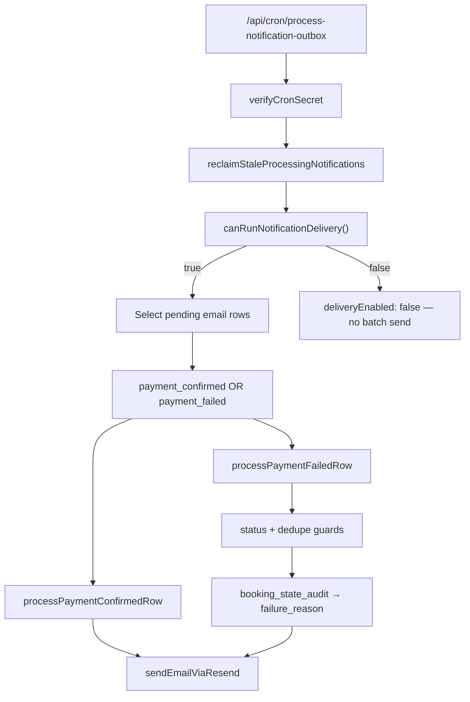

# Stage 5C-1 Final Rollout Audit — Notification delivery (`payment_confirmed` + `payment_failed`)

**Date:** 2026-05-17  
**Scope:** Stage 5C-0 enqueue hygiene, 5C-1a worker (`payment_confirmed`), 5C-1c reclaim, 5C-1b-a (`payment_failed`).  
**Type:** Audit only — no new templates, no code changes in this pass.

**Related:** [stage-5c-1-notification-worker-payment-confirmed-final-audit.md](./stage-5c-1-notification-worker-payment-confirmed-final-audit.md), [stage-5c-1b-payment-failed-email-design.md](../architecture/stage-5c-1b-payment-failed-email-design.md), [notification-outbox-worker.md](../operations/notification-outbox-worker.md)

---

## Executive summary

| Area | Verdict |
|------|---------|
| Flag default-off + provider gate | **Pass** |
| `payment_confirmed` delivery path | **Pass** |
| `payment_failed` delivery path + guards | **Pass** |
| Copy (`checkout_expired` / generic) | **Pass** |
| Stale + duplicate `payment_failed` protection | **Pass** |
| Non-delivered templates stay pending | **Pass** |
| Cron auth + reclaim | **Pass** |
| `APP_BASE_URL` links | **Pass** |
| Payment / assignment / earnings / RLS (notification code) | **Pass** |
| Automated tests | **Pass** (30 tests) |
| Manual staging cron | **Not run** (local dev server timeout) |

**Final recommendation:** **`payment_confirmed` and `payment_failed` email delivery are safe to enable in staging** when the checklist in §12 is followed. **Production enable is acceptable** for these two templates only after a staging soak, verified Resend domain/sender, and correct production `APP_BASE_URL` — not before.

---

## Verification matrix (13 checks)

| # | Check | Verdict | Evidence |
|---|--------|---------|----------|
| 1 | `ENABLE_NOTIFICATION_DELIVERY` defaults off | **Pass** | `isNotificationDeliveryEnabled()` returns false when unset (`config.ts` L36–37); `config.test.ts` “is disabled by default” |
| 2 | Resend env required when sending | **Pass** | `canRunNotificationDelivery()` = `enabled && providerReady`; `providerReady` needs `NOTIFICATION_FROM_EMAIL` + (`RESEND_API_KEY` or `POSTMARK_SERVER_TOKEN`) (`config.ts` L40–63); `sendEmailViaResend` fails closed without key/from |
| 3 | `payment_confirmed` sends correctly | **Pass** | `processPaymentConfirmedRow` → `buildPaymentConfirmedEmail` → Resend; test `marks sent on successful payment_confirmed delivery` |
| 4 | `payment_failed` sends correctly | **Pass** | `processPaymentFailedRow` → audit context + `buildPaymentFailedEmail` → Resend; tests `sends payment_failed with checkout_expired copy`, `sends payment_failed with generic copy for paystack_declined` |
| 5 | `checkout_expired` copy correct | **Pass** | Subject: “Your Shalean payment link expired”; body via `paymentIssuePanelCopy` (“checkout link expired”); `paymentFailed.test.ts` |
| 6 | `paystack_declined` / generic copy correct | **Pass** | Subject: “Payment was not completed for your Shalean booking”; generic body; no Paystack/gateway strings in tests |
| 7 | Stale `payment_failed` rows do not send | **Pass** | `booking.status !== "payment_failed"` → `markOutboxFailure` (non-retryable), no send; test `skips stale payment_failed when booking is no longer payment_failed` |
| 8 | Duplicate `payment_failed` does not resend | **Pass** | `hasSentPaymentFailedForBooking` → mark `sent` without second send; test `does not resend when payment_failed already sent for booking` |
| 9 | `assignment_offer` stays pending | **Pass** | Enqueued as `channel: "push"`; worker query `.eq("channel", "email")` + `isDeliverableEmailRow` excludes it; test `skips assignment_offer push rows` |
| 10 | Cron requires `CRON_SECRET` | **Pass** | `verifyCronSecret` returns false if env missing or header wrong (`route.ts` L14–18); `route.test.ts` 401 without bearer |
| 11 | Processing reclaim works | **Pass** | `reclaimStaleProcessingNotifications` at start of every run (even when delivery disabled); 4 unit tests in `reclaimStaleProcessingNotifications.test.ts`; worker test `calls reclaim before delivery batch` |
| 12 | Email links use `APP_BASE_URL` | **Pass** | `getNotificationDeliveryConfig().appBaseUrl` from `APP_BASE_URL` then `NEXT_PUBLIC_APP_URL` (`config.ts` L46–56); links `${appBaseUrl}/customer/bookings/{id}` in both templates |
| 13 | No payment/assignment/earnings/RLS changes in notification layer | **Pass** | All delivery code under `src/features/notifications/`; read-only use of bookings/audits/payments; no new migrations; no imports of finalize/assignment orchestrators |

---

## Automated verification

| Command | Result |
|---------|--------|
| `npm run typecheck` | **Pass** (exit 0) |
| `npx vitest run src/features/notifications src/app/api/cron/process-notification-outbox` | **Pass** — 8 files, **30 tests** |

### Test coverage map

| Concern | Test file |
|---------|-----------|
| Flag / provider gate | `config.test.ts` |
| `payment_confirmed` template | `paymentConfirmed.test.ts` |
| `payment_failed` template | `paymentFailed.test.ts` |
| Audit reason hydration | `loadPaymentFailedNotificationContext.test.ts` |
| Dedupe helper | `hasSentPaymentFailedForBooking.test.ts` |
| Reclaim | `reclaimStaleProcessingNotifications.test.ts` |
| Worker (both templates, guards, flag off) | `processNotificationOutbox.test.ts` |
| Cron auth | `route.test.ts` |

---

## Manual staging cron

| Attempt | Result |
|---------|--------|
| `GET http://localhost:3000/api/cron/process-notification-outbox` with `Authorization: Bearer $CRON_SECRET` | **Timeout (15s)** — dev server not responding on localhost during audit |

**Action for ops:** With staging deployed and env set, run:

```bash
curl -s -H "Authorization: Bearer $CRON_SECRET" \
  "https://<staging-host>/api/cron/process-notification-outbox"
```

Expect JSON: `ok`, `deliveryEnabled`, `reclaimed`, `scanned`, `sent`, `skipped`, `failed` — **no email addresses**. Confirm Resend dashboard for test sends.

---

## Architecture (deliverable templates only)



---

## Detailed findings

### 1. Feature flag and provider (checks 1–2)

- Unset / `false` / `0` / `no` → delivery disabled.
- Flag `true` without `RESEND_API_KEY` + `NOTIFICATION_FROM_EMAIL` → `canRunNotificationDelivery()` false; batch send skipped.
- `.env.example` documents vars as commented (default off in docs); production must **explicitly** set `ENABLE_NOTIFICATION_DELIVERY=true`.

**Note:** Reclaim still runs when delivery is disabled (updates stuck `processing` → `pending`). Delivery batch does not run. Ops doc line “does not mutate outbox” applies to the **send batch**, not reclaim.

### 2. `payment_confirmed` (check 3)

- Filter: `channel === "email"` and `template === "payment_confirmed"`.
- Resolves customer email; loads booking schedule/metadata; sends transactional copy; marks `sent` or retries/fails per existing rules.
- No booking-status guard (appropriate — sent after finalize success).

### 3. `payment_failed` (checks 4, 7–8)

| Step | Behavior |
|------|----------|
| Load booking | Requires `status === "payment_failed"` or skip (stale) |
| Dedupe | Prior `sent` `payment_failed` for same `bookingId` → mark current `sent`, no email |
| Reason | `loadPaymentFailedNotificationContext` → `resolvePaymentFailureReason` on `MARK_PAYMENT_FAILED` audits only |
| Retry line | `assessPaymentRetryEligibility(booking, payments)` |
| Send | Resend; same retry/backoff as confirmed |

**Enqueue unchanged (5C-0):** `enqueueNotificationWhenNotIdempotent(!r.idempotent)` on `MARK_PAYMENT_FAILED` — idempotent command replays do not create duplicate outbox rows.

### 4. Copy safety (checks 5–6)

| `failure_reason` | Subject | Body source |
|------------------|---------|-------------|
| `checkout_expired` | Your Shalean payment link expired | `paymentIssuePanelCopy` |
| `paystack_declined` / null | Payment was not completed for your Shalean booking | Generic panel copy |

Forbidden strings excluded in unit tests: `paystack`, `gateway`, `attention_required`, `dispatch`, `paystack_reference`.

### 5. Templates not delivered (check 9)

| Template | Channel | Worker |
|----------|---------|--------|
| `assignment_offer` | push | Excluded by `.eq("channel", "email")` |
| `payment_pending`, `pending_assignment`, `cleaner_assigned`, `booking_draft_created` | email | Not in `isDeliverableEmailRow` — remain `pending` |

### 6. Cron security (check 10)

- `verifyCronSecret`: requires `CRON_SECRET` env; accepts `Authorization: Bearer` or `x-cron-secret`.
- Missing/invalid secret → **401** before service role or worker runs.

### 7. Reclaim (check 11)

- Default stale threshold: **15 minutes** (`NOTIFICATION_PROCESSING_STALE_MINUTES`).
- Resets `processing` → `pending` when `updated_at` older than threshold and `attempts < 5`.
- Sets `last_error`: `Reclaimed stale processing notification`.
- Does **not** send email.

### 8. Links (check 12)

- Both templates use `config.appBaseUrl` (not hardcoded localhost in worker logic).
- **Risk:** Wrong `APP_BASE_URL` in production → broken links. Verify per environment before enable.

### 9. Scope isolation (check 13)

Notification subsystem:

- **Does not** call `executeBookingCommand`, Paystack finalize, assignment dispatch, or earnings writers.
- **Does** read `bookings`, `booking_state_audit`, `payments`, `customers`, `profiles`, `notification_outbox`, auth admin API.

No notification-related changes in `supabase/migrations` for 5C-1. RLS on `notification_outbox` unchanged (admin policy from prior migrations).

**Workspace note:** Uncommitted changes may exist in payment/booking files from other stages; the notification delivery module itself is isolated under `src/features/notifications/`.

---

## Residual risks

| Risk | Severity | Mitigation |
|------|----------|------------|
| Backlog burst on first enable | Medium | Batch size 25; cron every 2–5 min; monitor `notification_outbox` counts |
| `hasSentPaymentFailedForBooking` scans all `sent` email rows | Low (now); Medium (scale) | Acceptable for MVP; add JSON index / targeted query later |
| Wrong `APP_BASE_URL` in prod | High | Env checklist per deploy |
| Resend domain/sender not verified | High | Verify in Resend before enable |
| Customer paid before worker runs | Low | Stale guard on `payment_failed` |
| Local `.env.local` may have `ENABLE_NOTIFICATION_DELIVERY=true` | Ops | Do not use production DB from dev with delivery on |
| Route file comment still says “payment_confirmed only” | Low | Comment drift only; behavior includes `payment_failed` |
| Manual cron not verified this pass | Medium | Run staging curl before production |

---

## Staging rollout checklist

1. Set on **staging** only: `ENABLE_NOTIFICATION_DELIVERY=true`, `RESEND_API_KEY`, `NOTIFICATION_FROM_EMAIL` (verified domain), `APP_BASE_URL=https://<staging-host>`, `CRON_SECRET`, `SUPABASE_SERVICE_ROLE_KEY`.
2. Keep production flag **off** until staging soak completes.
3. Use test customers with known emails.
4. Trigger `payment_confirmed` (test payment finalize) and `payment_failed` (cron expiry or test decline).
5. Run cron manually; confirm one email per booking per template.
6. Verify subjects: checkout expired vs generic.
7. Retry payment on same booking → confirm no second failure email.
8. Confirm `assignment_offer` / `payment_pending` rows stay `pending`.
9. Query backlog: `select payload->>'template', status, count(*) from notification_outbox group by 1,2;`
10. After 48h soak, enable production with same env discipline.

---

## Production enable checklist

| Requirement | |
|-------------|--|
| Staging soak complete | |
| Resend production domain + sender verified | |
| `APP_BASE_URL` = production customer app URL | |
| `ENABLE_NOTIFICATION_DELIVERY=true` set only when ready | |
| `pg_cron` (or Vercel cron) scheduled every 2–5 min | |
| `CRON_SECRET` matches Vault / Vercel env | |
| Rollback plan: set flag false (immediate no-op on sends) | |

---

## Final question

### Is notification delivery safe to enable in production for `payment_confirmed` and `payment_failed` only?

**Yes — conditionally.**

| Environment | Recommendation |
|-------------|----------------|
| **Staging** | **Enable now** for these two templates, following § Staging rollout checklist. |
| **Production** | **Enable after staging soak** with verified Resend, correct `APP_BASE_URL`, cron scheduled, and backlog monitoring. |

**Do not enable** other templates (they remain pending by design). **Do not enable** production until manual staging cron succeeds and at least one real `payment_confirmed` and one `payment_failed` email are validated end-to-end.

**Smallest production slice:** Same worker, same flag — delivers only `payment_confirmed` + `payment_failed` email rows; all other templates unchanged.
