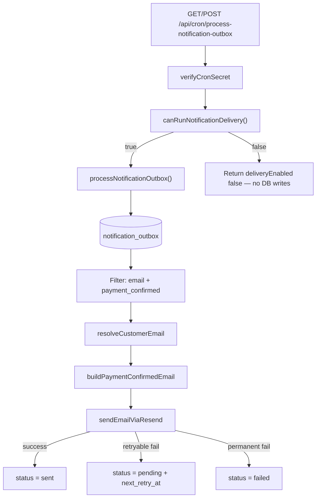

# Stage 5C-1 Final Audit — Notification Worker (`payment_confirmed` only)

**Date:** 2026-05-17  
**Scope:** Stage 5C-0 enqueue hygiene + Stage 5C-1a outbox worker, Resend delivery, cron route, and operational docs.  
**Type:** Audit only — no new templates, no code changes in this pass.

**Related:** [stage-5c-notification-system-operational-messaging-audit.md](./stage-5c-notification-system-operational-messaging-audit.md), [notification-outbox.md](../operations/notification-outbox.md), [notification-outbox-worker.md](../operations/notification-outbox-worker.md)

---

## Executive summary

| Area | Verdict | Summary |
|------|---------|---------|
| Delivery flag default-off | **Pass** | `ENABLE_NOTIFICATION_DELIVERY` unset/false → no-op, no outbox mutations |
| Missing provider → no-op | **Pass** | Flag on without `RESEND_API_KEY` + `NOTIFICATION_FROM_EMAIL` → `canRunNotificationDelivery()` false |
| Template scope | **Pass** | Only `payment_confirmed` + `channel === email` processed; others stay `pending` |
| Customer email resolution | **Pass** | `customers.id` → `profiles` → `auth.admin.getUserById` |
| Missing email handling | **Pass** | Permanent `failed`, no send attempted |
| Provider retry | **Pass** | Retryable errors → `pending` + `next_retry_at`; max 5 attempts |
| Successful send | **Pass** | `status = sent`, `last_error` cleared |
| Cron auth | **Pass** | `verifyCronSecret` — 401 without secret; tests green |
| PII in API/errors | **Pass** | Response has outbox IDs only; `sanitizeErrorMessage` redacts `@` in row errors |
| Payment / assignment / earnings / RLS | **Pass** | No changes in those subsystems for 5C-1 |
| Ops docs | **Pass** | Enable, disable, rollback, env vars documented |
| Automated tests | **Pass** | `npm run typecheck` + 13 targeted tests |

**Final recommendation:** **`payment_confirmed` delivery is safe to enable in staging** when the checklist in §12 is followed — especially using a **staging-only database or test customers**, a **verified Resend sender**, and **`APP_BASE_URL` pointing at staging**.

---

## Verification matrix (13 checks)

| # | Check | Verdict | Evidence |
|---|--------|---------|----------|
| 1 | Delivery flag defaults off | **Pass** | `isNotificationDeliveryEnabled()` → false when env unset (`config.ts` L17–24); `config.test.ts` |
| 2 | Missing provider env → no-op | **Pass** | `canRunNotificationDelivery()` requires `enabled && providerReady` (L47–50); no DB query when false (`processNotificationOutbox.ts` L250–252) |
| 3 | Only `payment_confirmed` processed | **Pass** | `isPaymentConfirmedEmailRow`: `channel === "email"` AND `template === "payment_confirmed"` (L50–53); candidates filtered (L272) |
| 4 | `payment_failed` stays `pending` | **Pass** | Wrong template → excluded from `candidates`; never claimed; test `skips non-payment_confirmed rows` |
| 5 | `assignment_offer` stays `pending` | **Pass** | Enqueued as `channel: "push"`; query `.eq("channel", "email")` (L263) excludes push rows entirely |
| 6 | Customer email resolution | **Pass** | `resolveCustomerEmail.ts` — customers → profile_id → auth email + optional `full_name` |
| 7 | Missing email fails safely | **Pass** | `NO_EMAIL` → `markOutboxFailure(..., retryable: false)` → `failed`; test covered |
| 8 | Provider errors retry safely | **Pass** | `classifySendError` in `sendEmail.ts`; `markOutboxFailure` keeps `pending` + backoff when retryable |
| 9 | Successful send → `sent` | **Pass** | `markOutboxSent` sets `status: "sent"` (L81–98); test covered |
| 10 | Cron requires `CRON_SECRET` | **Pass** | `route.ts` L14–18; `route.test.ts` 401 without bearer |
| 11 | No emails in API / logged errors | **Pass** | JSON: `outboxId`, `code`, generic `message` only; `sanitizeErrorMessage` on row errors; no `console.*` in `src/features/notifications` |
| 12 | Payment / assignment / earnings / RLS unchanged | **Pass** | Worker isolated under `src/features/notifications/`; no imports from payment finalize, assignment orchestrator, or earnings; no new migrations |
| 13 | Docs enable/disable/rollback | **Pass** | `notification-outbox-worker.md` § Flag, Rollback, Provider setup |

---

## Architecture (as implemented)



---

## 1. Feature flag and environment

### Default-off behavior

```23:25:src/features/notifications/server/config.ts
export function isNotificationDeliveryEnabled(): boolean {
  return parseBooleanEnv(process.env.ENABLE_NOTIFICATION_DELIVERY);
}
```

- Unset, empty, or any value other than `true` / `1` / `yes` → **disabled**.
- `.env.example` documents `ENABLE_NOTIFICATION_DELIVERY` as commented (default off).

### Provider gate

```47:51:src/features/notifications/server/config.ts
export function canRunNotificationDelivery(): boolean {
  const config = getNotificationDeliveryConfig();
  return config.enabled && config.providerReady;
}
```

`providerReady` = `NOTIFICATION_FROM_EMAIL` + (`RESEND_API_KEY` or `POSTMARK_SERVER_TOKEN`). Postmark token satisfies config but **only Resend is wired** in `sendEmailViaResend` — enabling with Postmark-only env would no-op at `canRunNotificationDelivery` if Resend key missing, or fail at send if misconfigured. **Use Resend for 5C-1.**

When disabled, worker returns immediately:

```250:252:src/features/notifications/server/processNotificationOutbox.ts
  if (!canRunNotificationDelivery()) {
    return empty(false);
  }
```

**No `select`, `update`, or `sent` transitions** — verified in tests (`no-ops when delivery flag is off`).

---

## 2. Template isolation

### What the worker processes

| Gate | Location |
|------|----------|
| DB query | `status = pending`, `channel = email`, retry due |
| In-memory filter | `payload.template === "payment_confirmed"` |
| Per-row guard | `isPaymentConfirmedEmailRow` before claim |
| Batch cap | 25 candidates max |

### What stays `pending`

| Template | Channel (typical) | Why skipped |
|----------|-----------------|-------------|
| `payment_failed` | `email` | Template filter |
| `payment_pending` | `email` | Template filter |
| `pending_assignment` | `email` | Template filter |
| `cleaner_assigned` | `email` | Template filter |
| `booking_draft_created` | `email` | Template filter |
| `assignment_offer` | `push` | Channel filter (`email` only) + template filter |

**Note:** Pending **email** rows for other templates are loaded from DB (up to `batchSize * 4`) but **never claimed or updated** — they remain `pending`. This is correct for 5C-1 scope.

---

## 3. Customer email resolution

Path: `notification_outbox.recipient` (customers.id) → `customers.profile_id` → `auth.admin.getUserById` → email; `profiles.full_name` for greeting.

- No email logged in notification module.
- Resolver comment documents no PII in logs.

---

## 4. Email content safety (`payment_confirmed`)

Template: `src/features/notifications/server/templates/paymentConfirmed.ts`

| Included | Excluded |
|----------|----------|
| Greeting + first name | `attention_required`, dispatch path, attempt counts |
| Short booking ref (8 chars) | Full internal ops metadata |
| Service label (catalog) | Cleaner identity before assignment |
| Schedule (customer timezone) | Paystack refs, cron names |
| Calm assignment message | Admin notes |
| Link to `/customer/bookings/{id}` | |

Uses `parseBookingDisplay` / `formatScheduleRange` — same family as customer dashboards.

---

## 5. Worker reliability

| Behavior | Implementation |
|----------|----------------|
| Claim | `pending` → `processing` with `eq(status, pending)` (optimistic) |
| Success | `sent`, `attempts + 1`, clear `last_error` |
| Retryable failure | `pending`, `next_retry_at` exponential (15 min base, cap 32×) |
| Permanent failure | `failed` (no email, invalid payload, booking missing, max attempts) |
| Batch isolation | Per-row try/catch; `releaseOutboxClaim` on unexpected error |
| Max attempts | 5 (`NOTIFICATION_MAX_ATTEMPTS`) |

### Known gap (acceptable for 5C-1)

| Gap | Severity | Notes |
|-----|----------|-------|
| Rows stuck in `processing` if process crashes after claim | Low–medium | No reclaim job; manual SQL or re-run after timeout |
| No outbox dedupe unique index | Low | 5C-0 enqueue hygiene mitigates duplicate rows |
| Top-level cron 500 uses unsanitized `e.message` | Low | Catastrophic errors only; row-level errors sanitized |
| No `pg_cron` migration in repo | Ops | Manual curl documented; schedule is ops-owned |

---

## 6. Cron route security

| Control | Status |
|---------|--------|
| `verifyCronSecret` before work | Yes |
| 401 without Bearer / `x-cron-secret` | Tested |
| Service role required | 503 if missing |
| Response fields | `ok`, `deliveryEnabled`, `scanned`, `sent`, `skipped`, `failed`, `errors[]` with `outboxId` + `code` + generic `message` |
| Email in response | **None** |

Route registered in `ALLOWED_CRON_POST_ROUTES` and `ALLOWED_SERVICE_ROLE_LIFECYCLE_IMPORTERS`.

---

## 7. Scope boundaries (unchanged systems)

| System | Touched by 5C-1? | Evidence |
|--------|------------------|----------|
| `FINALIZE_PAYMENT_SUCCESS` / Paystack finalize | **No** | No edits in `src/features/payments/server/finalize*` |
| Assignment orchestrator / offers | **No** | No edits in `src/features/assignments/server/*` (except unrelated existing files) |
| Earnings formulas | **No** | No edits in `src/features/earnings` |
| RLS migrations | **No** | No new SQL migrations |
| Enqueue logic | **No** (5C-0 only) | `executeBookingCommand` unchanged in 5C-1 |

Worker **reads** `bookings` (schedule, metadata) and **updates** `notification_outbox` only via service role.

---

## 8. Tests and typecheck

| Command | Result |
|---------|--------|
| `npm run typecheck` | **Pass** |
| `src/features/notifications/server/config.test.ts` | 3 tests |
| `src/features/notifications/server/templates/paymentConfirmed.test.ts` | 1 test |
| `src/features/notifications/server/processNotificationOutbox.test.ts` | 6 tests |
| `src/app/api/cron/process-notification-outbox/route.test.ts` | 2 tests |
| `src/app/api/cron/cronMutationRoutes.test.ts` | Registry includes new route |

**Total targeted: 13 tests, all pass.**

---

## 9. Documentation audit

| Doc | Enable | Disable / rollback | Env | Cron |
|-----|--------|-------------------|-----|------|
| [notification-outbox-worker.md](../operations/notification-outbox-worker.md) | § Flag behavior | § Rollback / disable | § Environment variables | § Cron route + schedule |
| [notification-outbox.md](../operations/notification-outbox.md) | Links to worker | Enqueue rules + delivery status | — | — |

Rollback: set `ENABLE_NOTIFICATION_DELIVERY=false` → immediate no-op; unschedule cron; do not mark rows `sent` in SQL without sending.

---

## 10. Staging enablement checklist

Before setting `ENABLE_NOTIFICATION_DELIVERY=true` in staging:

1. **Resend:** Staging API key; domain or sandbox sender verified.
2. **`NOTIFICATION_FROM_EMAIL`:** Address on verified domain.
3. **`APP_BASE_URL` / `NEXT_PUBLIC_APP_URL`:** Staging host (booking links correct).
4. **`CRON_SECRET`:** Set on Vercel; use in manual/cron calls.
5. **`SUPABASE_SERVICE_ROLE_KEY`:** Present (worker already uses for commands).
6. **Data isolation:** Prefer staging DB or test customers — **avoid sending to production customer emails from a staging DB clone.**
7. **Smoke test:** Complete one payment → confirm one `payment_confirmed` outbox row → curl cron → row `sent`, email received.
8. **Verify non-target rows:** Confirm `payment_failed` / `assignment_offer` rows (if any) remain `pending` after cron run.
9. **Monitor:** First cron cycles — check `failed` count and `last_error` (no addresses in DB column if redaction worked).
10. **Rollback tested:** Disable flag; confirm cron returns `deliveryEnabled: false` and no new `sent` rows.

Optional: Schedule `pg_cron` every 2–5 minutes (not in repo yet; mirror other cron docs).

---

## 11. Final question — Safe to enable in staging?

**Yes — with conditions.**

The implementation matches the 5C-1a scope: only `payment_confirmed` customer emails are delivered; the flag defaults off; missing provider config is a safe no-op; other templates and push offers are not processed; cron is authenticated; and row-level errors avoid leaking email addresses.

**Do not enable unconditionally.** Staging is safe when:

- Resend is configured with a verified sender.
- `APP_BASE_URL` points at the staging app.
- You accept the low risk of `processing` stuck rows on hard crashes (ops can clear manually).
- **You do not point the worker at a production database** without understanding that real customers will receive real emails.

For a typical isolated staging environment with test users, **enabling delivery is appropriate** for validating the full payment → outbox → email path before 5C-1b (`payment_failed`).

---

## Sign-off

| Stage | Status |
|-------|--------|
| 5C-0 Enqueue idempotency | **Complete** |
| 5C-1a Worker (`payment_confirmed` only) | **Complete** |
| 5C-1 Final audit | **Pass** — ready for controlled staging enablement |

**Defer to 5C-1b+:** `payment_failed`, cleaner offer email/push, admin digests, outbox RLS tightening, `processing` reclaim job, optional outbox dedupe index.
