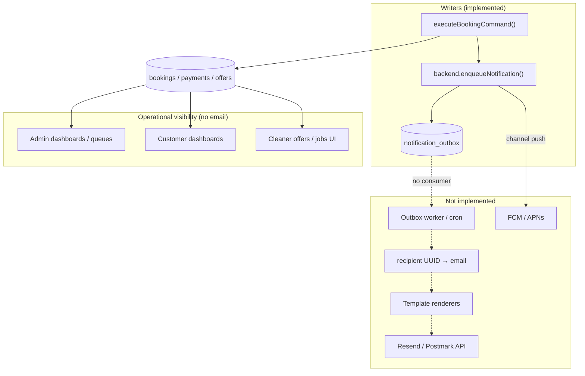

# Stage 5C — Notification System & Operational Messaging Audit

**Date:** 2026-05-17  
**Scope:** `notification_outbox`, enqueue paths in the booking command layer, email/push readiness (Resend/Postmark), idempotency and retry semantics, customer/cleaner/admin message safety, and operational alerts vs in-app admin surfaces.  
**Type:** Audit only — no code, migrations, RLS changes, payment finalize changes, assignment logic changes, or real email sends.

**Related:** [stage-4a-admin-dispatch-operational-control-audit.md](./stage-4a-admin-dispatch-operational-control-audit.md), [stage-5a-security-governance-audit.md](./stage-5a-security-governance-audit.md), [stage-5b-2-command-boundary-guard-audit.md](./stage-5b-2-command-boundary-guard-audit.md), [cleaner-offer-expiration-system-audit.md](./cleaner-offer-expiration-system-audit.md), [payment-failed-customer-retry.md](../operations/payment-failed-customer-retry.md), [booking-command-execution-layer.md](../architecture/booking-command-execution-layer.md)

---

## Executive summary

| Area | Verdict | Summary |
|------|---------|---------|
| Outbox schema | **Present** | `notification_outbox` with `pending` / `processing` / `sent` / `failed`, `attempts`, `next_retry_at` |
| Enqueue (write path) | **Partial** | Eight lifecycle hooks in `executeBookingCommand`; rows persisted in Supabase via command backend |
| Delivery (send path) | **Missing** | No worker, cron route, Resend/Postmark SDK, or HTML templates |
| Recipient addressing | **Not production-ready** | `recipient` stores `customers.id` / `cleaners.id` UUIDs, not email addresses |
| Template system | **Missing** | Payload is `{ template, bookingId, offerId? }` only — no centralized renderers |
| Enqueue idempotency | **Weak** | Only `payment_confirmed` gates on `!r.idempotent`; other paths can duplicate rows on retries |
| Delivery idempotency | **Undefined** | No unique key on outbox; no `processing` lease pattern implemented |
| Customer email safety | **Good potential** | UI copy is reason-aware; emails must mirror `paymentFailureDisplay` and omit admin/dispatch internals |
| Cleaner notifications | **Enqueue only** | `push` + `assignment_offer` queued; no FCM/APNs; offer email would need job fields from read models |
| Admin operational alerts | **In-app only** | Dashboards, queues, badges — no email/Slack/pager integration |
| Resend/Postmark readiness | **Not started** | No env vars in `.env.example`; `src/features/notifications/index.ts` is a placeholder |
| RLS on outbox | **Admin `FOR ALL`** | Differs from original plan (“workers only”); tightening deferred to Phase 5+ |

**Recommendation:** Stage 5C should start with **delivery infrastructure + one customer transactional email** (`payment_confirmed`), plus a **small enqueue idempotency hardening** slice before turning on `payment_failed` or high-volume templates. Do not enable `booking_draft_created` or `payment_pending` in the first send slice.

### Stage 5C-0 status (implemented)

| Item | Status |
|------|--------|
| `shouldEnqueueNotificationForCommandResult` + `enqueueNotificationWhenNotIdempotent` | **Shipped** — `src/features/bookings/server/commands/shouldEnqueueNotificationForCommandResult.ts` |
| All command-layer enqueues gated on `!idempotent` (or early idempotent return) | **Shipped** — `executeBookingCommand.ts` |
| Tests | **Shipped** — `notificationEnqueueIdempotency.test.ts` |
| Ops doc | **Shipped** — [notification-outbox.md](../operations/notification-outbox.md) |
| Delivery worker / email send | **Shipped** (5C-1a) — see [notification-outbox-worker.md](../operations/notification-outbox-worker.md) |

### Stage 5C-1a status (implemented)

| Item | Status |
|------|--------|
| `processNotificationOutbox` + cron route | **Shipped** |
| Resend provider + `payment_confirmed` template | **Shipped** |
| `ENABLE_NOTIFICATION_DELIVERY` default-off | **Shipped** |
| Other templates | **Still pending** in outbox |

---

## Current notification architecture



### Data model

Defined in `supabase/migrations/20260515201500_core_foundation.sql`:

| Column | Purpose |
|--------|---------|
| `id` | UUID primary key |
| `channel` | Free-text: `"email"` or `"push"` today |
| `recipient` | **Opaque string** — in practice `customers.id` or `cleaners.id` |
| `payload` | JSONB — `{ template, bookingId, offerId? }` |
| `status` | `pending` → `processing` → `sent` \| `failed` |
| `attempts`, `next_retry_at`, `last_error` | Intended for retry worker (unused) |
| `created_at`, `updated_at` | Timestamps |

Index: `(status, next_retry_at)` for worker polling — **no partial unique index** for deduplication.

### Write path

| Component | Role |
|-----------|------|
| `executeBookingCommand.ts` | Sole producer of notification intents (8 call sites) |
| `SupabaseBookingCommandBackend.enqueueNotification` | `INSERT` into `notification_outbox` with `status: pending` |
| `InMemoryBookingCommandBackend.enqueueNotification` | In-memory array for unit tests |
| `runBookingCommand()` | Selects backend; production uses service role |

Comment on table (migration): *“Reliable outbound notifications with retries. RLS: deferred.”* — RLS was later enabled with admin policy (`20260516160000_rls_role_security.sql`).

### Read / delivery path

| Expected | Actual |
|----------|--------|
| Cron or background worker polling `pending` | **None** |
| Mark `processing` / `sent` / `failed` | **Never updated after insert** |
| Email provider integration | **None** (`package.json` has no `resend`, `postmark`, `nodemailer`, `@react-email/*`) |
| `src/features/notifications/` | Placeholder: `/** Notifications feature — email (Resend/Postmark), push, outbox (later). */` |

Existing crons (`expire-pending-payments`, `expire-assignment-offers`, `recover-assignment-after-payment`) mutate bookings/payments/offers only — **they do not process the outbox**.

### Recipient resolution (required before any send)

`customers` and `cleaners` tables have **no email column** — email lives on `auth.users` via `profiles.id` → `customers.profile_id` / `cleaners.profile_id`.

A delivery worker must resolve:

```
recipient (customers.id | cleaners.id)
  → customers.profile_id | cleaners.profile_id
  → auth.admin.getUserById(profile_id) or join view
  → email address
```

Enqueue today passes **entity IDs**, not profile IDs or emails (`executeBookingCommand.ts` lines 154–507).

---

## Event-to-notification map

### Enqueued today (command layer)

| # | Trigger command | When | Channel | `payload.template` | Recipient | Enqueue idempotent? |
|---|-----------------|------|---------|-------------------|-----------|---------------------|
| 1 | `CREATE_BOOKING_DRAFT` | After draft insert | `email` | `booking_draft_created` | `cmd.customerId` | **No** — every draft |
| 2 | `MARK_PAYMENT_PENDING` | After transition to `pending_payment` | `email` | `payment_pending` | `booking.customer_id` | **Yes** (5C-0) — early return + `r.idempotent` |
| 3 | `FINALIZE_PAYMENT_SUCCESS` | After successful finalize | `email` | `payment_confirmed` | `booking.customer_id` | **Yes** (5C-0) — `enqueueNotificationWhenNotIdempotent` |
| 4 | `MARK_PAYMENT_FAILED` | After `recordPaymentFailure` | `email` | `payment_failed` | `booking.customer_id` | **Yes** (5C-0) — gated on `r.idempotent` |
| 5 | `MOVE_TO_PENDING_ASSIGNMENT` | After transition | `email` | `pending_assignment` | `booking.customer_id` | **Yes** (5C-0) — gated on `r.idempotent` |
| 6 | `OFFER_TO_CLEANER` | After new offer insert | `push` | `assignment_offer` | `cmd.cleanerId` | **Yes** — early idempotent return skips insert; new offers use `idempotent: false` |
| 7 | `ACCEPT_CLEANER_ASSIGNMENT` | After assign transition | `email` | `cleaner_assigned` | `booking.customer_id` | **Yes** (5C-0) — gated on `r.idempotent` + early accept replay |

**Source of truth:** `src/features/bookings/server/commands/executeBookingCommand.ts` (lines 154–510).

### Events that do **not** enqueue (gaps)

| Event / flow | Customer | Cleaner | Admin | Notes |
|--------------|----------|---------|-------|-------|
| `DECLINE_CLEANER_ASSIGNMENT` | — | — | — | In-app assignment metadata → `attention_required` only |
| Offer expiry (`expireStaleAssignmentOffers` cron) | — | — | — | May redispatch → new `OFFER_TO_CLEANER` → cleaner push only |
| Post-decline / post-expiry redispatch (`processBookingAfterOfferEnded`) | — | — (new offer) | — | Same as new offer |
| `RECORD_ASSIGNMENT_ATTENTION` | — | — | — | Admin queue visibility only |
| Assignment recovery cron / admin recover API | — | — | — | May call `runAssignmentAfterPayment` → #5–#6 if state changes |
| `CANCEL_BOOKING` | — | — | — | No email |
| `MARK_BOOKING_COMPLETED` / payout-ready / paid-out | — | — | — | No email |
| Paystack `charge.failed` webhook | #4 (generic template) | — | — | Failure reason in audit, not in outbox payload |
| Cron `checkout_expired` | #4 (same template) | — | — | Reason only in `booking_state_audit.metadata` |
| Admin manual dispatch / replace offer | — | #6 if new offer | — | No admin alert email |
| Payment retry success | #3 if finalize runs | — | — | Same as first success |
| Stuck `pending_assignment` / dispatch not started | — | — | — | Admin dashboard badges only |

---

## Queued vs actually sent

| Template | Rows enqueued in production path? | Actually sent? |
|----------|----------------------------------|--------------|
| All eight templates above | **Yes** (when commands run with Supabase backend) | **No** — rows remain `pending` forever |
| Any historical rows | May exist in DB from real checkouts | **0% delivery** until worker ships |

**Verification approach (ops, read-only):**

```sql
select status, channel, payload->>'template' as template, count(*)
from notification_outbox
group by 1, 2, 3
order by count(*) desc;
```

---

## Delivery / worker gap analysis

| Capability | Status | Risk if skipped |
|------------|--------|-------------------|
| Outbox poller (cron route or queue) | Missing | Notifications never leave DB |
| `pending` → `processing` claim (atomic update) | Missing | Double-send under concurrent workers |
| Exponential backoff + `next_retry_at` | Schema only | Transient provider errors become permanent `pending` |
| Dead-letter / `failed` after max attempts | Schema only | Ops cannot distinguish stuck vs abandoned |
| Provider SDK + API keys | Missing | No send path |
| HTML/text templates + branding | Missing | Cannot send meaningful email |
| Bounce/complaint handling | Missing | Future deliverability risk |
| Push provider (FCM/APNs) | Missing | `push` channel is a no-op |
| Observability (metrics, alert on backlog) | Missing | Silent failure — matches today |
| Unsubscribe / marketing separation | N/A | All current templates are transactional lifecycle |

**Recommended worker shape (design only):**

1. `SELECT … FOR UPDATE SKIP LOCKED` where `status = 'pending'` and `next_retry_at IS NULL OR next_retry_at <= now()`.
2. Set `processing`, increment `attempts`.
3. Resolve recipient → email; load booking (and offer) via service role.
4. Render template; call provider.
5. On success: `sent`; on retryable error: `pending` + `next_retry_at`; on permanent error: `failed` + `last_error`.

---

## Idempotency analysis

### Enqueue-side (command layer)

| Path | Booking/payment idempotency | Notification idempotency | Duplicate risk |
|------|----------------------------|--------------------------|----------------|
| `FINALIZE_PAYMENT_SUCCESS` | Audit key on command | **Gated** (5C-0) | Low |
| `MARK_PAYMENT_FAILED` | RPC returns `idempotent: true` when audit key exists | **Gated** (5C-0) | Low — duplicate rows on replay avoided |
| `MOVE_TO_PENDING_ASSIGNMENT` | RPC idempotent via audit key | **Gated** (5C-0) | Low |
| `MARK_PAYMENT_PENDING` | Payment row / early return | **Gated** (5C-0) on `r.idempotent`; early `pending_payment` return skips enqueue | Low |
| `CREATE_BOOKING_DRAFT` | None | **Not gated** | Low volume but noisy if ever sent |
| `OFFER_TO_CLEANER` | DB unique open offer | Skips enqueue on duplicate open offer to same cleaner | Low for same cleaner; new cleaner = new row |
| `ACCEPT_CLEANER_ASSIGNMENT` | Transition idempotent possible | **Not gated** | Low |

Documented prior art: `docs/architecture/stage-2b-3-paystack-failed-charge-webhook-design.md` recommends gating `enqueueNotification` on `!r.idempotent` (deferred).

**Outbox table:** no `(booking_id, template, channel)` unique constraint; duplicate rows are independent `pending` jobs.

### Delivery-side (worker)

Not implemented. Required before production send:

| Mechanism | Purpose |
|-----------|---------|
| Claim lease (`processing` + worker id + timeout) | Prevent double send |
| Idempotency key in payload or derived `dedupe_key` column | Skip if `sent` row exists for same booking+template |
| Provider idempotency header (Resend) | Provider-level replay protection |

### Relationship to booking audit idempotency

`booking_state_audit` has partial unique `(booking_id, idempotency_key)` — **notifications do not participate**. A idempotent command replay can still insert multiple outbox rows.

---

## Template / safety analysis

### Centralization

| Layer | Status |
|-------|--------|
| Template registry (name → renderer) | **Missing** |
| Shared layout (header, footer, support) | **Missing** |
| Reason-specific copy for `payment_failed` | **Exists in UI only** (`paymentFailureDisplay.ts`) — not referenced by outbox payload |
| Admin/dispatch vocabulary | **Exists in UI** (`resolveAssignmentVisibility`, admin read models) — must **not** appear in customer email |

### Payload safety (current)

Outbox payload is minimal — **good for privacy**, but insufficient for send without server-side hydration:

```json
{ "template": "payment_confirmed", "bookingId": "<uuid>" }
```

Worker must load booking + metadata and apply the same sanitization rules as customer read models (`customerBookingReadModel.ts`, `parseBookingDisplay.ts`).

### Per-template safety notes

| Template | Audience | Safe content | Do **not** include |
|----------|----------|--------------|-------------------|
| `payment_confirmed` | Customer | Schedule, service label, amount, link to `/customer/bookings/{id}` | Cleaner name before accept, dispatch path, attempt counts, admin notes |
| `payment_failed` | Customer | Reason-specific copy (`checkout_expired` vs generic decline), retry link if eligible | Paystack refs, internal cron names, `attention_required` |
| `payment_pending` | Customer | Checkout continue link (if applicable) | Lock internals, idempotency keys |
| `pending_assignment` | Customer | “Finding a cleaner” calm copy (match assignment-decline-redispatch.md) | Cleaner IDs, offer expiry, redispatch attempts |
| `cleaner_assigned` | Customer | Assigned confirmation, schedule, location summary | Other cleaners considered, earnings, payout |
| `booking_draft_created` | Customer | Resume booking CTA | Low value; often abandoned drafts |
| `assignment_offer` | Cleaner | Schedule, location, service, earnings preview (mirror `listCleanerOffersForDashboard`) | Customer PII beyond address summary, admin dispatch reason |
| *(missing)* admin attention | Admin | Booking id, visibility key, runbook link | Customer payment card details |

### `payment_failed` / `checkout_expired` email safety

| Concern | Assessment |
|---------|------------|
| Wrong reason shown | **Risk** — outbox has no `failure_reason`; worker must read latest `MARK_PAYMENT_FAILED` audit (same as `resolvePaymentFailureReason`) |
| Retry link | Must use same eligibility as `assessPaymentRetryEligibility` — do not email retry CTA when `QUOTE_STALE` / past schedule |
| Duplicate emails on cron + webhook | **High** until enqueue gated on `!r.idempotent` |
| Exposing internal metadata | Avoid echoing raw `metadata` from audit in email body |

### Cleaner job information adequacy

Cleaner **UI** already hydrates offers with `scheduleLabel`, `locationSummary`, `serviceLabel`, `earningsCents` (`cleanerJobReadModel.ts`). Push/email worker should **reuse the same read-model helpers**, not raw `bookings.metadata` admin fields.

---

## Customer / cleaner / admin message policy

### Customer (transactional email)

| Principle | Implementation guidance |
|-----------|-------------------------|
| Transactional only | No marketing in lifecycle emails; separate List-Unsubscribe not required for receipts/failures |
| Mirror dashboard truth | Use `paymentFailureDisplay`, `parseBookingDisplay`, assignment visibility helpers |
| Calm assignment messaging | “We’re confirming availability” — not “attention_required” or cleaner decline reasons |
| Payment failure | Distinguish `checkout_expired` vs generic; link to booking detail + retry when `canRetryPaymentOnExistingBooking()` |
| Post-payment success | Confirm payment + what happens next (assignment in progress) — optional merge with `pending_assignment` to reduce email volume |

### Cleaner

| Channel | Policy |
|---------|--------|
| `push` (future) | Offer received, offer expiring soon (not implemented) |
| Email (future) | Prefer email if push unavailable; include accept link to `/cleaner/offers` |
| Decline/expiry | No email required on decline; optional “offer expired” only if product requests |

### Admin

| Today | Future (5C+ / ops) |
|-------|---------------------|
| In-app: `/admin`, assignment queue, payment_failed filters, operational audit | Optional **digest** email for `attention_required`, `dispatch_not_started`, `payment_failed` spike |
| Cron handles batch recovery/expiry — documented in ops runbooks | Email should link to booking detail, not raw SQL |
| `admin_operational_audit` table | Durable action log — not wired to notifications |

**Marketing vs transactional:** No marketing emails in scope. If newsletters are added later, use separate domain, Resend audience, and opt-in — never mix with outbox worker.

---

## Operational alert roadmap

| Priority | Alert | Channel today | Suggested 5C+ channel |
|----------|-------|---------------|------------------------|
| P0 | Outbox backlog depth (`pending` > N) | None | Metric + log alert |
| P0 | Worker failures (`failed` rate) | None | Metric |
| P1 | `payment_failed` spike | Admin UI filter | Optional admin digest email |
| P1 | `attention_required` / manual dispatch needed | Assignment queue | Admin digest or Slack (out of scope for MVP email) |
| P2 | Stuck `pending_assignment` > 24h | Launch checklist | Cron metric |
| P2 | Paystack webhook failures | Docs only | Existing log/monitoring |
| P3 | Payout batch ready | Admin payouts page | Email when bank transfers exist |

---

## Safest implementation slices

Ordered for **minimum blast radius** while unlocking real customer value.

### Slice 5C-0 — Enqueue hygiene (small command-layer change)

| Item | Action |
|------|--------|
| Gate all `enqueueNotification` calls on `!transitionResult.idempotent` where applicable | Prevents duplicate rows from cron/webhook/recovery |
| Add optional `dedupeKey` in payload or DB unique index | `(recipient, channel, template, booking_id)` WHERE `status IN ('pending','processing','sent')` |
| Defer enabling send for templates without idempotency | Until 5C-0 ships |

**Do not** change RPC semantics or payment finalize.

### Slice 5C-1a — **Recommended first send slice**

| Item | Action |
|------|--------|
| Resend (or Postmark) SDK + `RESEND_API_KEY`, `EMAIL_FROM` env | Document in `.env.example` |
| `processNotificationOutbox` + `GET/POST /api/cron/process-notifications` with `CRON_SECRET` | Mirror existing cron auth pattern |
| Recipient resolver (customer only) | `customers.id` → auth email |
| Single template: **`payment_confirmed`** | Hydrate booking display fields; CTA to customer booking detail |
| Worker marks `sent` / `failed` with retry backoff | Use existing columns |
| Feature flag `NOTIFICATIONS_SEND_ENABLED=false` default | Dry-run mode logs would-send |

**Why safest:** Only `payment_confirmed` is enqueue-gated on `!r.idempotent`; highest signal; lowest risk of leaking dispatch internals; no cleaner push dependency.

### Slice 5C-1b — Payment failure email

| Prerequisite | 5C-0 idempotency gate on `MARK_PAYMENT_FAILED` |
| Template variants | `checkout_expired` vs generic (read audit metadata) |
| CTA | Retry only when `assessPaymentRetryEligibility` passes |
| Exclude | Paystack reference, cron source, admin copy |

### Slice 5C-2 — Assignment customer emails

| Templates | `pending_assignment` (optional merge with confirmed), `cleaner_assigned` |
| Product choice | Consider suppressing `pending_assignment` if `payment_confirmed` already sets expectations |
| Still exclude | Cleaner identity pre-assignment, path, attempt metadata |

### Slice 5C-3 — Cleaner offer email

| Channel | Start with **email** (push infra is larger) |
| Content | Reuse `listCleanerOffersForDashboard` field set |
| Trigger | Same `OFFER_TO_CLEANER` outbox row or add `channel: email` parallel enqueue |

### Slice 5C-4 — Admin operational email (optional)

| Scope | Digest of queue items with visibility keys — not per-row spam on every decline |
| Alternative | Slack webhook before email |

### Slice 5C-5 — RLS tightening

| Change | Replace `notification_outbox_admin` `FOR ALL` with **service-role-only** writes + optional admin **SELECT** for ops debugging |
| Align | `docs/security/rls-plan.md` intent |

---

## Things not to touch (Stage 5C audit scope)

| Area | Reason |
|------|--------|
| `booking_finalize_payment_success` RPC / `FINALIZE_PAYMENT_SUCCESS` semantics | User constraint; payment finalize frozen |
| Assignment accept/decline/redispatch orchestrator logic | User constraint |
| Earnings formulas / `recordEarningsForBooking` | User constraint |
| RLS migrations (except planned outbox policy in dedicated slice) | User constraint — design only here |
| Sending real emails in audit / test without sandbox keys | User constraint |
| `booking_draft_created` / `payment_pending` as first production templates | High noise + weak idempotency |
| Wiring `ADMIN_OVERRIDE_STATUS` to notifications | Dangerous bypass surface |

---

## Resend / Postmark integration readiness

| Requirement | Status |
|-------------|--------|
| npm dependency | **Not installed** |
| Env vars in `.env.example` | **Not present** |
| Domain verification / SPF | Ops task |
| Sandbox vs production API keys | Document per environment |
| Webhook for bounces (Resend) | Future — mark emails undeliverable |
| `import "server-only"` on sender module | Follow existing payment/cron patterns |
| Vercel cron registration | Follow `expire-assignment-offers-cron.md` pattern (Vault + `CRON_SECRET`) |

**Recommendation:** Resend — simpler API, good Next.js docs; Postmark equally viable if already contracted.

---

## `notification_outbox` RLS / admin policy

| Policy | Migration | Effect |
|--------|-----------|--------|
| `notification_outbox_admin` | `20260516160000_rls_role_security.sql` | Authenticated **admin JWT** can `FOR ALL` on outbox |

| Actor | Insert | Select | Risk |
|-------|--------|--------|------|
| `service_role` (command backend) | Yes (bypass RLS) | Yes | Expected |
| Admin JWT | **Insert/update/delete** | Yes | **Tamper / fake sent rows / delete backlog** |
| Customer/cleaner JWT | Denied | Denied | Good |

**Later tightening (5C-5):** Admin **SELECT** only (optional); all writes via service role worker; aligns with [stage-5b-3-rls-tightening-design.md](../architecture/stage-5b-3-rls-tightening-design.md) deferral list.

---

## Assignment recovery / replace / dispatch — who should be notified?

| Scenario | Notify customer? | Notify cleaner? | Notify admin? |
|----------|----------------|-----------------|---------------|
| Auto dispatch after payment | Optional `pending_assignment` email | **Yes** (offer) | No — in-app queue |
| Decline | No (UI copy sufficient) | No | **In-app only** today |
| Offer expiry + auto-redispatch | No | New cleaner: **yes** | No |
| Max attempts → `attention_required` | Optional “we’re reviewing” | No | **In-app**; digest email later |
| Admin manual dispatch | Same as auto offer | **Yes** | No |
| Admin replace offer | No | New cleaner: **yes** | No |
| Recovery cron on `confirmed` | No unless re-enters `MOVE_TO_PENDING_ASSIGNMENT` | If new offer | No |

**Conclusion:** Stage 5C should **not** add admin per-event email on recovery/replace/dispatch until digest pattern exists — avoids noise and duplicate with dashboards.

---

## Tests gap

| Area | Current | Needed for 5C |
|------|---------|---------------|
| Outbox enqueue | Indirect via command tests | Assert enqueue counts per command + idempotent replay |
| Worker | None | Unit: claim, retry, dedupe; integration: Resend sandbox mock |
| Template render | None | Snapshot tests for customer-safe HTML (no admin tokens) |
| Security | RLS integration allows admin select on outbox | Tighten when policy changes |

---

## Final question — safest first Stage 5C implementation slice

**Ship 5C-1a: notification outbox worker (dry-run flag + cron) + recipient resolution + Resend plumbing + deliver only `payment_confirmed` to customers, after a minimal 5C-0 enqueue idempotency pass on any template you plan to send within the same release.**

| In first slice | Defer |
|----------------|-------|
| Worker infrastructure, status transitions, retries | `push` / FCM |
| Customer email resolver | All admin emails |
| One template: `payment_confirmed` | `booking_draft_created`, `payment_pending` |
| Feature flag + staging sandbox | Payout emails |
| Gate `payment_confirmed` enqueue (already idempotent) | Changing payment finalize or assignment RPCs |
| Optional 5C-0: gate `MARK_PAYMENT_FAILED` enqueue before 5C-1b | RLS migration (can parallel if needed) |

This path sends the highest-value post-payment receipt, avoids duplicate failure emails until enqueue is fixed, keeps cleaner and admin messaging on existing in-app surfaces, and does not touch payment finalize, assignment logic, earnings, or RLS beyond optional outbox policy hardening in a separate migration.
