# Universal Platform Optimization & Operational Intelligence Audit

**Date:** 2026-05-20  
**Type:** Audit only — no implementation  
**Scope:** Holistic UX/operational presentation across customer, cleaner, and admin surfaces; booking wizard; payment return; status vocabulary; mobile density; lightweight operational intelligence  
**Out of scope:** Backend architecture, lifecycle/payment/dispatch/earnings logic, RLS, cron, commands, APIs, schema, service pricing models  

**Baseline:** Service specialization complete (Regular, Deep, Move In/Out, Airbnb, Office, Carpet). Canonical booking/payment/dispatch system treated as stable.  
**Related:** [stage-7p-full-app-ux-ui-polish-audit.md](./stage-7p-full-app-ux-ui-polish-audit.md), [stage-7a-operational-queue-intelligence-final-audit.md](./stage-7a-operational-queue-intelligence-final-audit.md), per-service `*-ux-optimization.md` and `*-end-to-end-audit.md`

---

## 1. Executive summary

| Question | Answer |
|----------|--------|
| Platform maturity | **Functionally elite, presentation-heavy** — shared tokens (`productUiTokens.ts`), `StatusBadge`, `DashboardShell`, and five parallel `*CustomerDisplay` / `*OperationalDisplay` modules give consistency at the cost of copy duplication |
| Biggest scan friction | **Admin** — queue explainability collapsed but still triple-layered on home; assignment workbench capped at 100 rows; badge stacks on bookings list |
| Biggest trust friction | **Customer** — payment-failure narrative repeats across `/payment/failed`, detail `PaymentIssuePanel`, list amber line, and timeline |
| Biggest mobile friction | **Cleaner job detail** — 5–7 stacked cards, no sticky primary action; **Booking wizard** — no route skeleton, text-only loading |
| Status system | **Centralized in `statusLabels.ts`** but **overridden** on customer list cards and cleaner list (not detail) per service |
| Operational intelligence | **Partial** — admin same-day notes, offer expiry urgency, recurring customer counts; gaps: assignment aging labels, unified customer-facing assignment progress |
| Safe optimization path | **Presentation-only**, incremental — compress copy, align labels, collapse sections, surface hints without new backend |

**Verdict:** Ready for a **universal polish phase** (7P-style) without touching canonical lifecycle. Highest ROI: status vocabulary alignment, payment-failure deduplication, admin scan compression, cleaner detail density, wizard loading perception.

---

## 2. Global objective assessment

### What already works

- **Shared design language:** `UI_CARD_SHELL_CLASS`, compact list padding (`p-3.5 sm:p-4`), `min-h-11` CTAs, horizontal filter chip scroll on mobile
- **Progressive disclosure:** Collapsible `
` on customer/cleaner guidance, admin audit tails, operational guides
- **Role-appropriate shells:** `DashboardShell` + responsive nav; booking wizard intentionally separate with sticky footer
- **Service identity without logic forks:** Display modules branch on `serviceSlug`; quote/payment/dispatch unchanged

### What blocks “operationally elite / calm / fast to scan”

| Pattern | Impact |
|---------|--------|
| Parallel five-service display modules | Same function shapes copied; drift risk (list vs hero labels) |
| Helper text stacks (badge + line + panel + timeline) | High cognitive load on failed-payment and admin attention rows |
| Collapsed-by-default ops guidance | Correct for calmness, wrong for **first-scan** admin triage unless preview lines are strong |
| Text-only wizard loading | Dashboard feels faster than book flow (skeletons vs “Calculating price…”) |
| Internal payment labels on customer hero | “Initialized”, “Failed” leak admin vocabulary |

### Target feeling — gap analysis

| Desired | Current gap |
|---------|-------------|
| Operationally elite | Admin has intelligence but requires expand + mental math on queue caps |
| Calm | Payment failure and admin explain grids feel anxious when expanded |
| Fast to scan | Customer list and admin rows carry 3–5 simultaneous signals |
| Trustworthy | Reassurance copy is good but **repeated** until it feels defensive |
| Low-friction | Wizard details step + cleaner job scroll depth still fatigue |

---

## 3. Customer dashboard optimization

### Surfaces audited

| Surface | Route | Key files |
|---------|-------|-----------|
| Home + list | `/customer`, `/customer/bookings` | `customer/page.tsx`, `CustomerBookingsDashboard`, `CustomerBookingListCard` |
| Detail | `/customer/bookings/[id]` | `CustomerBookingStatusHero`, `CustomerBookingWhatHappensNext`, `PaymentIssuePanel`, `CustomerBookingDetailsCard` |
| Payment return | `/payment/success`, `/payment/failed` | `PaymentReturnPanels`, `PaymentFailedPageContent` |

### Hierarchy vs ideal (status → schedule → assignment → payment → next action → secondary)

| Priority | Current | Issue |
|----------|---------|-------|
| 1 Status | Hero badge + status line + list badges | List uses **service-specific** labels; hero uses **generic** (`Finding cleaner` vs `Cleaner assignment in progress`) |
| 2 Schedule | `schedule · location` on list and hero | Good; location de-emphasized appropriately |
| 3 Assignment | Cleaner line on list; deferred callout in details | Can duplicate hero; suppression only when `deferredAssignmentMessage` set |
| 4 Payment | Payment chip on hero uses `labelForPaymentStatus` | **Not customer-friendly**; list has dedicated payment helper |
| 5 Next action | Compact guidance / payment panel | Collapsed “More about your booking” overlaps email/assignment steps |
| 6 Secondary | Details + timeline collapsibles | Good placement; payments embedded in details |

### Issues (customer-specific)

| ID | Issue | Severity |
|----|-------|----------|
| C-1 | **Duplicate list entry points** — `/customer` and `/customer/bookings` render same list; home adds extra “My Bookings” h1 | Medium |
| C-2 | **Triple heading on detail** — shell title + service h1 + service hero subtitle | Medium |
| C-3 | **Payment failure story ×4** — failed URL, `PaymentIssuePanel`, list helper, timeline | High |
| C-4 | **Badge tone mismatch** — `payment_failed` warning on hero, danger on list | Low |
| C-5 | **Weak list CTA** — text link “View details →” only; no primary affordance for unpaid | Medium |
| C-6 | **Dead components** — `CustomerBookingSummaryGrid`, `CustomerBookingPaymentsCard` unused | Low (maintainability) |
| C-7 | **Oversized empty state** — `py-12 sm:py-14` vs compact list cards | Low |
| C-8 | **Payment success context** — wizard header “Book a clean” + stepper on return feels disconnected from dashboard | Medium |
| C-9 | **Regular cleaning** — no dedicated `*CustomerDisplay`; generic copy vs richer specialty services | Medium (perceived parity) |

### Customer mobile

- Filter tabs: horizontal scroll — good
- List cards: column stack, badge row wraps — good
- Detail hero: price full-width on `sm` — acceptable
- Payment CTAs: `min-h-11` — good

---

## 4. Cleaner dashboard optimization

### Surfaces audited

| Surface | Route | Key files |
|---------|-------|-----------|
| Home | `/cleaner` | Preview offers/jobs (3 each), no per-offer actions on home |
| Offers | `/cleaner/offers` | `CleanerOfferCard`, `OfferExpiryChip`, `OfferActions` |
| Jobs | `/cleaner/jobs`, `/cleaner/jobs/[id]` | `CleanerJobListCard`, `CleanerJobStatusHero`, guidance, details, timeline |
| Earnings | `/cleaner/earnings` | `CleanerEarningsListCard`, trust line |

### Cleaner “immediate understanding” matrix

| Need | Offers | Jobs list | Job detail |
|------|--------|-----------|------------|
| What job | Service + ops subtitle | Service label | Hero service |
| Where | Meta line | Meta line | Details address (text only) |
| When | Schedule + expiry chip | Schedule | Schedule in hero |
| Earnings | Top-right pay | Top-right pay | Pay section + line items |
| Instructions | — | — | Notes inset + service titles |
| Urgency | Expiry chip tones | Sort by soonest | Hero “Next:” inset |

### Issues (cleaner-specific)

| ID | Issue | Severity |
|----|-------|----------|
| CL-1 | **List vs detail status mismatch** — e.g. “Turnover completed” on list, “Completed” on hero | High |
| CL-2 | **Duplicate offer UIs** — `CleanerOfferListCard` vs `CleanerOfferCard` near-identical layout | Medium |
| CL-3 | **Job detail scroll depth** — 5–7 full cards; Start/Complete scrolls away (no sticky action) | High |
| CL-4 | **Home offer links go to offers list**, not focused offer | Medium |
| CL-5 | **Past offers** full card layout with opacity — heavy for history | Low |
| CL-6 | **Calculating pay helper** — `max-w-[12rem]` may wrap awkwardly beside amount on mobile | Low |
| CL-7 | **No map/deep link** for address — text only | Low (product choice) |

### Cleaner mobile (reference quality on offers)

- `OfferActions`: stacked `min-h-11` Accept on mobile — **keep as pattern**
- Stage 6F docs: `stage-6f-cleaner-mobile-polish-mini-audit.md` — offers are benchmark; job detail is the gap

---

## 5. Admin dashboard optimization

### Surfaces audited

| Surface | Route | Key files |
|---------|-------|-----------|
| Home | `/admin` | `AdminHomeCommandCenter`, health tiles, queue strip, 5-card preview |
| Assignments | `/admin/assignments` | `AdminAssignmentsQueueWorkbench`, presets, same-day notes |
| Bookings | `/admin/bookings`, `[id]` | `AdminBookingListRow`, `AdminBookingOperationalSummary`, ops panel |
| Customers | `/admin/customers/[id]` | `AdminCustomerDetailSections`, recurring counts |
| Cleaners | `/admin/cleaners/[id]` | Profile, lifecycle, audit |
| Payouts | `/admin/payouts` | Inline stats + sparse queue |

### Admin “immediate identification” matrix

| Signal | Surfaced today | Scan friction |
|--------|----------------|---------------|
| Needs attention | Health tiles + 5 preview cards + workbench | Preview not exhaustive; workbench max **100** rows |
| Payment problems | `payment_attention` queue (urgent), badges | Correlated booking + payment badges |
| Assignment delays | Assignment attention, deferred overdue, recovery grace | Guidance behind `
` |
| Same-day urgency | `sameDayNote` on workbench (per service) | **Not** on home recent bookings or light list rows |
| Cleaner gaps | Open offers inline on workbench | — |
| Payout blockers | Home tile, earnings banner on detail | Payouts page low density |

### Issues (admin-specific)

| ID | Issue | Severity |
|----|-------|----------|
| A-1 | **Triple queue explain** on home — strip + explain grid + preview footnote | High |
| A-2 | **Count confusion** — SQL `assignment_attention` vs workbench fetch vs client preset counts | High |
| A-3 | **Badge overload** on bookings list — up to 5 service + operational badges | High |
| A-4 | **Booking detail scroll fatigue** — 9+ sections, ops repeats queue guidance | High |
| A-5 | **Home recent bookings** lack schedule/price/next-action vs full list row | Medium |
| A-6 | **Bookings list window** — 200 newest; filtered search subset messaging | Medium |
| A-7 | **Nav** — 6 items, no active state, wrap on mobile | Medium |
| A-8 | **Payouts page** — placeholder footnote, plain error `
` vs `DashboardFetchError` | Low |

---

## 6. Booking flow optimization

### Structure

`service → datetime → location → details → cleaner → review → checkout`  
**Files:** `BookingWizard.tsx`, `wizardLayout.ts`, step panels, `WizardMobileStickyFooter`, `WizardBookingSummarySidebar`

### Step friction matrix

| Step | Density | Friction | Notes |
|------|---------|----------|-------|
| Service | Light–medium | Dual mobile/desktop descriptions | Descriptions add height |
| Schedule | Light | Env mismatch warning (good) | — |
| Location | Medium | Generic for all services | No service-specific access hints (office/move differ in dashboards) |
| Details | **Heavy** (regular, carpet) / medium (others) | Long scroll; carpet metadata **non-quote** | Risk: perceived bait-and-switch |
| Cleaner | Medium | `max-h-64` scroll; double prefetch on next | Duplicate API on details→cleaner and cleaner→review |
| Review | Medium | Text-only “Calculating price…” | No skeleton |
| Checkout | Medium | Trust row necessary; verbose safety copy | Keep meaning, compress layout |

### Booking flow issues

| ID | Issue | Severity |
|----|-------|----------|
| B-1 | **No `loading.tsx`** on book routes — wizard feels slower than dashboards | Medium |
| B-2 | **7-step stepper** truncates &lt;360px; `WIZARD_STEP_SHORT_LABELS` unused | Medium |
| B-3 | **`airbnbCleaningDisplay.ts` as global copy router** — office/move/deep/carpet wired through airbnb module | Medium (maintainability) |
| B-4 | **Regular + carpet longest details** — form fatigue | Medium |
| B-5 | **Payment return uses wizard chrome** — context switch from dashboard | Medium |

### Conversion / confidence (documentary — no analytics SDK)

| Likely drop-off | Hypothesis | Evidence |
|-----------------|------------|----------|
| Details step | Longest step, most fields | Step panel size, regular/carpet fields |
| Cleaner step | Empty/sparse cleaner list | Loading label only; no empty-state illustration |
| Review → checkout | Price shock / quote wait | “Calculating price…” delay |
| Checkout | Paystack redirect anxiety | Trust row exists; safety copy dense |
| Post-payment assignment | “When will cleaner be assigned?” | Repeated across success copy and guidance |

---

## 7. Universal status system

### Canonical source

`src/features/bookings/server/statusLabels.ts` — booking, payment, cleaner job, assignment attention, offers, payout labels and tones.

Customer overlay: `paymentFailureDisplay.ts` → `labelForCustomerBookingStatus` (payment_failed variants, collapse payout states to “Completed”).

### Inconsistency table (same booking state, different words)

| State | Admin | Customer list (specialty) | Customer hero | Cleaner list | Cleaner detail |
|-------|-------|---------------------------|---------------|--------------|----------------|
| `pending_assignment` | Finding cleaner | Cleaner assignment in progress | Finding cleaner | (service overrides rare) | Awaiting cleaner |
| `confirmed` | Payment confirmed | Service-specific | Payment confirmed | — | — |
| `in_progress` | In progress | e.g. Commercial cleaning in progress | Generic / service line | Service-specific | In progress |
| `completed` / payout | Payout ready / Paid out | Completed (customer) | Completed | Turnover completed (airbnb list) | Completed |
| Payment chip | Paid / Failed / Initialized | — | **Initialized, Failed on hero** | — | — |

### Standardization recommendations (presentation only)

1. **Single customer assignment phrase** — pick one: “Finding your cleaner” (friendly) or “Assigning cleaner” (operational); use on list + hero + guidance
2. **Never show `labelForPaymentStatus` raw on customer surfaces** — map to “Paid”, “Payment pending”, “Payment not completed”
3. **Cleaner list/detail parity** — use same label function on `CleanerJobListCard` and `CleanerJobStatusHero` (service override optional but consistent)
4. **Tone rules document** — `payment_failed` always `danger` or always `warning` on customer; document in `statusLabels.test.ts`
5. **Admin vs customer completed** — intentional split (ops needs Payout ready); document as by-design

### Avoid

- New status enum values in UI layer
- Leaking: dispatch, recovery, MARK_, Ref, visibility keys on customer/cleaner

---

## 8. Mobile-first platform audit

### Global mobile patterns (good)

- `max-w-5xl`, `overflow-x-clip`, `px-4`
- Hamburger nav below `sm`, `min-h-11` touch targets
- Horizontal filter scroll with `UI_FILTER_CHIP_NAV_CLASS`
- `break-words` / `[overflow-wrap:anywhere]` on addresses

### Mobile-specific issues by role

| Role | Issue | Fix type |
|------|-------|----------|
| Customer | List badge row wraps to 3+ lines on 375px | Reduce badges shown inline; move rest to detail |
| Customer | Payment failed: stacked panels on small screens | Single primary panel on detail; link to retry only |
| Cleaner | Job detail: no sticky Start/Complete | Sticky footer bar on `assigned` / `in_progress` |
| Cleaner | Offer card: actions below fold | Optional: sticky accept/decline on open offers (6F-2 design) |
| Admin | 6-link nav wrap | Active state + optional “Ops” grouped submenu |
| Admin | Workbench cards: badge + reason + guidance | One-line scan summary always visible (not in details) |
| Wizard | Stepper 7 chips | Mobile: current step + “Step N of 7” only |
| Wizard | `pb-24` + sticky footer | Good — preserve |

---

## 9. Operational intelligence layer (lightweight display only)

### Already implemented (reuse, don’t rebuild)

| Signal | Where | Module |
|--------|-------|--------|
| Same-day / handover | Admin assignments workbench | `*OperationalDisplay.ts` `sameDayNote` |
| Offer expiry urgency | Cleaner offers | `formatOfferExpiryDisplay`, `OfferExpiryChip` |
| Recurring customer | Admin customer detail | `recurringCount`, `isRecurring` on bookings |
| Queue severity | Admin home/bookings | `adminOperationalQueues.ts` |
| Deferred dispatch overdue | Badges, home banner | `adminBookingListBadges` |
| Recovery grace | Ops panel “Grace ~N min” | booking detail |
| Next action line | Admin bookings list | `adminBookingListDisplay.ts` |
| Assignment attention labels | Admin badges | `labelForAssignmentAttention` |

### Gaps — recommended **display-only** hints (no new cron/SQL)

| Hint | Audience | Suggested placement | Data already available |
|------|----------|---------------------|------------------------|
| Awaiting cleaner response | Customer | Hero secondary line when open offer exists | Offer status on read model |
| Assignment delayed | Admin | List row amber prefix if paid + pending_assignment + age &gt; SLA | `updatedAt`, payment time |
| Same-day booking | Customer | Subtle badge on list (mirror admin) | Schedule date vs today |
| Payment issue | Customer | **One** banner tier, not four | `payment_failed` |
| Recurring customer | Admin | Chip on customer list row | `recurringCount` |
| Offer aging | Admin | “Offer expires in Xh” on workbench (cleaner has chip) | `expiresAt` |
| Payout risk | Admin | Consolidate earnings banner + payout queue label | payout status |

### Do not implement in this phase

- SLA engines, alerting pipelines, new materialized views
- ML prioritization, auto-dispatch changes
- Push notification rule changes

---

## 10. Notification & attention hierarchy

### Current attention layers (stacking risk)

1. Global wizard `role="alert"` API errors
2. `PaymentIssuePanel` / failed page panels
3. `StatusBadge` tones (warning/danger)
4. List inline amber helpers
5. Admin health tiles + cron critical banner
6. Collapsed explain grids (when expanded, high volume)

### Principles for calmness

| Rule | Application |
|------|-------------|
| One primary alert per viewport | Payment failed: panel OR list line, not both on same navigation path |
| Badge max per row | Customer list: 2 visible (status + payment OR assignment) |
| Critical-only banners | Admin cron banner stays; demote informational queue cards to counts only |
| No duplicate reassurance | “You were not charged” once per session path |
| Progressive severity | info → warning → danger; never two danger blocks adjacent |

### Repeated copy to consolidate

- `PAYMENT_NOT_CHARGED_REASSURANCE` family
- `PAYMENT_FAILED_ASSIGNMENT_NOTE` / checkout assignment notes
- `EMAIL_UPDATES_STEP` vs payment success steps
- Admin queue `whyHere` bullets vs per-item `assignmentReason`

---

## 11. Cross-service consistency

### Interaction patterns (aligned)

- Single `BookingWizard` for all services
- List card: service eyebrow → title → schedule · location → pay/status → CTA
- Detail: hero → guidance/payment issue → collapsible details → timeline
- Five `*CustomerDisplay.ts` + five `*OperationalDisplay.ts` + wizard `*CleaningDisplay.ts`

### Inconsistencies (preserve identity, fix rhythm)

| Dimension | Regular | Specialty services |
|-----------|---------|-------------------|
| Customer list badges | Generic `labelForCustomerBookingStatus` | Rich operational labels |
| Wizard details density | Highest (frequency, intensity, rooms) | Office sqm-only; carpet zones |
| Admin same-day note | Generic | Per-service `sameDayNote` |
| Cleaner guidance panel title | “What happens next” | Service-specific (e.g. Move preparation) |

### Consistency targets (same rhythm, different words)

- Card padding: always `UI_CARD_PADDING_COMPACT` on lists
- Section gap: `space-y-3` on detail stacks (already mostly true)
- CTA hierarchy: primary zinc-900 on payment actions; secondary elsewhere
- Guidance: max 3 visible steps above fold; rest in `
`

---

## 12. Analytics & conversion review (documentation only)

### Instrumentation gap

No product analytics SDK on booking funnel in `src/`. Admin has assignment/team-support **operational** analytics, not conversion.

### Likely drop-off areas (ranked)

| Rank | Stage | Friction |
|------|-------|----------|
| 1 | Details | Field count, carpet non-pricing fields |
| 2 | Cleaner selection | Wait + empty state |
| 3 | Review quote fetch | Perceived latency |
| 4 | Checkout redirect | External Paystack |
| 5 | Post-payment dashboard | Assignment uncertainty copy |

### Recommended future instrumentation (out of scope)

- Step duration + abandon step (wizard only, privacy-safe)
- `payment_failed` → retry success rate
- Time from `confirmed` → `assigned` (customer-visible expectation setting)

---

## 13. Performance & perceived speed

| Area | Current | Recommendation |
|------|---------|----------------|
| Dashboard routes | `DashboardPageSkeleton` + `loading.tsx` on 13 routes | Good — extend to book routes |
| Wizard | Text labels only | Add lightweight skeleton for review sidebar + cleaner list |
| Prefetch | Double cleaner fetch on next | Dedupe in `goNext` (careful — may be intentional warmup) |
| Payment verify | “Confirming your payment…” | Keep; add subtle progress indicator |
| Layout shift | Collapsible sections | Reserve min-height for hero badge row |
| Empty states | Large `py-8–14` | Align with `UI_EMPTY_STATE_SHELL_CLASS` only where empty |

---

## 14. Priority-ranked optimization opportunities

### P0 — High impact, low risk (presentation only)

| ID | Opportunity | Surfaces | Effort |
|----|-------------|----------|--------|
| P0-1 | Align customer **list + hero** status labels for `pending_assignment` and payment | Customer | S |
| P0-2 | Replace customer hero **payment chip** with `labelForCustomerBookingStatus` / friendly payment map | Customer detail | S |
| P0-3 | **Deduplicate payment-failure** copy path — one primary narrative per entry (failed page OR detail, cross-link) | Customer payment | M |
| P0-4 | Admin bookings list: **cap visible badges to 2** + “+N” overflow | Admin | S |
| P0-5 | Admin home: **collapse explain grid by default**; show only health tiles + counts (7P-1) | Admin | S |
| P0-6 | Cleaner job detail: **sticky Start/Complete** on eligible states | Cleaner | M |
| P0-7 | Cleaner **list/detail status label** unification | Cleaner | S |

### P1 — High impact, medium effort

| ID | Opportunity | Surfaces | Effort |
|----|-------------|----------|--------|
| P1-1 | Customer list: reduce inline messages; move assignment/payment to badge only | Customer | M |
| P1-2 | Add `loading.tsx` + skeleton to `/customer/book` | Wizard | S |
| P1-3 | Wizard mobile stepper: **Step N of 7** instead of 7 chips | Wizard | S |
| P1-4 | Admin assignment workbench: **always-visible scan line** (schedule + next action + same-day) outside details | Admin | M |
| P1-5 | Surface **same-day** badge on customer list (display-only) | Customer | S |
| P1-6 | Remove or wire **dead customer components** (`SummaryGrid`, `PaymentsCard`) | Customer | S |
| P1-7 | Consolidate five `*CustomerDisplay` **shared helpers** (payment issue, list badge switch) | All customer | M |

### P2 — Medium impact

| ID | Opportunity | Surfaces |
|----|-------------|----------|
| P2-1 | Customer home/bookings route deduplication | Customer |
| P2-2 | Admin booking detail: tab or anchor nav for ops vs audit | Admin |
| P2-3 | Regular cleaning `regularCustomerDisplay.ts` parity | Customer |
| P2-4 | Wizard details: collapse addons behind “Add extras” | Wizard |
| P2-5 | Payment success: dashboard-branded shell option | Customer |
| P2-6 | Admin nav active state + group Operations links | Admin |
| P2-7 | Past cleaner offers: default collapsed section | Cleaner |

### P3 — Lower priority / polish

| ID | Opportunity |
|----|-------------|
| P3-1 | Carpet wizard: clarify non-quoting fields |
| P3-2 | Map link on cleaner job detail |
| P3-3 | Admin payouts `DashboardFetchError` |
| P3-4 | Compress checkout safety copy (preserve legal meaning) |
| P3-5 | Shared `<Alert>` primitive for tone consistency |

---

## 15. Recommended implementation order

```mermaid
flowchart LR
  subgraph phase1 [Phase 1 — Trust & vocabulary]
    P0_1[P0-1 Status alignment]
    P0_2[P0-2 Payment chip]
    P0_7[P0-7 Cleaner labels]
    P0_3[P0-3 Payment dedupe]
  end
  subgraph phase2 [Phase 2 — Scan speed]
    P0_4[P0-4 Admin badge cap]
    P0_5[P0-5 Admin home compress]
    P1_1[P1-1 Customer list density]
    P1_4[P1-4 Admin scan line]
  end
  subgraph phase3 [Phase 3 — Mobile & flow]
    P0_6[P0-6 Sticky cleaner actions]
    P1_2[P1-2 Wizard skeleton]
    P1_3[P1-3 Wizard stepper]
    P1_5[P1-5 Same-day customer badge]
  end
  subgraph phase4 [Phase 4 — Maintainability]
    P1_7[P1-7 Display consolidation]
    P2_3[P2-3 Regular display module]
    P2_6[P2-6 Admin nav]
  end
  phase1 --> phase2 --> phase3 --> phase4
```

**Suggested sprint mapping**

1. **Sprint A (1–2 days):** P0-1, P0-2, P0-7, P0-4, P0-5 — tests in `statusLabels.test.ts`, customer list card tests  
2. **Sprint B (2–3 days):** P0-3, P1-1, P0-6 — payment + cleaner UX  
3. **Sprint C (2 days):** P1-2, P1-3, P1-4, P1-5 — mobile + admin scan  
4. **Sprint D (ongoing):** P1-7, P2-* — consolidation without logic changes  

---

## 16. Risks

| Risk | Severity | Mitigation |
|------|----------|------------|
| Copy change breaks snapshot tests | Medium | Update display tests only; never lifecycle tests |
| Status label change confuses existing users | Low | Prefer clearer, not radically different |
| Removing payment copy reduces legal clarity | Medium | Keep one reassurance block; legal review checkout only |
| Sticky cleaner actions obscure content | Low | Only on actionable states; respect safe-area |
| Admin badge cap hides critical signal | Medium | Priority order: payment_failed &gt; assignment &gt; service |
| Display consolidation regression across 5 services | Medium | Parameterized tests per slug |
| Touching wizard prefetch | Medium | Measure before deduping |

---

## 17. Suggested future architecture direction (not for this phase)

### Presentation layer (6–12 months)

- **`display/` package per audience** — `customer/`, `cleaner/`, `admin/` with `resolveDisplay(serviceSlug)` instead of five import chains per component  
- **`OperationalHint` component** — props: `kind`, `tone`, `label`; fed by read models, no new DB  
- **Shared `AlertBanner`** — severity + dismiss + single-instance guard  
- **Dashboard list row primitive** — slots: eyebrow, title, meta, badges (max 2), action  

### Intelligence (when backend ready)

- Materialized “attention score” per booking for admin sort (still display-only sort)  
- Customer-facing “assignment progress” enum mapped from offers (no internal keys)  
- Funnel analytics via Vercel Analytics or PostHog on wizard steps only  

### Explicitly frozen

- `calculateQuote`, Paystack flow, lock/recalc, dispatch commands, earnings formulas, RLS, notification outbox worker  

---

## 18. Acceptance criteria mapping

| Criterion | Audit verdict | Primary work |
|-----------|---------------|--------------|
| Platform feels operationally mature | Partial — admin strong, customer/cleaner copy-heavy | P0–P1 |
| Dashboards easier to scan | Partial | P0-4, P0-5, P1-1, P1-4 |
| Mobile tighter/faster | Partial — cleaner offers yes, job detail/wizard no | P0-6, P1-2, P1-3 |
| Booking flow lower-friction | Partial | P1-2, P1-3, P2-4 |
| Cleaner workflows clearer | Partial | P0-6, P0-7 |
| Admin workflows faster | Partial | P0-4, P0-5, P1-4 |
| Customer trust improves | Partial — copy good, repetition hurts | P0-3, P0-2 |
| Architecture stable | Yes — all items presentation-only | — |
| No service regressions | Risk managed via slug tests | Per-service display tests |

---

## 19. Appendix — key file index

| Domain | Path |
|--------|------|
| UI tokens | `src/lib/ui/productUiTokens.ts` |
| Status labels | `src/features/bookings/server/statusLabels.ts` |
| Customer display | `src/features/dashboards/customerBookingDetailDisplay.ts`, `*CustomerDisplay.ts` |
| Cleaner display | `src/features/dashboards/cleanerJobDetailDisplay.ts`, `*OperationalDisplay.ts` |
| Admin ops | `src/features/dashboards/adminOperationalQueues.ts`, `adminBookingListDisplay.ts` |
| Wizard | `src/features/booking-wizard/components/BookingWizard.tsx` |
| Shared badge | `src/components/dashboard/StatusBadge.tsx` |
| Skeleton | `src/components/dashboard/DashboardPageSkeleton.tsx` |

---

## 20. Sign-off

| Item | Status |
|------|--------|
| Audit complete | Yes |
| Implementation | **Not started** — awaiting prioritized sprint pick |
| Backend changes required | **None** for P0–P1 |
| Recommended first slice | **P0-1 + P0-2 + P0-7** (status vocabulary, 1 day) |
