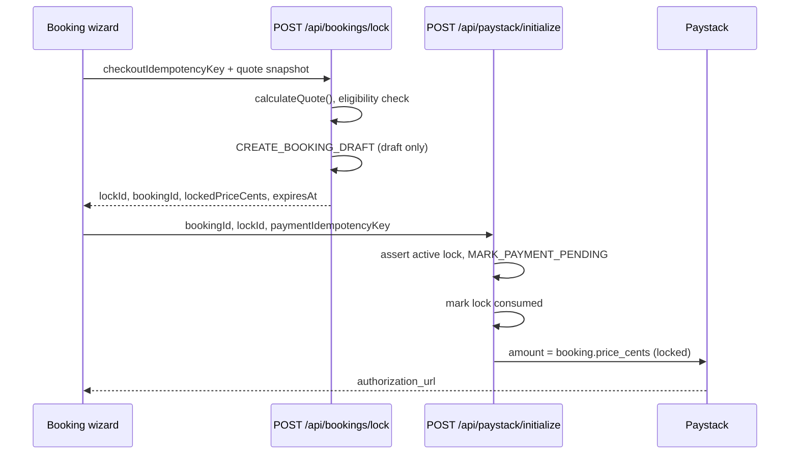

# Booking lock before payment (Phase 7)

Server-authoritative checkout lock so quote, schedule, location, add-ons, and cleaner preference cannot drift between review and Paystack.

## What is locked

| Field | Storage | Notes |
|-------|---------|-------|
| Quote total | `booking_locks.locked_price_cents` + `bookings.price_cents` | Server `calculateQuote()` is authoritative |
| Service | `locked_service_slug` | From pricing input |
| Schedule | `locked_schedule_start`, `locked_schedule_end`, `locked_schedule_timezone` | Rejects past slots |
| Area | `locked_area_slug` | Normalized suburb |
| Cleaner preference | `locked_cleaner_preference` jsonb | `best_available` or `selected` + `selectedCleanerId` |
| Wizard snapshot | `locked_metadata` jsonb | Address, frequency, add-ons, quote line items |
| Client advisory total | `client_quote_total_cents` | Must match server total or `QUOTE_MISMATCH` |

Locks live in `booking_locks` (migration `20260516190000_booking_payment_lock.sql`). Payment links get `payments.payment_link_expires_at` when Paystack initializes.

## Flow

- **Draft** at lock time — not `pending_payment`.
- **`pending_payment`** only after initialize succeeds server-side.
- **`confirmed`** only after Paystack webhook/verify (Phase 3).

## Server quote is authoritative

`createBookingPaymentLock()` always calls `calculateQuote()` on the server. The wizard sends `clientQuoteTotalCents` for display parity only. If it differs from the server total, the API returns `409 QUOTE_MISMATCH` and the wizard returns the user to **Review** to refresh the quote.

Paystack `amount` is always `bookings.price_cents` from the locked draft — never a client-supplied price.

## Idempotency

| Key | Scope | Behavior |
|-----|-------|----------|
| `checkoutIdempotencyKey` | Lock row (`booking_locks.idempotency_key`) | Same customer + same inputs hash → reuse existing lock and draft booking |
| `paystack:checkout:{checkoutIdempotencyKey}` | Payment row | Same Paystack session on retry; `MARK_PAYMENT_PENDING` is idempotent |

Changing inputs (service, slot, suburb, cleaner, etc.) changes `inputs_hash` → `LOCK_INPUT_MISMATCH` (refresh review).

Repeated initialize with the same payment idempotency key while already `pending_payment` reuses the payment row and re-opens Paystack without creating another booking.

## Expiry

- Default TTL: **30 minutes** (`BOOKING_LOCK_TTL_MINUTES`).
- Expired active locks are marked `expired` and return `410 LOCK_EXPIRED`.
- Consumed locks cannot be used for a **new** checkout; idempotent payment retry uses the existing `pending_payment` row instead.

Historical bookings and locks are not deleted in this phase.

## APIs

| Route | Purpose |
|-------|---------|
| `POST /api/bookings/lock` | `createBookingPaymentLock()` |
| `POST /api/paystack/initialize` | Requires `bookingId` + `lockId`; optional `priceCents` rejected if mismatched |

## Environment

| Variable | Default | Purpose |
|----------|---------|---------|
| `BOOKING_LOCK_REQUIRED` | `true` | Set `false` only for legacy/staging tests without locks |

## Deferred to Phase 8+

- Assignment engine and cleaner offers
- Auto-assign / `assignBestCleaner`
- Setting `preferred_cleaner_id` on the booking row at lock time (preference is stored on the lock only)
- Customer booking dashboard

## Related

- [Customer booking wizard](./customer-booking-wizard.md)
- [Paystack foundation](../payments/paystack-foundation.md)
- [Pricing engine](../pricing/pricing-engine.md)
- [Cleaner eligibility](../cleaners/cleaner-availability-eligibility.md)
