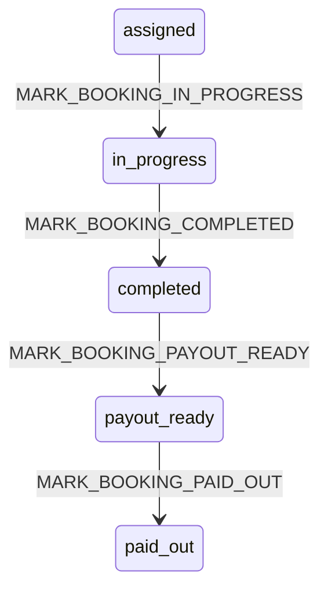

# Earnings and payouts (Phase 10)

Phase 10 closes the transactional MVP: assigned cleaner → in progress → completed → earnings → payout-ready → paid out.

## Lifecycle map

| Booking status | Meaning |
|----------------|---------|
| `assigned` | Cleaner accepted offer |
| `in_progress` | Cleaner started job |
| `completed` | Service done; `earning_lines` created |
| `payout_ready` | Admin approved for settlement |
| `paid_out` | Admin marked paid (ledger only) |

All transitions use `executeBookingCommand` → `booking_apply_transition` RPC. No direct `bookings.status` patches.

## Commands

| Command | Actor | From → To |
|---------|-------|-----------|
| `MARK_BOOKING_IN_PROGRESS` | Assigned cleaner | `assigned` → `in_progress` |
| `MARK_BOOKING_COMPLETED` | Assigned cleaner | `in_progress` → `completed` |
| `MARK_BOOKING_PAYOUT_READY` | Admin | `completed` → `payout_ready` |
| `MARK_BOOKING_PAID_OUT` | Admin | `payout_ready` → `paid_out` |

Legacy aliases `MARK_IN_PROGRESS` / `MARK_COMPLETED` remain for tests; completion APIs use `MARK_BOOKING_*`.

### Completion rules

- Paid payment required (`payments.status = paid`)
- Assigned `cleaner_id` must match acting cleaner
- `price_cents > 0`
- Earnings computed server-side from `metadata.quote` (pricing engine)
- Payout amount must be **> 0** and **≤ customer total**

## Earnings ledger

Table: `earning_lines`

| Field | Purpose |
|-------|---------|
| `gross_amount_cents` | Customer booking total |
| `payout_amount_cents` | Cleaner payout (also mirrored in `amount_cents`) |
| `payout_status` | `pending` → `payout_ready` → `paid` |
| `payout_batch_id` | Optional link to `payout_batches` |
| `calculation_metadata` | Rule applied, percents, team size |

Unique: one `booking_completion` line per booking.

## Payout states

| `earning_lines.payout_status` | When |
|-------------------------------|------|
| `pending` | Created on completion |
| `payout_ready` | Admin runs `MARK_BOOKING_PAYOUT_READY` |
| `paid` | Admin runs `MARK_BOOKING_PAID_OUT` |

## Admin payout workflow

1. Cleaner completes job → booking `completed`, earnings `pending`
2. Admin reviews booking on `/admin/bookings/[id]`
3. **Mark payout-ready** → earnings `payout_ready`, booking `payout_ready`
4. **Mark paid out** → earnings `paid`, booking `paid_out`
5. Summary on `/admin/payouts` (totals + queue)

No Paystack transfers or bank automation in Phase 10.

## APIs

| Route | Method | Actor |
|-------|--------|-------|
| `/api/cleaner/jobs/[bookingId]/start` | POST | Cleaner |
| `/api/cleaner/jobs/[bookingId]/complete` | POST | Cleaner |
| `/api/admin/bookings/[bookingId]/payout-ready` | POST | Admin |
| `/api/admin/bookings/[bookingId]/mark-paid-out` | POST | Admin |
| `/api/admin/payouts` | GET | Admin |

## RLS

- **Cleaner:** `SELECT` own `earning_lines` only
- **Admin:** full `earning_lines` + `payout_batches`
- **Customer:** no access to earnings

## Dashboards

- **Customer:** sees `completed` / `paid_out`; payout substates hidden
- **Cleaner:** job actions (start/complete), earnings on job + `/cleaner/earnings`
- **Admin:** payout actions on booking detail, `/admin/payouts` ledger

## Deferred (future)

- External bank / Paystack transfer automation
- Multi-cleaner team split lines per member
- Customer confirmation gate before completion
- Payout batch export and reconciliation UI

## Related docs

- [Customer/cleaner/admin dashboards](../dashboards/customer-cleaner-admin-dashboards.md)
- [Pricing engine](../pricing/pricing-engine.md)
- [Paystack foundation](../payments/paystack-foundation.md)
