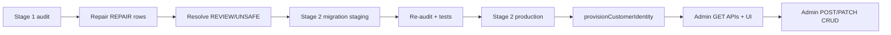

# Customer domain reconciliation & hardening plan

**Status:** Stage 1–1C complete · Stage 2 applied on `shalean-software` (jdmumbvednevkrctkiwd) · Stage 3 (admin CRUD) planned, not implemented  
**Goal:** Prepare the platform for safe admin customer CRUD by establishing data integrity gates first.

---

## Executive summary

| Stage | Deliverable | Status |
|-------|-------------|--------|
| 1 | `scripts/ops/reconcile-customer-domain-rows.mjs` | Ready — audit-only, dry-run default |
| 1B | `scripts/ops/repair-customer-domain-rows.mjs` | Ready — REPAIR only; `ops:repair:customer-domain` |
| 1C | `scripts/ops/cleanup-stray-customer-domain-rows.mjs` | Ready — REVIEW stray rows; `ops:cleanup:customer-domain` |
| 2 | `supabase/migrations/20260519120000_customer_domain_hardening.sql` | **Applied** on shalean-software (2026-05-19) |
| 3 | `provisionCustomerIdentity.ts`, `/api/admin/customers`, `/admin/customers` | Planned below — no CRUD yet |

**Invariant (target):**

- `profiles.role = customer` ⇒ exactly one `customers` row (after provisioning completes)
- `profiles.role = cleaner` ⇒ exactly one `cleaners` row, zero `customers` rows
- `profiles.role = admin` ⇒ zero domain rows
- Never both `customers` and `cleaners` for the same `profile_id` on new writes

---

## Stage 1 — Audit script

### Run

```bash
npm run ops:audit:customer-domain
npm run ops:audit:customer-domain -- --json
```

Requires `NEXT_PUBLIC_SUPABASE_URL` (or `SUPABASE_URL`) and `SUPABASE_SERVICE_ROLE_KEY` in `.env.local`.

### Detections

| Code | Condition |
|------|-----------|
| `CUSTOMER_PROFILE_MISSING_DOMAIN_ROW` | `profiles.role = customer` and no `customers` row |
| `CUSTOMER_ROW_ROLE_MISMATCH` | `customers` row exists but `profiles.role != customer` |
| `DUAL_DOMAIN_PROFILE` | Both `customers` and `cleaners` for same `profile_id` |
| `DUPLICATE_CUSTOMER_PROFILE_MAPPING` | More than one `customers` row per `profile_id` (should be impossible) |
| `CUSTOMER_ROW_ORPHAN_PROFILE` | `customers.profile_id` with no `profiles` row |

### Action classification

| Action | Meaning | Typical remediation |
|--------|---------|---------------------|
| **KEEP** | Valid state | None |
| **REPAIR** | Safe automated fix | `ensure_customer_provisioned(profile_id)` |
| **REVIEW** | Needs ops decision | Stray/dual-domain row without bookings |
| **UNSAFE** | Bookings or integrity risk | Manual playbook; no auto-delete |

### Exit code

- `0` — all profiles KEEP, no orphan customer rows
- `1` — any REPAIR, REVIEW, UNSAFE, or orphan row (suitable for CI gate before admin CRUD)

### Pre-production checklist

- [x] Run audit on staging (shalean-software) — exit 0
- [x] REPAIR via `ops:repair:customer-domain -- --apply`
- [x] REVIEW cleanup via `ops:cleanup:customer-domain -- --apply`
- [x] Re-run audit until exit `0` (228 KEEP)
- [x] Apply Stage 2 migration on staging
- [ ] Production audit + migration (see Production rollout below)

---

## Stage 2 — DB hardening migration (applied on staging)

**File:** `supabase/migrations/20260519120000_customer_domain_hardening.sql`

**Applied:** `shalean-software` project (`jdmumbvednevkrctkiwd`) after audit exit 0 (228 KEEP). Post-apply audit unchanged.

### Production rollout (pending)

1. Confirm production audit clean: `npm run ops:audit:customer-domain` (exit 0).
2. Maintenance window — migration is additive (functions + triggers only).
3. Apply via Supabase Dashboard SQL or `supabase db push` linked to production project.
4. Re-run audit (expect same KEEP/REPAIR/REVIEW/UNSAFE counts as pre-apply).
5. Smoke: customer signup, `/customer/setup` repair RPC, cleaner/admin provision scripts (read-only dry-runs).
6. Monitor for `check_violation` on invalid domain inserts (expected — indicates guard working).

**Not in scope for this migration:** RLS, bookings ownership, payments, payouts, assignments, admin customer CRUD.

---

## Stage 2 — DB hardening behaviors (reference)

### Behaviors (when applied)

1. **`AFTER UPDATE OF role ON profiles`**
   - Role → `customer`: calls `provision_customer_for_profile` (idempotent)
   - Role leaves `customer`: calls `reconcile_customer_domain_on_role_leave`

2. **`reconcile_customer_domain_on_role_leave`**
   - If `bookings` reference `customers.id`: **keep row** (RESTRICT + history)
   - If no bookings: **delete** stray `customers` row

3. **`BEFORE INSERT/UPDATE` on `customers`**
   - `profiles.role` must be `customer`
   - No existing `cleaners` row for `profile_id`

4. **`BEFORE INSERT/UPDATE` on `cleaners`**
   - `profiles.role` must be `cleaner`
   - No existing `customers` row for `profile_id`

### Apply order

1. Clean audit (Stage 1 exit `0`)
2. `supabase db push` on staging
3. Re-run `npm run ops:audit:customer-domain`
4. Run Stage 1C + RLS integration tests
5. Production during maintenance window

### Integration tests

| Test | File |
|------|------|
| Role UPDATE → customer provisions row | `src/tests/security/customer-domain-hardening.integration.test.ts` |
| Role demote, zero bookings → row removed | same |
| Role demote with bookings → row preserved | same |
| INSERT customers on admin profile fails | same |
| INSERT cleaners on customer / dual-domain fails | same |

---

## Stage 3A — Admin customer read platform (shipped)

| Layer | Path |
|-------|------|
| List page | `/admin/customers` |
| Detail page | `/admin/customers/[customerId]` |
| API | `GET /api/admin/customers`, `GET /api/admin/customers/[customerId]` |
| Read model | `src/features/customers/server/admin/adminCustomersReadModel.ts` |

Read-only: no create/edit/delete. Uses canonical `customers.id` for bookings/payments. Zod-validated query params.

---

## Stage 3 — Implementation plan (mutations — not yet)

### 3.1 `src/lib/auth/provisionCustomerIdentity.ts`

Mirror `provisionCleanerIdentity.ts` with customer-specific rules.

**Responsibilities:**

| Step | Behavior |
|------|----------|
| Auth user | `auth.admin.createUser` or reuse existing by email |
| Profile | Upsert `profiles` with `role = customer` (never admin/cleaner) |
| Domain row | Call `provision_customer_for_profile` via service role (not client insert) |
| Idempotency | Same email → return existing `customerId` if already valid customer |
| Conflicts | Reject if profile is `cleaner` or has `cleaners` row |
| Rollback | On failure after `createUser`, delete auth user (same pattern as cleaner) |

**Public API (proposed):**

```ts
export type ProvisionCustomerIdentityParams = {
  email: string;
  fullName: string;
  phoneE164?: string;
  password?: string; // optional if linking existing auth user only
  companyName?: string;
};

export type ProvisionCustomerIdentityResult =
  | { ok: true; profileId: string; customerId: string; createdAuthUser: boolean }
  | { ok: false; code: string; message: string };
```

**Error codes (align with cleaner):**

- `AUTH_EMAIL_TAKEN` (non-customer role)
- `PROFILE_ROLE_CONFLICT`
- `DUAL_DOMAIN_CONFLICT`
- `PROVISION_FAILED`

**Dependencies:**

- `findAuthUserByEmail` — reuse from `provisionCleanerIdentity.ts` (extract shared `findAuthUserByEmail` to `src/lib/auth/findAuthUserByEmail.ts` when implementing)
- Service role client only — `requireServiceRoleClient()`
- DB functions: `provision_customer_for_profile` (after Stage 2 migration, role UPDATE also provisions)

**Tests:** `provisionCustomerIdentity.test.ts` — unit with mocked client; integration with service role (staging).

---

### 3.2 `/api/admin/customers`

Follow `src/app/api/admin/cleaners/route.ts` patterns.

**Phase A — read-only (ship before CRUD):**

| Method | Route | Purpose |
|--------|-------|---------|
| `GET` | `/api/admin/customers` | Paginated list (profile + customer + email + booking count) |
| `GET` | `/api/admin/customers/[customerId]` | Detail read model |

**Phase B — mutations (after Stage 2 live + audit clean):**

| Method | Route | Purpose |
|--------|-------|---------|
| `POST` | `/api/admin/customers` | Create via `provisionCustomerIdentity` |
| `PATCH` | `/api/admin/customers/[customerId]` | Update `company_name`, `phone`, `notes`, `full_name` |
| `POST` | `/api/admin/customers/[customerId]/archive` | Soft-archive (future column) or role demotion playbook |

**Do not implement in Phase B yet:**

- Hard delete `customers` with bookings
- Role change customer ↔ cleaner in one API (separate migration script)

**Server modules (proposed):**

```
src/features/customers/server/admin/
  listCustomers.ts
  getCustomerDetail.ts
  createCustomer.ts          # Phase B
  parseCreateCustomerBody.ts
  mapCreateCustomerHttpStatus.ts
  recordCustomerProfileAudit.ts  # mirror cleaner audit
```

**Auth:** `requireApiUser(["admin"])` on all routes.

**RLS note:** Admin insert already allowed via `customers_admin_insert`. Provisioning should still prefer `provision_customer_for_profile` to satisfy Stage 2 triggers.

---

### 3.3 `/admin/customers`

Mirror `src/app/(admin)/admin/cleaners/`.

**Phase A — read-only UI:**

| Page | Purpose |
|------|---------|
| `/admin/customers` | Table: name, email, phone, booking count, provisioning status |
| `/admin/customers/[customerId]` | Detail: profile, customer fields, recent bookings link |

**Phase B — create flow:**

| Page | Purpose |
|------|---------|
| `/admin/customers/new` | Form → `POST /api/admin/customers` |

**Components:**

- Reuse admin layout, table, and form patterns from cleaners
- Show audit banner if `REVIEW`/`UNSAFE` flags detected (optional: call audit counts from a small admin health endpoint)

**Navigation:** Add “Customers” to admin sidebar next to Cleaners.

---

## Sequencing (recommended)



| Order | Task | Blocker |
|-------|------|---------|
| 1 | Run `ops:audit:customer-domain` on all envs | — |
| 2 | Fix REPAIR rows | — |
| 3 | Ops sign-off on REVIEW/UNSAFE | Manual |
| 4 | Apply `20260519120000_customer_domain_hardening.sql` | Audit exit 0 |
| 5 | Implement `provisionCustomerIdentity.ts` + tests | Stage 2 on staging |
| 6 | Admin GET routes + list/detail pages | provision helper |
| 7 | Admin POST/PATCH CRUD | Phases 5–6 stable |

---

## Relationship to existing tooling

| Tool | Use |
|------|-----|
| `npm run ops:audit:auth-profiles` | Auth users missing `profiles` |
| `npm run ops:repair:auth-profiles` | Create profile + `ensure_customer_provisioned` |
| `npm run ops:audit:customer-domain` | **This plan** — domain row integrity |
| `/customer/setup` | Self-serve orphan repair (`ensure_customer_provisioned`) |
| `demote-mock-admins` | Role-only demotion — run customer-domain audit after |

---

## Security notes

- Audit and repair scripts require **service role** — never expose to client
- `provision_customer_for_profile` remains **service_role** only; admin API uses service role internally
- RLS unchanged: customers cannot self-insert; provisioning stays `SECURITY DEFINER`
- Stage 2 triggers prevent **new** invalid combinations; existing stray rows must be cleaned in Stage 1

---

## Related documents

- `docs/architecture/stage-1b-identity-provisioning-architecture.md`
- `docs/audits/stage-1c-customer-provisioning-final-audit.md`
- `supabase/migrations/20260517160000_stage1c_customer_auto_provisioning.sql`
- `src/lib/auth/provisionCleanerIdentity.ts` (reference implementation)
