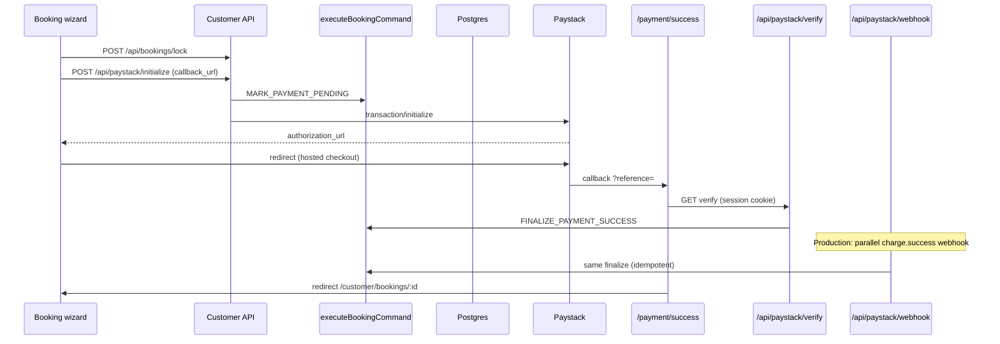

# Paystack payment foundation (Phase 3)

Server-only Paystack integration for booking checkout: initialize → `pending_payment` → webhook or verify fallback → `confirmed` via the existing booking command layer.

## Routes

| Route | Method | Auth | Responsibility |
|-------|--------|------|----------------|
| `/api/paystack/initialize` | POST | Customer session | Requires locked `bookingId` + `lockId`; `MARK_PAYMENT_PENDING`, Paystack initialize with `callback_url`, return checkout URL |
| `/api/paystack/webhook` | POST | `x-paystack-signature` | **Production authority** — `charge.success`, finalize booking |
| `/api/paystack/verify` | GET, POST | Customer session | Paystack verify API fallback; same finalize path as webhook |
| `/payment/success` | GET | Customer session (for verify call) | Paystack redirect target; calls `/api/paystack/verify`, then redirects to booking detail |
| `/payment/failed` | GET | Public | Safe messaging when checkout is abandoned or fails |

## Environment variables

| Variable | Required | Notes |
|----------|----------|-------|
| `PAYSTACK_SECRET_KEY` | Yes (when enabled) | Server-only; API auth and default webhook HMAC secret |
| `PAYSTACK_WEBHOOK_SECRET` | No | Overrides webhook HMAC secret; defaults to `PAYSTACK_SECRET_KEY` |
| `PAYSTACK_ENABLED` | No | Set `false` to return 503 on initialize/verify |
| `PAYSTACK_API_BASE_URL` | No | Defaults to `https://api.paystack.co` |
| `APP_BASE_URL` | Yes (checkout) | Absolute app origin for Paystack `callback_url` (e.g. `http://localhost:3000`) |
| `NEXT_PUBLIC_APP_URL` | Recommended | Browser fallback for callback URL when wizard runs client-side |
| `SUPABASE_SERVICE_ROLE_KEY` | Yes | Command persistence and payment row patches |

Never expose Paystack or service role keys with `NEXT_PUBLIC_*`.

## Lifecycle flow

- Initialize **never** sets `confirmed`.
- Finalize runs only after Paystack reports `success` and amount matches `payments.amount_cents`.
- After successful finalize, the [assignment engine](../assignments/assignment-engine.md) runs automatically; assignment failure does not undo payment.

## Shared finalization

All success paths call `finalizePaidBooking` → `executeBookingCommand({ type: "FINALIZE_PAYMENT_SUCCESS", actor: service })` → `booking_finalize_payment_success` RPC.

Steps:

1. Load payment by `provider_ref` (Paystack reference).
2. Assert `amount_cents` matches Paystack amount.
3. Insert `payment_events` (`provider_event_id` unique).
4. Run `FINALIZE_PAYMENT_SUCCESS` with idempotency key `paystack:txn:{transactionId}`.

## Idempotency

| Layer | Key | Behavior |
|-------|-----|----------|
| Payment init | `paystack:checkout:{checkoutIdempotencyKey}` (from lock) or `paystack:booking:{bookingId}` | Reuses payment row; idempotent `MARK_PAYMENT_PENDING`; Paystack amount = locked server quote |
| Booking lock | `checkoutIdempotencyKey` | One draft + lock per customer/key; see [booking lock](../booking/booking-lock-before-payment.md) |
| `payment_events` | `paystack:txn:{id}` | Unique constraint; duplicate insert ignored |
| Booking finalize | Same as `payment_events` transaction id | Audit idempotency + RPC short-circuit |

Duplicate webhooks return success with `idempotent: true` and do not double-confirm.

## Webhook vs verify fallback

| | Webhook | Verify (API + return page) |
|---|---------|----------------------------|
| **Role** | **Production authority** when delivered | **Local/staging safety** when user returns to app |
| Trigger | Paystack POST to `/api/paystack/webhook` | `/payment/success` → GET `/api/paystack/verify?reference=` |
| Trust | HMAC signature | Paystack verify API + customer session |
| Events handled | `charge.success` only | Successful verify status only |
| Finalize | `processPaystackChargeSuccess(..., "webhook")` | `processPaystackChargeSuccess(..., "verify")` |

- **Localhost:** Webhook usually needs a tunnel; **return + verify** finalizes without manual API calls.
- **Production:** Configure webhook URL; return-page verify is idempotent if webhook arrived first.
- Verify returns `{ paid: false, status }` for failed/pending Paystack states without mutating the booking.
- The browser **never** sets `bookings.status`; only `finalizePaidBooking` does.

## Code map

| Module | Role |
|--------|------|
| `paystackEnv.ts` | Env validation, feature flag |
| `paystackClient.ts` | Initialize, verify, webhook signature |
| `initializePayment.ts` | Customer-scoped checkout start |
| `finalizePaidBooking.ts` | Shared success facade |
| `upsertBookingFromPaystack.ts` | Reference → payment → finalize |
| `handlePaystackWebhook.ts` | Webhook entry |
| `verifyPayment.ts` | Verify fallback |
| `src/lib/app/paymentReturn.ts` | Callback URL + reference parsing |
| `src/app/payment/success` | Post-checkout verify UI |

## Remaining risks before production

- **Staging Paystack keys** — End-to-end test with real test transactions not automated in CI.
- **Currency units** — Amounts assume Paystack `amount` matches `price_cents` / `amount_cents` (kobo/cents per currency).
- **Customer email** — Initialize requires `email` in request body; no profile email fallback yet.
- **Auto assignment** — `MOVE_TO_PENDING_ASSIGNMENT` after pay is not enabled (Phase 8).
- **Webhook URL** — Must be configured in Paystack dashboard pointing to `/api/paystack/webhook`.
- **BOOKING_COMMAND_BACKEND=memory** — Must not be used in production; finalize requires Supabase RPCs for real deploys.

## Related docs

- [Booking command execution layer](../architecture/booking-command-execution-layer.md)
- [RLS role security](../security/rls-role-security.md)
