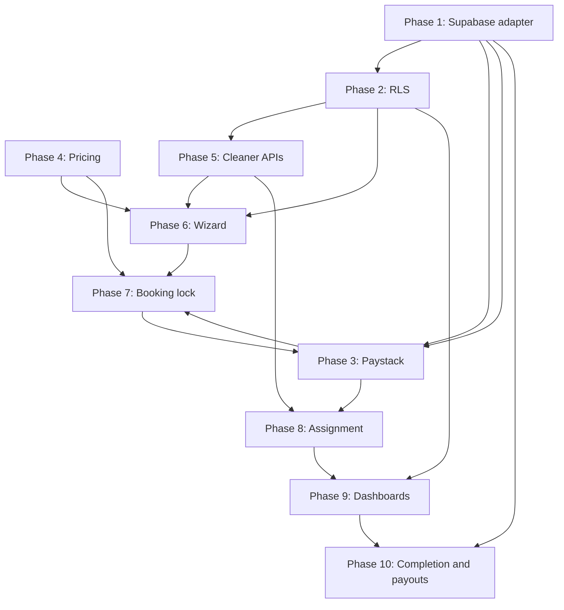

# Foundation Completion Plan — Shalean Cleaning Services

**Status:** Planning only (no implementation in this document)  
**Based on:** [Foundation vs target flow audit](../audits/shalean-foundation-vs-target-flow-audit.md) — Verdict **B**  
**Target flow:** Customer wizard → Pricing → Cleaner eligibility → APIs → Cleaner picker → Booking lock → Paystack → `pending_payment` → Webhook/verify → Finalize → `confirmed` → Assignment (selected or auto) → Dashboards → Completed → Earnings/payout readiness

---

## How to read this plan

- Phases are **sequential by dependency**. Do not skip ahead without accepting the prior phase’s acceptance criteria.
- **Critical before real users:** Phase 2 (RLS) and Phase 3 (Paystack finalization). Do not onboard customers or process live money until both are done and verified in staging.
- All booking **status** changes must continue to flow through `executeBookingCommand()` and Postgres RPCs — never ad hoc `UPDATE bookings SET status`.
- Naming alignment: the codebase uses `confirmed` (not `payment_confirmed`); offers live on `assignment_offers` (booking stays `pending_assignment` until accept).

---

## Dependency overview

| Phase | Hard depends on | Soft depends on |
|-------|-----------------|-----------------|
| 1 | — | — |
| 2 | 1 | — |
| 3 | 1 | 2 recommended before prod |
| 4 | 1 | — (can parallel with 2–3 in dev) |
| 5 | 1, 2 | 4 (for quote-aware eligibility later) |
| 6 | 1, 2, 4, 5 | 7 (lock can ship with wizard) |
| 7 | 1, 4, 6 (draft shape) | 3 |
| 8 | 1, 2, 3, 5 | 6 |
| 9 | 1, 2, 8 | 3, 6 |
| 10 | 1, 2, 8 | 9 |

---

## Phase 1 — Supabase production adapter for booking commands

### Objective

Replace the in-memory-only execution path with a **server-only Supabase backend** that runs the same guard ordering as `executeBookingCommand()`, then persists via existing `booking_*` RPCs and targeted DML for offers, payments, and outbox rows.

### Files likely to create or update

| Action | Path |
|--------|------|
| Create | `src/features/bookings/server/commands/supabaseBookingCommandBackend.ts` |
| Create | `src/lib/supabase/serviceRole.ts` (server-only service role client) |
| Create | `src/features/bookings/server/commands/runBookingCommand.ts` (factory: memory vs Supabase by env) |
| Update | `src/features/bookings/server/commands/index.ts` (export adapter) |
| Update | `src/features/bookings/server/commands/executeBookingCommand.ts` (accept `BookingCommandBackend` interface) |
| Update | `src/lib/database/types.ts` (RPC arg types if generated) |
| Create | `src/features/bookings/server/commands/executeBookingCommand.integration.test.ts` |
| Update | `docs/architecture/booking-command-execution-layer.md` |

### Database changes needed

- **None required** for minimal adapter (reuse `booking_apply_transition`, `booking_finalize_payment_success`, `booking_record_payment_failure`).
- **Optional follow-up migration:** single `execute_booking_command(jsonb)` RPC wrapping all command types in one transaction (reduces round-trips; not blocking for Phase 1).

### API routes needed

- None in this phase (adapter is consumed by Server Actions / route handlers added later).

### Command / lifecycle rules

- **Unchanged guard order:** `assertActorAuthorizedForCommand` → ownership context → `assertTransitionShape` → persist.
- Map commands to RPCs:
  - `FINALIZE_PAYMENT_SUCCESS` → `booking_finalize_payment_success`
  - `MARK_PAYMENT_FAILED` → `booking_record_payment_failure`
  - Status transitions with cleaner id → `booking_apply_transition` (`p_cleaner_id` on accept)
- `CREATE_BOOKING_DRAFT`, `MARK_PAYMENT_PENDING`, `OFFER_TO_CLEANER`, offer updates: **insert/update via service role** with audit row in same transaction (application-orchestrated until unified RPC exists).
- Populate `BookingCommandRunContext` (`actingCustomerId`, `actingCleanerId`) from `customers` / `cleaners` by `profile_id` — add `src/lib/auth/resolveActorScope.ts`.
- **Never** call service role from client bundles; use `import "server-only"`.

### Tests required

| Test | Type |
|------|------|
| Each command happy path against local DB | Integration (`supabase db reset`) |
| Idempotent `FINALIZE_PAYMENT_SUCCESS` (duplicate `idempotency_key`) | Integration |
| Optimistic conflict (`BOOKING_STATUS_CONFLICT`) | Integration |
| `MOVE_TO_PENDING_ASSIGNMENT` without paid payment | Integration |
| In-memory tests remain for fast unit runs | Unit (existing Vitest) |

### Acceptance criteria

- [ ] Server Action or internal test harness can run full lifecycle: draft → pending_payment → confirmed → pending_assignment → assigned → in_progress → completed **against Postgres**.
- [ ] Audit rows appear in `booking_state_audit` for every status change.
- [ ] No production code path uses `InMemoryBookingCommandBackend` when `SUPABASE_SERVICE_ROLE_KEY` is set.
- [ ] `actingCustomerId` / `actingCleanerId` resolved server-side from session profile.

### Risk level

**High** — Incorrect adapter ordering can corrupt lifecycle or skip audit.

### Rollback notes

- Keep `InMemoryBookingCommandBackend` behind env flag (`BOOKING_COMMAND_BACKEND=memory`).
- Adapter is additive; rollback = flip flag and redeploy without running new migrations.

---

## Phase 2 — RLS and role security enforcement

> **CRITICAL before real users.** Do not expose booking/payment data to authenticated clients until this phase passes staging verification.

### Objective

Enable Row Level Security on all `public` user-facing tables so customers, cleaners, and admins see only permitted rows; **deny direct `bookings.status` updates** from `authenticated`; keep mutations on lifecycle paths via service role + RPC.

### Files likely to create or update

| Action | Path |
|--------|------|
| Create | `supabase/migrations/YYYYMMDDHHMMSS_enable_rls.sql` |
| Create | `supabase/migrations/YYYYMMDDHHMMSS_rls_policies.sql` |
| Update | `docs/security/rls-plan.md` (mark implemented policies) |
| Update | `docs/security/auth-enforcement-gap-map.md` |
| Create | `src/lib/auth/onAuthSignup.ts` or SQL trigger file `supabase/migrations/..._profile_bootstrap.sql` |
| Update | `src/middleware.ts` (fail closed in production when env missing) |
| Create | `tests/security/rls-policies.test.ts` (optional: pgTAP or scripted supabase-js) |

### Database changes needed

- `ALTER TABLE ... ENABLE ROW LEVEL SECURITY` on: `profiles`, `customers`, `cleaners`, `services`, `bookings`, `payments`, `payment_events`, `assignment_offers`, `earning_lines`, `notification_outbox`, `booking_state_audit`.
- Policies per `docs/security/rls-plan.md`:
  - Customers: `SELECT` own `customers` row; `SELECT` bookings where `customer_id` matches.
  - Cleaners: `SELECT` own `cleaners` row; `SELECT` bookings where `cleaner_id` matches or open `assignment_offers` for them.
  - Admin: scoped read (and limited write where appropriate).
  - **Deny** `UPDATE` on `bookings.status` for `authenticated` (column-level or trigger).
- Auth bootstrap: trigger on `auth.users` insert → `profiles` (+ `customers` or `cleaners` row as needed).
- Re-run Supabase security advisors; document exceptions.

### API routes needed

- None dedicated; all routes must use **user-scoped** client for reads and **service role** only inside server handlers for commands.

### Command / lifecycle rules

- Command executor continues to use **service role** for writes; user-scoped client only for reads in Server Components.
- `ADMIN_OVERRIDE_STATUS` remains admin-only; must still write audit (via adapter).
- Verify `profiles.role` is authoritative — **never** `user_metadata` for authorization.

### Tests required

| Test | Expectation |
|------|-------------|
| Customer A cannot `SELECT` customer B bookings | RLS blocks |
| Cleaner cannot `UPDATE` booking status directly | Denied |
| Cleaner can `SELECT` offered assignment for self | Allowed |
| Service role can run `booking_finalize_payment_success` | Allowed |
| Anonymous cannot read bookings | Denied |

### Acceptance criteria

- [ ] RLS enabled on all tables in plan.
- [ ] Supabase advisor security lint: no critical unaddressed issues.
- [ ] Middleware redirects unauthenticated users; production build **requires** Supabase env (no `x-auth-enforcement: disabled` in prod).
- [ ] Profile row exists after signup smoke test.

### Risk level

**Critical** — Misconfigured policies can leak PII or block all reads.

### Rollback notes

- Migration can `DISABLE ROW LEVEL SECURITY` per table in reverse order (emergency only).
- Prefer fixing policies over disabling RLS in production.
- Keep service-role command path working independently of read policies.

---

## Phase 3 — Paystack initialize, webhook, and verify fallback

> **CRITICAL before real users.** No live payments until webhook idempotency and finalize path are proven in staging.

### Objective

Implement the payment edge of the target diagram: initialize → `pending_payment` booking → Paystack webhook **or** verify fallback → `FINALIZE_PAYMENT_SUCCESS` / `MARK_PAYMENT_FAILED` → `confirmed` or `payment_failed`.

### Files likely to create or update

| Action | Path |
|--------|------|
| Create | `src/features/payments/server/paystackClient.ts` |
| Create | `src/features/payments/server/initializePayment.ts` |
| Create | `src/features/payments/server/finalizePaidBooking.ts` (thin wrapper → `FINALIZE_PAYMENT_SUCCESS`) |
| Create | `src/features/payments/server/upsertBookingFromPaystack.ts` (map provider payload → command + `payment_events`) |
| Create | `src/features/payments/server/verifyPayment.ts` (fallback) |
| Update | `src/features/payments/index.ts` |
| Create | `src/app/api/payments/paystack/initialize/route.ts` |
| Create | `src/app/api/payments/paystack/webhook/route.ts` |
| Create | `src/app/api/payments/paystack/verify/route.ts` (GET or POST by reference) |
| Update | `.env.example` — `PAYSTACK_SECRET_KEY`, `PAYSTACK_WEBHOOK_SECRET` (no secrets committed) |

### Database changes needed

- **Optional:** `payments.expires_at timestamptz`, `payments.provider_ref` index already exists.
- **Optional:** `bookings.payment_expires_at` or store in `metadata`.
- Ensure `payment_events` insert on every webhook/verify with `provider_event_id` = Paystack event id or reference.
- No change to `booking_status` enum for this phase.

### API routes needed

| Route | Method | Auth | Purpose |
|-------|--------|------|---------|
| `/api/payments/paystack/initialize` | POST | Customer session | Create/update payment row, `MARK_PAYMENT_PENDING`, return Paystack authorization URL |
| `/api/payments/paystack/webhook` | POST | Paystack signature | Idempotent finalize / fail |
| `/api/payments/paystack/verify` | GET/POST | Customer or system | Fallback when webhook delayed |

### Command / lifecycle rules

| Step | Command / rule |
|------|----------------|
| Initialize | `MARK_PAYMENT_PENDING` with stable `paymentIdempotencyKey`; set `payments.provider_ref` when Paystack returns reference |
| Success | `FINALIZE_PAYMENT_SUCCESS` with **required** `idempotencyKey` = provider event id; then `MOVE_TO_PENDING_ASSIGNMENT` (system actor) if product policy is auto-dispatch after pay |
| Failure | `MARK_PAYMENT_FAILED` |
| Duplicate webhook | Second call returns idempotent success; no double audit |
| Amount mismatch | Reject finalize if Paystack amount ≠ `payments.amount_cents` |

**Target alignment:** `finalizePaidBooking` and `upsertBookingFromPaystack` are **facade names** over the existing command vocabulary — do not fork lifecycle logic.

### Tests required

| Test | Type |
|------|------|
| Initialize creates `pending_payment` + payment row | Integration |
| Webhook `charge.success` → `confirmed` + paid payment | Integration |
| Duplicate webhook idempotent | Integration |
| Invalid signature rejected | Unit |
| Verify fallback after missed webhook | Integration |
| Wrong amount / wrong booking rejected | Integration |

### Acceptance criteria

- [ ] Staging Paystack test transaction completes: `draft`/`pending_payment` → `confirmed`.
- [ ] `payment_events` row for each webhook delivery.
- [ ] Customer cannot finalize another user’s booking (RLS + server checks).
- [ ] Secrets only in server env; none in `NEXT_PUBLIC_*`.

### Risk level

**Critical** — Money and double-charge / double-confirm risk.

### Rollback notes

- Feature flag `PAYSTACK_ENABLED=false` returns 503 on initialize; bookings stay in `draft`/`pending_payment`.
- Webhook route can be disabled at edge without DB rollback.
- Do not delete `payment_events` on rollback — needed for reconciliation.

---

## Phase 4 — Pricing engine

### Objective

Centralize quote calculation: service type, size inputs (bedrooms/bathrooms), frequency, add-ons, optional team size → **customer total** and **cleaner earnings preview** stored on the booking draft for downstream payment and assignment.

### Files likely to create or update

| Action | Path |
|--------|------|
| Create | `src/features/pricing/index.ts` |
| Create | `src/features/pricing/server/calculateQuote.ts` |
| Create | `src/features/pricing/server/types.ts` (inputs, line items, breakdown) |
| Create | `src/features/pricing/server/rules/` (per service type) |
| Create | `src/app/api/pricing/quote/route.ts` (optional; Server Action alternative) |
| Update | `src/features/bookings/server/commands/types.ts` — `CREATE_BOOKING_DRAFT` accepts quote snapshot in `metadata` |
| Update | `supabase/seed.sql` — sample services, add-ons |

### Database changes needed

| Change | Purpose |
|--------|---------|
| `service_addons` table (or jsonb catalog) | Add-on definitions and prices |
| `pricing_rules` table (optional) | Admin-editable rates; else code-first rules |
| Extend `services` or `bookings.metadata` | Store `quote_breakdown`, `bedrooms`, `bathrooms`, `frequency`, `team_size` |
| **No** change to `booking_status` enum |

### API routes needed

| Route | Method | Auth | Purpose |
|-------|--------|------|---------|
| `/api/pricing/quote` | POST | Public or customer | Stateless quote for wizard |

Alternatively: Server Action `getQuote` only (no public route) — document choice in implementation.

### Command / lifecycle rules

- `CREATE_BOOKING_DRAFT` must set `price_cents` from engine output; persist full breakdown in `metadata` for audit/disputes.
- Cleaner earnings preview is **informational** until Phase 10; do not write `earning_lines` at quote time.
- Admin price override (if any) goes through explicit metadata flag + audit reason, not silent patch.

### Tests required

| Test | Coverage |
|------|----------|
| Known fixture inputs → expected total | Unit |
| Add-on combinations | Unit |
| Zero/negative price rejected | Unit |
| Earnings preview ≤ customer total (business rule) | Unit |
| Currency consistency (ZAR vs USD) | Unit |

### Acceptance criteria

- [ ] Single `calculateQuote()` used by wizard and initialize (no duplicated math).
- [ ] Quote breakdown visible in booking `metadata` after draft create.
- [ ] Changing inputs after lock (Phase 7) invalidates or blocks checkout.

### Risk level

**Medium** — Wrong prices are commercial/reputational risk, not security.

### Rollback notes

- Engine version in `metadata.pricingVersion`; old bookings keep stored breakdown.
- Code-first rules: rollback = deploy previous package version.

---

## Phase 5 — Cleaner availability and cleaner eligibility APIs

### Objective

Support the diagram’s two cleaner endpoints: booking-scoped eligibility and general availability — excluding inactive, unavailable, out-of-area, and suspended cleaners; feed cleaner picker and assignment engine.

### Files likely to create or update

| Action | Path |
|--------|------|
| Create | `src/features/cleaners/index.ts` |
| Create | `src/features/cleaners/server/availability.ts` |
| Create | `src/features/cleaners/server/eligibility.ts` |
| Create | `src/features/cleaners/server/types.ts` |
| Create | `src/app/api/booking/cleaners/route.ts` |
| Create | `src/app/api/cleaners/available/route.ts` |
| Update | `src/features/assignments/index.ts` (re-export or depend on cleaners) |

### Database changes needed

| Table / column | Purpose |
|----------------|---------|
| `cleaner_availability` (cleaner_id, day_of_week, start_time, end_time, timezone) | Recurring windows |
| `cleaner_time_off` (cleaner_id, start_at, end_at, reason) | Exceptions |
| `cleaner_service_areas` (cleaner_id, geo or suburb list) | Service area |
| `cleaners.suspended_at` or `status` enum | Block suspended |
| Index on `(cleaner_id, scheduled_start)` via bookings for conflict detection | Double-booking |

### API routes needed

| Route | Query/body | Returns |
|-------|------------|---------|
| `GET /api/booking/cleaners` | `bookingId` or draft params (service, slot, location) | Cleaners eligible for **this** booking |
| `GET /api/cleaners/available` | `date`, `serviceId`, optional location | Generally available cleaners |

Both routes: **authenticated** customer (or admin); use RLS-safe reads + server-side filters.

### Command / lifecycle rules

- Eligibility is **read-only**; no lifecycle transitions.
- Selected `cleaner_id` stored on draft `metadata.preferred_cleaner_id` until lock (Phase 7).
- Auto-assign (Phase 8) reuses same eligibility function with ranking.

### Tests required

| Test | Type |
|------|------|
| Inactive cleaner excluded | Unit |
| Outside service area excluded | Unit |
| Conflicting booking excluded | Integration |
| Suspended cleaner excluded | Unit |
| Two APIs return consistent subset for same inputs | Integration |

### Acceptance criteria

- [ ] Both routes return stable JSON schema documented in code types.
- [ ] p95 query acceptable with seed data (document target, e.g. &lt; 200ms local).
- [ ] RLS: customer cannot enumerate cleaners outside eligibility rules beyond intended visibility.

### Risk level

**Medium** — Wrong eligibility causes failed jobs or unfair dispatch.

### Rollback notes

- Routes can return 503 and wizard falls back to “auto-assign only” if flag set.
- DB tables additive; unused tables harmless.

---

## Phase 6 — Customer booking wizard

### Objective

Implement the customer-facing path: service selection → pricing → date/time → address → notes → cleaner preference → review → checkout — calling server actions that use the adapter (Phase 1), pricing (Phase 4), and cleaner APIs (Phase 5).

### Files likely to create or update

| Action | Path |
|--------|------|
| Create | `src/app/(customer)/customer/book/page.tsx` (or `/book/[step]`) |
| Create | `src/features/booking-wizard/` (components + state machine) |
| Create | `src/features/booking-wizard/server/actions.ts` (createDraft, updateDraft, proceedToCheckout) |
| Update | `src/app/(customer)/customer/page.tsx` (CTA to book) |
| Create | `src/features/booking-wizard/types.ts` (wizard state) |

### Database changes needed

| Change | Purpose |
|--------|---------|
| `bookings.metadata` schema convention | `address`, `notes`, `preferred_cleaner_id`, `quote_breakdown` |
| Optional `booking_addresses` table | Normalized address if needed for reporting |

### API routes needed

- Prefer **Server Actions** over public REST for wizard mutations.
- Optional: `POST /api/bookings/draft` if mobile client needed later.

### Command / lifecycle rules

| Wizard step | System action |
|-------------|---------------|
| Review confirm | `CREATE_BOOKING_DRAFT` (or update draft if multi-save) |
| Checkout click | Hand off to Phase 7 lock, then Phase 3 initialize |
| No direct status patches | Commands only |

### Tests required

| Test | Type |
|------|------|
| Wizard state machine transitions | Unit |
| E2E: complete wizard → draft in DB | E2E (Playwright, staging) |
| Customer cannot submit another customer’s draft | Integration |

### Acceptance criteria

- [ ] Authenticated customer can complete all steps and land on Paystack redirect.
- [ ] Draft row exists with quote metadata and schedule.
- [ ] Invalid step data blocked with clear errors.

### Risk level

**Medium** — UX and data validation; security relies on Phases 1–2.

### Rollback notes

- Hide `/customer/book` via feature flag; marketing page unchanged.
- Draft bookings in `draft` status can be garbage-collected later.

---

## Phase 7 — Booking lock before payment

### Objective

Lock service, slot, price, and cleaner preference **before** Paystack initialize to prevent race conditions and price drift; support expiry and safe retry.

### Files likely to create or update

| Action | Path |
|--------|------|
| Create | `src/features/bookings/server/lock/createBookingLock.ts` |
| Create | `src/features/bookings/server/lock/releaseBookingLock.ts` |
| Create | `src/features/bookings/server/lock/types.ts` |
| Update | `src/features/booking-wizard/server/actions.ts` (lock on checkout) |
| Update | `src/app/api/payments/paystack/initialize/route.ts` (require valid lock) |

### Database changes needed

| Option | Details |
|--------|---------|
| A. `booking_locks` table | `booking_id`, `locked_at`, `expires_at`, `locked_price_cents`, `hash` of inputs |
| B. `bookings.metadata.lock` + `bookings.status` stays `draft` | Simpler; weaker concurrency |

Recommendation: **Option A** for explicit expiry and unique constraint on active lock per slot/cleaner if needed.

| Column | Purpose |
|--------|---------|
| `expires_at` | Align with Paystack init timeout (e.g. 15–30 min) |
| `idempotency_key` | Retry same checkout session |

### API routes needed

| Route | Purpose |
|-------|---------|
| `POST /api/bookings/lock` | Create lock before initialize |
| `DELETE /api/bookings/lock` | Release on abandon (optional) |

Or fold into Server Action `lockBookingForCheckout`.

### Command / lifecycle rules

- Lock **does not** set `pending_payment`; initialize does via `MARK_PAYMENT_PENDING`.
- Re-initialize with same `paymentIdempotencyKey` allowed while lock valid.
- If lock expired: reject initialize; wizard must re-quote (Phase 4).
- Price change after lock → reject or force new lock.

### Tests required

| Test | Type |
|------|------|
| Lock expires → initialize fails | Integration |
| Concurrent lock same slot → one wins | Integration |
| Retry initialize same idempotency key | Integration |

### Acceptance criteria

- [ ] Cannot initialize Paystack without active lock.
- [ ] Locked price matches `payments.amount_cents` at initialize.
- [ ] Expired lock returns actionable error to customer.

### Risk level

**High** — Concurrency bugs cause double bookings or wrong price.

### Rollback notes

- Bypass lock with env `BOOKING_LOCK_REQUIRED=false` (staging only).
- Release locks via cron job on `expires_at`.

---

## Phase 8 — Assignment engine

### Objective

After payment and `MOVE_TO_PENDING_ASSIGNMENT`, support **two paths** aligned with the target diagram:

1. **Selected cleaner:** create dispatch offer → cleaner accepts → `assigned`
2. **Auto assign:** `assignBestCleaner` → `assigned` without lingering `pending_assignment`

### Files likely to create or update

| Action | Path |
|--------|------|
| Create | `src/features/assignments/server/createDispatchOffer.ts` |
| Create | `src/features/assignments/server/assignBestCleaner.ts` |
| Create | `src/features/assignments/server/ranking.ts` |
| Create | `src/features/assignments/server/expireOffers.ts` (cron or edge) |
| Create | `src/app/api/assignments/offers/[offerId]/accept/route.ts` |
| Create | `src/app/api/assignments/offers/[offerId]/decline/route.ts` |
| Update | `src/features/bookings/server/commands/executeBookingCommand.ts` (optional: `AUTO_ASSIGN_CLEANER` command) |
| Update | `src/features/bookings/server/commands/types.ts` |

### Database changes needed

- **Optional:** `assignment_offer_audit` append-only log.
- **Optional:** index `assignment_offers (status, expires_at)` where `status = offered`.
- Consider DB function to expire offers (`status = expired`) — or app cron.
- **No** `offered` booking status — keep on `assignment_offers`.

### API routes needed

| Route | Actor | Action |
|-------|-------|--------|
| `POST /api/assignments/offer` | System/admin | `OFFER_TO_CLEANER` |
| `POST /api/assignments/auto` | System | `assignBestCleaner` |
| `POST /api/assignments/offers/[id]/accept` | Cleaner | `ACCEPT_CLEANER_ASSIGNMENT` |
| `POST /api/assignments/offers/[id]/decline` | Cleaner | `DECLINE_CLEANER_ASSIGNMENT` |

Post-payment hook (Phase 3): if `metadata.preferred_cleaner_id` → offer path; else → auto path.

### Command / lifecycle rules

| Path | Flow |
|------|------|
| Selected | `confirmed` → `MOVE_TO_PENDING_ASSIGNMENT` → `OFFER_TO_CLEANER` → (cleaner accepts) → `ACCEPT_CLEANER_ASSIGNMENT` → `assigned` |
| Auto | `confirmed` → `MOVE_TO_PENDING_ASSIGNMENT` → `assignBestCleaner` → `assigned` in **one transaction** (new command or orchestrated `booking_apply_transition` + set `cleaner_id`) |
| Decline | Offer `declined`; booking stays `pending_assignment`; trigger re-offer or auto |
| Expire | Offer `expired`; no silent `assigned` |

**Invariant:** Booking must not reach `assigned` without either accepted offer or successful auto-assign audit.

### Tests required

| Test | Type |
|------|------|
| Accept assigns `cleaner_id` and status | Integration |
| Double accept blocked | Integration |
| Auto-assign picks highest rank eligible | Unit |
| No eligible cleaner → remains `pending_assignment` + alert | Integration |
| Expired offer cannot accept | Integration |

### Acceptance criteria

- [ ] Selected path: cleaner sees offer in dashboard (Phase 9) and accept works.
- [ ] Auto path: booking `assigned` without manual accept when no preference.
- [ ] `pending_assignment` does not persist indefinitely without ops visibility (metric/alert).

### Risk level

**High** — Operations impact if jobs unassigned.

### Rollback notes

- Force manual admin assignment via `ADMIN_OVERRIDE_STATUS` with reason (audited).
- Disable auto-assign flag → selected-offer-only mode.

---

## Phase 9 — Customer, cleaner, and admin dashboards

### Objective

Role-specific surfaces showing lifecycle state, labels, booking details, payment state, assignment state, and completion — backed by RLS-safe queries and command read models.

### Files likely to create or update

| Action | Path |
|--------|------|
| Update | `src/features/bookings/server/queries.ts` (real Supabase queries) |
| Create | `src/features/bookings/server/statusLabels.ts` |
| Create | `src/app/(customer)/customer/bookings/page.tsx` |
| Create | `src/app/(customer)/customer/bookings/[id]/page.tsx` |
| Create | `src/app/(cleaner)/cleaner/jobs/page.tsx` |
| Create | `src/app/(cleaner)/cleaner/offers/page.tsx` |
| Create | `src/app/(admin)/admin/bookings/page.tsx` |
| Create | `src/app/(admin)/admin/operations/page.tsx` |
| Create | shared UI components under `src/components/bookings/` |

### Database changes needed

- **Views (optional):** `booking_lifecycle_view` for dashboard joins (booking + latest payment + open offer).
- **No** new status enum required.

### API routes needed

- Prefer Server Components + queries; optional BFF:
  - `GET /api/bookings/[id]` (customer/cleaner scoped)
  - `GET /api/admin/bookings` (admin only)

### Command / lifecycle rules

- Dashboards are **read-only** except actions that call existing commands (accept offer, mark in progress, etc.).
- Display `assignment_offers.status` for “offered” UX while booking is `pending_assignment`.
- Payment display derived from `payments.status`, not inferred from booking alone.

### Tests required

| Test | Type |
|------|------|
| Customer list returns only own bookings | Integration (RLS) |
| Cleaner sees assigned + open offers | Integration |
| Admin list requires admin role | Integration |
| E2E smoke per role | E2E |

### Acceptance criteria

- [ ] Each role sees correct bookings and status labels matching `docs/booking-lifecycle.md`.
- [ ] Payment and assignment substates visible where applicable.
- [ ] No service role in client components.

### Risk level

**Medium** — Mostly read path; leaks prevented by Phase 2.

### Rollback notes

- Revert to placeholder pages; data remains in DB.
- Feature-flag per dashboard section.

---

## Phase 10 — Completion, earnings, and payout readiness

### Objective

Close the target diagram: cleaner marks job complete → optional confirmation → `completed` → earnings records → **payout readiness** (and later payout execution).

### Files likely to create or update

| Action | Path |
|--------|------|
| Create | `src/features/earnings/server/recordEarningsForBooking.ts` |
| Create | `src/features/earnings/server/markPayoutReady.ts` |
| Create | `src/features/earnings/server/types.ts` |
| Update | `src/features/bookings/server/commands/types.ts` — tighten `MARK_COMPLETED` earnings behavior |
| Create | `src/app/api/bookings/[id]/complete/route.ts` (cleaner) |
| Create | `src/app/(admin)/admin/payouts/page.tsx` |
| Update | `supabase/migrations/..._payouts.sql` |

### Database changes needed

| Change | Purpose |
|--------|---------|
| `payout_status` on `earning_lines` or separate `payouts` table | Batch payouts |
| Optional `booking_status` values `payout_ready` / `paid` **or** keep on `earning_lines`/`payouts` only | Align with target diagram — prefer **not** overloading booking status unless ops require it |
| `earning_lines.amount_cents check (amount_cents >= 0)` | Block R0 / negative |
| Trigger or policy: append-only `earning_lines` | No silent deletes |
| Link `earning_lines.booking_id` UNIQUE per line_type | Prevent duplicates |

### API routes needed

| Route | Actor | Purpose |
|-------|-------|---------|
| `POST /api/bookings/[id]/complete` | Cleaner | `MARK_IN_PROGRESS` → `MARK_COMPLETED` + earnings |
| `POST /api/bookings/[id]/confirm` | Customer/admin (optional) | Confirmation gate if product requires |
| `GET /api/admin/payouts` | Admin | List payout-ready lines |
| `POST /api/admin/payouts/run` | Admin | Mark paid (future external payout provider) |

### Command / lifecycle rules

| Step | Rule |
|------|------|
| Start job | `MARK_IN_PROGRESS` from `assigned` (cleaner actor) |
| Complete | `MARK_COMPLETED` from `in_progress` |
| Earnings | Use pricing snapshot from `metadata` or explicit `recordEarningsSnapshot` with **server-computed** cents (never trust client amount) |
| Payout ready | New command or earnings service sets `payout_ready` on line/batch |
| Paid | Admin/system marks payout settled; audit row |

**R0 prevention:** Reject `amount_cents <= 0` unless explicit admin override with reason.

### Tests required

| Test | Type |
|------|------|
| Complete without in_progress fails | Unit |
| Earnings amount matches pricing snapshot | Integration |
| Duplicate complete idempotent | Integration |
| Cleaner cannot complete unassigned booking | Integration |
| Payout ready only after completed | Integration |

### Acceptance criteria

- [ ] Cleaner can complete assigned job; customer sees completed in dashboard.
- [ ] `earning_lines` row created with correct cleaner and amount.
- [ ] Admin sees payout-ready queue; no duplicate lines for same booking.
- [ ] Booking cannot skip to `completed` without `in_progress`.

### Risk level

**High** — Financial and trust impact.

### Rollback notes

- Disable earnings creation flag; `MARK_COMPLETED` still works without lines.
- Payout tables additive; manual SQL reversal only with finance approval.

---

## Cross-cutting: testing and environments

| Layer | When |
|-------|------|
| Unit (Vitest) | Every phase — guards, pricing, ranking |
| Integration (`supabase db reset`) | Phases 1–3, 5, 7, 8, 10 |
| E2E (Playwright) | Phases 6, 9 |
| Staging Paystack | Phase 3+ |
| Load (optional) | Phase 5, 7 before scale |

**Environments:** local (`npm run db:reset`), staging (RLS + Paystack test keys), production only after Phase 2 + 3 sign-off.

---

## Cross-cutting: observability

- Structured logs on every command: `bookingId`, `command`, `actorType`, `idempotent`, `durationMs`.
- Webhook logs: `provider_event_id`, signature valid, outcome.
- Metrics: count by `bookings.status`, stuck `pending_assignment`, failed payments.

---

## Recommended timeline (honest)

| Order | Phase | Why |
|-------|-------|-----|
| 1 | Supabase adapter | Unblocks all persistence |
| 2 | RLS | **Critical** before any real user data |
| 3 | Paystack | **Critical** before money |
| 4 | Pricing | Needed for wizard and lock |
| 5 | Cleaner APIs | Needed for wizard + assignment |
| 6–7 | Wizard + lock | Product path to payment |
| 8 | Assignment | After paid bookings exist |
| 9 | Dashboards | After lifecycle is wired |
| 10 | Completion & payouts | End of funnel |

Phases 4 and 5 can start in parallel with 2–3 **only in local dev**; staging/production must respect 2 before 3 before real users.

---

## Definition of “foundation complete”

Foundation matches the target diagram for a first production slice when:

1. Customer completes wizard → lock → Paystack → `confirmed`.
2. Assignment (selected or auto) reaches `assigned`.
3. Cleaner completes job; earnings and payout-ready recorded.
4. All three dashboards show accurate lifecycle and payment/assignment state.
5. RLS and payment idempotency verified in staging.
6. No ad hoc `bookings.status` updates in application code.

Until then, the project remains **Verdict B** from the audit.

---

## Document control

| Version | Date | Notes |
|---------|------|-------|
| 1.0 | 2026-05-16 | Initial plan from foundation audit |

*Planning document only. No application code was modified.*
